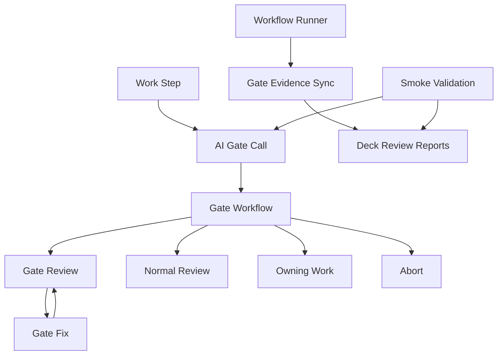
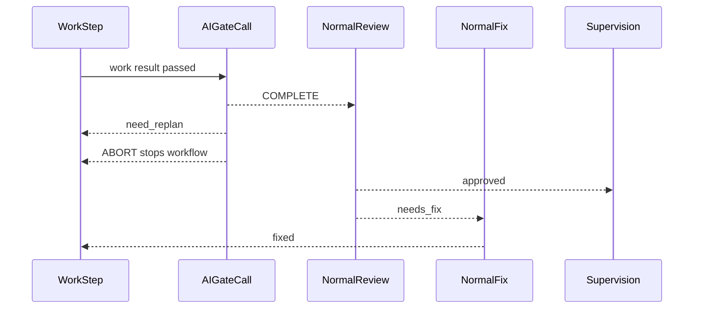
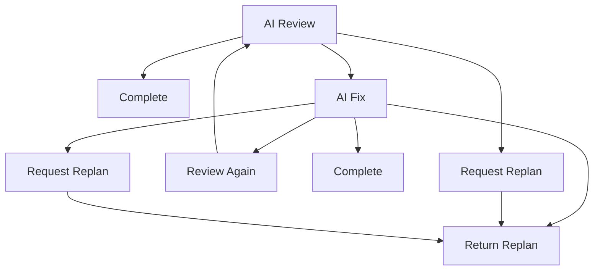

# 設計ドキュメント

## 概要

`slide-workflow-ai-quality-gate` は、Marp slide workflow の `plan / compose / polish / deliver` すべてに、通常 review/inspect/verify へ進む前の callable AI antipattern quality gate を追加する設計です。AI gate は、存在しない path/tool/API、入力にない主張、過度な抽象化、指示外の互換対応、未検証の断定を通常 review へ流す前に検出します。

この spec は既存の command/state model、approval ownership、normal review/fix/supervision loop を変更しません。AI gate は command work 成果物の信用境界として機能し、gate evidence を deck-local report として残しつつ、successful command state は引き続き `<command>-supervision.md` だけで判定します。

### 目標

- 4つの canonical workflow すべてで work 成功後、通常 review/inspect/verify 前に AI gate を実行する
- AI-specific finding を通常 slide quality finding から分離する
- 修正可能な AI finding は command 境界内の専用 fix loop で扱う
- command 境界内で安全に直せない finding は caller workflow の owning work step へ戻す
- AI gate review/fix report を fresh で command-attributable な evidence として残す
- gate placement、routing、report association を smoke/static validation で検証する

### 非目標

- TAKT runtime の `workflow_call` 実装変更
- `quality_gates` command object の再導入
- normal review/inspect/verify の品質基準の再定義
- `plan / compose / polish / deliver` の successful state semantics の変更
- human approval file の生成または approval ownership の変更
- external web access を標準成功条件にすること
- GitHub PR automation との接続

## 境界コミットメント

### この spec が所有するもの

- `.takt/workflows/takt-marp-slide-ai-quality-gate.yaml` の internal callable workflow
- 4つの caller workflow における AI gate call step と outcome routing
- AI antipattern review/fix report の Marp-specific output contract
- AI antipattern fix instruction の command boundary rule
- runner が current TAKT run から AI gate reports を deck-local report へ同期する契約
- smoke/static validation による gate placement、routing、report association の検証

### 境界外

- TAKT built-in `workflow_call` semantics、subworkflow execution engine、built-in AI antipattern criteria の変更
- command/state model、`COMMANDS`、`COMMAND_STATES`、approval command set の変更
- normal review/inspect/verify、normal fix、supervision の置き換え
- `polish` の plan redesign 化、`deliver` の visual/layout inspection 化
- `slides/<deck>` 以外の target contract
- full YAML parser dependency の追加

### 許可する依存

- `slide-workflow-foundation` の `slides/<deck>` target resolver、front matter parser、runner preflight、report sync、state check
- `slide-workflow-orchestration` の4 canonical workflow、normal review/fix/supervision loop、existing report family
- `slide-workflow-smoke-validation` の smoke script と static workflow assertions
- TAKT 0.43.0 の `kind: workflow_call`、`subworkflow.callable`、`loop_monitors`、built-in `ai-antipattern` policy、`ai-antipattern-reviewer` persona、`loop-monitor-ai-antipattern-fix` instruction
- 既存 `.takt/facets/policies/takt-marp-worker-boundary.md` と `.takt/facets/knowledge/takt-marp-repo-conventions.md`

### 再検証トリガー

- TAKT の subworkflow report directory layout が変わる
- runner の successful run selection または deck-local report sync contract が変わる
- canonical workflow の work step、normal review step、fix step、supervision step 名が変わる
- AI gate report front matter field、result enum、filename が変わる
- foundation parser の supported YAML subset が変わる
- `quality_gates` schema compatibility rule が変わる

## アーキテクチャ

### 既存状態

現在の4 workflow は、work 成功後に通常 review/inspect/verify へ直接進みます。`plan` と `compose` は `summarize_*_work -> review_*`、`polish` は `render_evidence -> inspect_render`、`deliver` は `build_delivery -> verify_delivery` です。通常 review/fix の非収束は各 workflow の `loop_monitors` で監視されています。

runner は successful TAKT run を `<command>-supervision.md` で特定し、既知の command report だけを `slides/<deck>/review/` へ同期します。このため、AI gate を callable subworkflow として追加するだけでは gate evidence が deck-local に残らない可能性があります。

### 採用パターン

採用パターン: callable gate with deck-local evidence sync。AI gate lifecycle は1つの internal callable workflow に集約し、caller workflow は command ごとの placement と routing だけを持ちます。gate reports は current run の subworkflow evidence から per-command deck-local filenames へ同期します。

主要な決定:

- AI gate は workflow step として通常 review の前に入る。通常 review は AI-specific finding を再分類しない。
- callable gate workflow は `COMPLETE`、`need_replan`、`ABORT` だけを caller-visible outcome とする。
- `COMPLETE` は normal review/inspect/verify へ進む。
- `need_replan` は current command の owning work step へ戻る。
- `ABORT` は caller workflow を停止する。
- AI gate reports は command state 判定に使わない。state 判定は引き続き supervision report が所有する。
- AI gate reports は flat YAML front matter と Markdown body table で書く。front matter に詳細配列や nested object を入れない。
- `quality_gates` command object は使わない。callable subworkflow routing と static validation で実現する。

### Technology Stack

| Layer | Choice / Version | Role in Feature | Notes |
|-------|------------------|-----------------|-------|
| Workflow | TAKT `^0.43.0` | `workflow_call` と `loop_monitors` | 既存 devDependency を利用し新規依存なし |
| CLI | Node.js ESM scripts | runner sync と smoke validation | 既存 `scripts/*.mjs` pattern に従う |
| Data / Storage | Markdown + YAML front matter | deck-local AI gate reports | 既存 parser subset の範囲で定義 |
| Validation | `slide:smoke` | route/order/report association regression | 既存 smoke script を拡張 |

## ファイル構成計画

### 作成するファイル

- `.takt/workflows/takt-marp-slide-ai-quality-gate.yaml` — `GateWorkflowDefinition`。internal callable AI gate workflow、AI review、AI fix、request replan、gate-local loop monitor を所有する。
- `.takt/facets/instructions/takt-marp-ai-antipattern-review.md` — `GateReviewInstruction`。current target marker、command work report、source artifacts を読み、AI-specific finding だけを report する。
- `.takt/facets/instructions/takt-marp-ai-antipattern-fix.md` — `GateFixInstruction`。current command 境界内で AI finding を直す。安全に直せない場合は `NEED_REPLAN` を返す。
- `.takt/facets/output-contracts/takt-marp-ai-antipattern-review.md` — `GateReviewContract`。AI gate review report の flat front matter と finding table contract。
- `.takt/facets/output-contracts/takt-marp-ai-antipattern-fix.md` — `GateFixContract`。AI gate fix report の flat front matter、finding decision、validation evidence contract。

### 変更するファイル

- `.takt/workflows/takt-marp-slide-plan.yaml` — `CallerGateRoutes`。`summarize_plan_work` 成功後を `ai_quality_gate_plan` へ変更し、gate completion を `review_plan` へ、`need_replan` を `summarize_plan_work` へ戻す。
- `.takt/workflows/takt-marp-slide-compose.yaml` — `CallerGateRoutes`。`summarize_compose_work` 成功後を `ai_quality_gate_compose` へ変更し、gate completion を `review_compose` へ、`need_replan` を `summarize_compose_work` へ戻す。
- `.takt/workflows/takt-marp-slide-polish.yaml` — `CallerGateRoutes`。`render_evidence` 成功後を `ai_quality_gate_polish` へ変更し、gate completion を `inspect_render` へ、`need_replan` を `render_evidence` へ戻す。
- `.takt/workflows/takt-marp-slide-deliver.yaml` — `CallerGateRoutes`。`build_delivery` 成功後を `ai_quality_gate_deliver` へ変更し、gate completion を `verify_delivery` へ、`need_replan` を `build_delivery` へ戻す。
- `scripts/takt-marp-run-slide-workflow.mjs` — `GateEvidenceSync`。current successful run の subworkflow reports から AI gate review/fix reports を deck-local per-command filenames へ同期し、stale deck-local AI reports を cleanup 対象に含める。
- `scripts/takt-marp-validate-slide-workflow-smoke.mjs` — `GateRouteAssertions`、`GateReportAssertions`、`GateSchemaAssertions`。gate placement/order/routing、schema compatibility、AI gate report association の static/smoke assertions を追加する。
- `scripts/takt-marp-validate-slide-workflow-foundation.mjs` — `GateEvidenceSync` regression。runner report sync の regression が foundation-level helper で捕捉しやすい場合のみ、AI gate report sync の最小 regression を追加する。

### 変更しないファイル

- `scripts/lib/takt-marp-slide-workflow.mjs` の command/state enum と approval ownership
- `package.json` の user-facing `slide:*` command surface
- `.kiro/specs/slide-workflow-foundation/**`
- `.kiro/specs/slide-workflow-orchestration/**`
- `.kiro/specs/slide-workflow-smoke-validation/**`
- `slides/**` の real deck source artifacts

## System Flows

### Caller Workflow Flow

### Gate Subworkflow Flow

Flow decisions:

- First-pass no-issue review completes without requiring a fix report.
- Fix `NO_FIX_NEEDED` completes only when every finding decision has finding-level evidence.
- Ambiguous, blocked, internally inconsistent, or non-convergent gate outcomes return `need_replan` instead of continuing to normal review.

## Requirements Traceability

| Requirement | Summary | Components | Interfaces | Flows |
|-------------|---------|------------|------------|-------|
| 1.1 | `plan` review 前に gate を実行する | CallerGateRoutes | plan workflow route | Caller Workflow Flow |
| 1.2 | `compose` review 前に gate を実行する | CallerGateRoutes | compose workflow route | Caller Workflow Flow |
| 1.3 | `polish` inspection 前に gate を実行する | CallerGateRoutes | polish workflow route | Caller Workflow Flow |
| 1.4 | `deliver` verification 前に gate を実行する | CallerGateRoutes | deliver workflow route | Caller Workflow Flow |
| 1.5 | top-level command にしない | GateWorkflowDefinition | internal callable workflow | Caller Workflow Flow |
| 2.1 | AI-specific issue を分類する | GateReviewContract, GateReviewInstruction | review report | Gate Subworkflow Flow |
| 2.2 | no issue なら通常 review へ進む | GateWorkflowDefinition, CallerGateRoutes | `COMPLETE` route | Gate Subworkflow Flow |
| 2.3 | finding id と evidence を記録する | GateReviewContract | finding table | Gate Subworkflow Flow |
| 2.4 | target/output 不明時に通常 review へ進まない | GateReviewInstruction, GateWorkflowDefinition | `need_replan` route | Gate Subworkflow Flow |
| 2.5 | 通常品質 finding と AI finding を分ける | GateReviewInstruction | review criteria | Gate Subworkflow Flow |
| 3.1 | current command 境界内の fix を要求する | GateFixInstruction, GateWorkflowDefinition | fix report | Gate Subworkflow Flow |
| 3.2 | no-fix には finding-level evidence を要求する | GateFixContract | finding decisions | Gate Subworkflow Flow |
| 3.3 | 安全に直せない issue は replan を返す | GateFixInstruction, GateWorkflowDefinition | `need_replan` return | Gate Subworkflow Flow |
| 3.4 | caller は owning work step へ戻す | CallerGateRoutes | per-command route | Caller Workflow Flow |
| 3.5 | ambiguous outcome を成功扱いしない | GateWorkflowDefinition | request replan | Gate Subworkflow Flow |
| 4.1 | review report に target/command/run/finding count を含める | GateReviewContract | front matter | Gate Subworkflow Flow |
| 4.2 | fix report に decision/files/evidence/context を含める | GateFixContract | front matter and table | Gate Subworkflow Flow |
| 4.3 | cross-target/command/run report を current evidence にしない | GateEvidenceSync, GateReportAssertions | sync validation | Runner Sync |
| 4.4 | evidence-free no-fix を成功扱いしない | GateFixContract, GateReportAssertions | fix validation | Gate Subworkflow Flow |
| 4.5 | first-pass no issue で fix report 不要 | GateWorkflowDefinition | optional fix report | Gate Subworkflow Flow |
| 5.1 | 通常 review/fix/supervision を置換しない | CallerGateRoutes | route order | Caller Workflow Flow |
| 5.2 | human approval file を生成しない | GateWorkflowDefinition, GateFixInstruction | boundary rule | Gate Subworkflow Flow |
| 5.3 | successful state semantics を変えない | GateEvidenceSync | report sync only | Runner Sync |
| 5.4 | `polish`/`deliver` 境界を拡張しない | GateFixInstruction | command boundary | Gate Subworkflow Flow |
| 5.5 | web access を標準成功条件にしない | GateWorkflowDefinition | workflow config | Gate Subworkflow Flow |
| 5.6 | incompatible quality gate schema を使わない | GateSchemaAssertions | static validation | Validation |
| 6.1 | 4 workflow の gate placement を検証する | GateRouteAssertions | smoke static check | Validation |
| 6.2 | completion/replan/abort routing を検証する | GateRouteAssertions | smoke static check | Validation |
| 6.3 | gate report association を記録する | GateReportAssertions, GateEvidenceSync | smoke evidence | Validation |
| 6.4 | gate removal を検出する | GateRouteAssertions | smoke static check | Validation |
| 6.5 | unrelated command boundary routing を検出する | GateRouteAssertions | smoke static check | Validation |

## Components and Interfaces

| Component | Domain/Layer | Intent | Req Coverage | Key Dependencies | Contracts |
|-----------|--------------|--------|--------------|------------------|-----------|
| GateWorkflowDefinition | Workflow | AI review/fix/replan lifecycle を所有する internal callable workflow | 1.5, 2.2, 3.1, 3.3, 3.5, 4.5, 5.2, 5.5 | TAKT workflow_call P0 | Batch, State |
| CallerGateRoutes | Workflow | 4 command の work success route を AI gate 経由にする | 1.1, 1.2, 1.3, 1.4, 3.4, 5.1 | canonical workflows P0 | State |
| GateReviewInstruction | Facet | AI-specific issue だけを分類する review instruction | 2.1, 2.4, 2.5 | built-in ai-antipattern P0 | Batch |
| GateFixInstruction | Facet | command 境界内で AI finding を fix または replan へ分類する | 3.1, 3.3, 5.2, 5.4 | worker boundary policy P0 | Batch |
| GateReviewContract | Output Contract | review report の flat front matter と finding evidence を定義する | 2.3, 4.1 | front matter parser P0 | State |
| GateFixContract | Output Contract | fix report の decision/evidence/no-fix contract を定義する | 3.2, 4.2, 4.4 | front matter parser P0 | State |
| GateEvidenceSync | CLI | current run gate reports を deck-local per-command reports へ同期する | 4.3, 5.3, 6.3 | runner sync P0 | Batch |
| GateRouteAssertions | Validation | gate placement と outcome routing を静的検証する | 6.1, 6.2, 6.4, 6.5 | smoke script P0 | Batch |
| GateReportAssertions | Validation | deck-local AI gate report の freshness と optional fix rule を検証する | 4.3, 4.4, 6.3 | smoke script P0 | Batch, State |
| GateSchemaAssertions | Validation | incompatible `quality_gates` schema を再導入しない | 5.6 | smoke script P1 | Batch |

### Workflow Components

#### GateWorkflowDefinition

| Field | Detail |
|-------|--------|
| Intent | AI antipattern review/fix/replan lifecycle を1つの internal callable workflow に閉じる |
| Requirements | 1.5, 2.2, 3.1, 3.3, 3.5, 4.5, 5.2, 5.5 |

**Responsibilities & Constraints**

- `subworkflow.callable: true`、`visibility: internal`、`returns: [need_replan]` を持つ。
- `ai-antipattern-review-1st`、`ai-antipattern-fix`、`request-replan` を持つ。
- gate-local loop monitor は `ai-antipattern-review-1st` と `ai-antipattern-fix` の非収束を `request-replan` へ送る。
- workflow-level `network_access` は既存 slide workflows と同じく `false` を標準とする。
- human approval file を生成しない。

**Dependencies**

- Inbound: CallerGateRoutes — workflow_call step から呼ばれる (P0)
- Outbound: GateReviewInstruction, GateFixInstruction — gate step instruction (P0)
- External: TAKT `workflow_call` — callable subworkflow execution (P0)

**Contracts**: Service [ ] / API [ ] / Event [ ] / Batch [x] / State [x]

##### Batch / Job Contract

- Trigger: caller workflow の `kind: workflow_call`
- Input: current TAKT run context、`.takt/workflow-current-target.json`、command work report、source artifacts
- Output: `ai-antipattern-review.md` and optional `ai-antipattern-fix.md` in current run report tree
- Idempotency & recovery: first-pass no-issue has no fix report; ambiguous or blocked outcome returns `need_replan`

##### State Management

- State model: caller-visible outcomes are `COMPLETE`, `need_replan`, `ABORT`
- Persistence & consistency: gate reports identify `command`, `target`, `workflow_run_id`
- Concurrency strategy: no shared mutable state outside current run reports and deck-local sync

**Implementation Notes**

- Integration: mirror `takt-sdd` callable AI quality gate shape, but use Marp-specific output contracts.
- Validation: smoke checks existence, placement, and caller routes.
- Risks: subworkflow report path is TAKT-owned; runner sync must verify current run identity.

#### CallerGateRoutes

| Field | Detail |
|-------|--------|
| Intent | Each canonical workflow routes work success through AI gate before normal review |
| Requirements | 1.1, 1.2, 1.3, 1.4, 3.4, 5.1 |

**Responsibilities & Constraints**

- Adds one AI gate call step per canonical command.
- Does not add a user-facing command or npm script.
- Preserves normal review/fix/supervision steps and existing loop monitors.
- Maps `need_replan` to the owning work step for the current command only.

**Dependencies**

- Inbound: Existing command work steps — success route enters gate (P0)
- Outbound: GateWorkflowDefinition — workflow call target (P0)
- Outbound: Existing normal review/inspect/verify steps — `COMPLETE` route (P0)

**Contracts**: Service [ ] / API [ ] / Event [ ] / Batch [ ] / State [x]

##### State Management

| Command | Gate step | Previous success source | `COMPLETE` next | `need_replan` next |
|---------|-----------|-------------------------|-----------------|--------------------|
| `plan` | `ai_quality_gate_plan` | `summarize_plan_work` | `review_plan` | `summarize_plan_work` |
| `compose` | `ai_quality_gate_compose` | `summarize_compose_work` | `review_compose` | `summarize_compose_work` |
| `polish` | `ai_quality_gate_polish` | `render_evidence` | `inspect_render` | `render_evidence` |
| `deliver` | `ai_quality_gate_deliver` | `build_delivery` | `verify_delivery` | `build_delivery` |

**Implementation Notes**

- Integration: each caller passes `fix_instruction: takt-marp-ai-antipattern-fix`.
- Validation: static assertions must check route order, not only step presence.
- Risks: adding gate steps to normal loop monitor cycles could conflate AI gate loop with normal review loop; keep AI gate loop inside callable workflow.

### Facet Components

#### GateReviewInstruction

| Field | Detail |
|-------|--------|
| Intent | Review current command output for AI-specific defects only |
| Requirements | 2.1, 2.4, 2.5 |

**Responsibilities & Constraints**

- Reads `.takt/workflow-current-target.json` to identify command and target.
- Reads the current command work report and source artifact scope.
- Classifies hallucinated paths/tools/APIs, unsupported source claims, unrequested compatibility behavior, overbroad abstractions, and unused generated artifacts.
- Does not classify ordinary slide content, layout, render, or delivery quality findings unless they come from AI-specific fabrication or unsupported assumptions.
- Blocks normal review when target or reviewed scope cannot be identified.

**Dependencies**

- Inbound: GateWorkflowDefinition — review step instruction (P0)
- Outbound: GateReviewContract — report shape (P0)
- External: TAKT built-in `ai-antipattern` policy — base criteria (P0)

**Contracts**: Service [ ] / API [ ] / Event [ ] / Batch [x] / State [ ]

##### Batch / Job Contract

- Trigger: gate review step
- Input: current target marker, command work report, source artifacts, local policies
- Output: AI review report with stable finding ids and evidence
- Idempotency & recovery: repeated review preserves finding identity where possible

#### GateFixInstruction

| Field | Detail |
|-------|--------|
| Intent | Resolve AI-specific findings inside the current command boundary or request replan |
| Requirements | 3.1, 3.3, 5.2, 5.4 |

**Responsibilities & Constraints**

- Reads the current AI review report and handles every finding.
- Restricts edits to the current command artifact boundary.
- Emits `FIXED`, `NO_FIX_NEEDED`, `NEED_REPLAN`, or `BLOCKED`.
- Requires finding-level evidence for `NO_FIX_NEEDED`.
- Never writes approval files.

**Dependencies**

- Inbound: GateWorkflowDefinition — fix step instruction (P0)
- Outbound: GateFixContract — report shape (P0)
- Outbound: Existing source artifacts — command-local edits only (P0)

**Contracts**: Service [ ] / API [ ] / Event [ ] / Batch [x] / State [ ]

##### Batch / Job Contract

- Trigger: AI review found AI-specific issues
- Input: AI review report, current command marker, source artifacts
- Output: optional AI fix report
- Idempotency & recovery: `FIXED` loops to review; `NEED_REPLAN` returns to caller

### Report Contract Components

#### GateReviewContract

| Field | Detail |
|-------|--------|
| Intent | Make AI review report attributable and parseable |
| Requirements | 2.3, 4.1 |

**Responsibilities & Constraints**

- Front matter uses only existing parser-supported scalar fields.
- Body contains finding tables with `finding_id`, `family_tag`, location, issue, required change, evidence.
- `finding_count` equals the total current AI finding rows.

**Dependencies**

- Inbound: GateReviewInstruction — writes report (P0)
- Outbound: GateEvidenceSync, GateReportAssertions — parse and validate report (P0)

**Contracts**: Service [ ] / API [ ] / Event [ ] / Batch [ ] / State [x]

##### State Management

Required front matter:

| Field | Type | Rule |
|-------|------|------|
| `command` | string | `plan`, `compose`, `polish`, or `deliver` |
| `target` | string | `slides/<deck>` |
| `generated_at` | ISO timestamp | parseable date |
| `workflow_run_id` | string | current TAKT run id |
| `step` | string | `ai_antipattern_review` |
| `cycle` | number | gate review cycle |
| `reviewed_scope` | string | work artifact scope label |
| `result` | string | `approved`, `needs_fix`, or `blocked` |
| `finding_count` | number | total AI findings |
| `blocking_finding_count` | number | findings that block normal review |

#### GateFixContract

| Field | Detail |
|-------|--------|
| Intent | Make AI fix decisions auditable and safe for no-fix completion |
| Requirements | 3.2, 4.2, 4.4 |

**Responsibilities & Constraints**

- Records every finding decision in the body table.
- Front matter captures counts and high-level status without nested YAML.
- `NO_FIX_NEEDED` is valid only when each finding row has evidence.
- `NEED_REPLAN` and `BLOCKED` require missing context in body.

**Dependencies**

- Inbound: GateFixInstruction — writes report (P0)
- Outbound: GateWorkflowDefinition, GateReportAssertions — validate result (P0)

**Contracts**: Service [ ] / API [ ] / Event [ ] / Batch [ ] / State [x]

##### State Management

Required front matter:

| Field | Type | Rule |
|-------|------|------|
| `command` | string | current command |
| `target` | string | current target |
| `generated_at` | ISO timestamp | parseable date |
| `workflow_run_id` | string | current TAKT run id |
| `step` | string | `ai_antipattern_fix` |
| `cycle` | number | gate fix cycle |
| `status` | string | `FIXED`, `NO_FIX_NEEDED`, `NEED_REPLAN`, or `BLOCKED` |
| `handled_finding_count` | number | decisions listed in body |
| `changed_file_count` | number | changed files count, `0` when none |
| `remaining_context_count` | number | missing context rows |

### CLI and Validation Components

#### GateEvidenceSync

| Field | Detail |
|-------|--------|
| Intent | Copy current run AI gate reports to stable deck-local filenames |
| Requirements | 4.3, 5.3, 6.3 |

**Responsibilities & Constraints**

- Runs after successful command run selection, not before.
- Copies current gate review report to `slides/<deck>/review/<command>-ai-antipattern-review.md`.
- Copies current gate fix report to `slides/<deck>/review/<command>-ai-antipattern-fix.md` only when it exists.
- Cleans stale deck-local AI gate reports when absent from the current successful run.
- Does not use AI reports to decide successful command state.

**Dependencies**

- Inbound: runner successful run sync — invokes evidence sync (P0)
- Outbound: deck-local review directory — writes reports (P0)
- External: TAKT run report layout — source reports (P0)

**Contracts**: Service [ ] / API [ ] / Event [ ] / Batch [x] / State [ ]

##### Batch / Job Contract

- Trigger: `syncTaktReportsToDeck(command, targetInfo, runSnapshotBefore)` after run selection
- Input: selected top-level reports dir, command, targetInfo
- Output: deck-local AI gate reports or removal of stale AI gate reports
- Idempotency & recovery: replacement follows existing temp/backup report replacement pattern

#### GateRouteAssertions

| Field | Detail |
|-------|--------|
| Intent | Fail validation when any workflow bypasses or misroutes the AI gate |
| Requirements | 6.1, 6.2, 6.4, 6.5 |

**Responsibilities & Constraints**

- Checks every canonical workflow contains exactly one command AI gate step.
- Checks work success route points to the AI gate step.
- Checks gate `COMPLETE`, `need_replan`, and `ABORT` routes.
- Checks route order is work -> gate -> normal review/inspect/verify.

**Dependencies**

- Inbound: smoke validation — static workflow check (P0)
- Outbound: workflow YAML files — parsed as text with ordered snippets (P0)

**Contracts**: Service [ ] / API [ ] / Event [ ] / Batch [x] / State [ ]

#### GateReportAssertions

| Field | Detail |
|-------|--------|
| Intent | Validate gate report freshness and optional fix semantics |
| Requirements | 4.3, 4.4, 6.3 |

**Responsibilities & Constraints**

- Verifies deck-local AI review report front matter matches target, command, and current run id.
- Allows missing fix report only when review report has no blocking AI findings.
- Rejects fix reports with `NO_FIX_NEEDED` when body lacks finding-level evidence.
- Records observed gate report paths in smoke summary.

**Dependencies**

- Inbound: smoke validation — report evidence check (P0)
- Outbound: existing front matter parser — parse flat report fields (P0)

**Contracts**: Service [ ] / API [ ] / Event [ ] / Batch [x] / State [x]

#### GateSchemaAssertions

| Field | Detail |
|-------|--------|
| Intent | Prevent regression to incompatible workflow command gate schema |
| Requirements | 5.6 |

**Responsibilities & Constraints**

- Keeps existing check that `type: command` quality gate objects are absent from relevant workflow YAML.
- Extends the check to confirm AI gate uses `kind: workflow_call`, not `quality_gates`.

**Dependencies**

- Inbound: smoke validation — static schema compatibility check (P1)
- Outbound: workflow YAML files — text validation (P1)

**Contracts**: Service [ ] / API [ ] / Event [ ] / Batch [x] / State [ ]

## Data Models

### Domain Model

- `AIGateReviewReport`: command work output に対する AI-specific issue review evidence。
- `AIGateFixReport`: AI-specific findings に対する command-local fix decision evidence。
- `GateRoute`: caller workflow の `COMPLETE`、`need_replan`、`ABORT` route mapping。
- `GateEvidence`: current TAKT run と deck-local report を結びつける observable artifact。

### Logical Data Model

AI gate reports are Markdown files with flat YAML front matter. Natural keys are:

- `target`
- `command`
- `workflow_run_id`
- `step`

Deck-local filenames:

- `slides/<deck>/review/<command>-ai-antipattern-review.md`
- `slides/<deck>/review/<command>-ai-antipattern-fix.md`

Consistency rules:

- A deck-local AI report is current only when its front matter target, command, and workflow_run_id match the active successful command run.
- Fix report is optional only when review report indicates no blocking AI findings.
- AI reports never replace `<command>-supervision.md` as successful state evidence.

### Data Contracts & Integration

Gate review and fix body tables are authoritative for finding-level decisions. Front matter contains only machine-readable identity and count fields. This keeps validation compatible with the existing parser and avoids new YAML dependencies.

## Error Handling

### Error Strategy

- Missing target marker, missing work report, unidentifiable command output, or malformed AI report prevents normal review continuation.
- Ambiguous, blocked, internally inconsistent, or non-convergent AI gate results route to `need_replan` or `ABORT`.
- Runner sync failure for required review evidence is a command run sync error, not a successful command state.
- Smoke validation failures report the command, expected route/report, observed route/report, and path.

### Error Categories and Responses

- Workflow routing errors: smoke validation fails before the change is considered complete.
- Gate review ambiguity: gate returns `need_replan`.
- Gate fix unsafe scope: gate returns `need_replan`.
- Gate report freshness mismatch: report is ignored as current evidence and validation fails.
- Schema compatibility regression: smoke validation fails on workflow YAML.

## Testing Strategy

- Static workflow route tests: verify `plan`, `compose`, `polish`, and `deliver` work success routes enter AI gate before normal review/inspect/verify. Covers 1.1, 1.2, 1.3, 1.4, 6.1, 6.4.
- Static outcome route tests: verify `COMPLETE` routes to normal review, `need_replan` routes to owning work step, and `ABORT` aborts for all four commands. Covers 3.4, 6.2, 6.5.
- Schema compatibility tests: verify AI gate is implemented with `kind: workflow_call` and object-shaped `quality_gates` command gates are not reintroduced. Covers 5.6.
- Report sync tests: use a fake TAKT run with subworkflow AI reports and confirm runner copies review and optional fix reports to deck-local per-command filenames while preserving supervision-based state selection. Covers 4.3, 5.3, 6.3.
- Report freshness tests: parse deck-local AI reports and reject target, command, or workflow_run_id mismatches. Covers 4.1, 4.2, 4.3.
- Optional fix report tests: accept first-pass no-issue review without fix report; reject `NO_FIX_NEEDED` fix report without finding-level evidence. Covers 3.2, 4.4, 4.5.
- Boundary tests: verify AI fix instruction and validation do not generate approval files, do not change command state enums, and keep `polish`/`deliver` boundaries intact. Covers 5.1, 5.2, 5.4, 5.5.
- Smoke evidence test: run canonical smoke path or synthetic equivalent and record observed AI gate report paths in smoke summary. Covers 6.3.

## Security Considerations

- Gate workflow standard configuration keeps network access disabled; external web access is not a success condition.
- AI fix runs with edit permission, so the instruction must constrain editable paths by current command boundary.
- Gate evidence sync copies only reports from the selected successful current run and validates front matter identity before treating them as current evidence.

## Migration Strategy

- This is an in-repo workflow change with no data migration.
- Existing deck-local reports may lack AI gate evidence until each command is rerun.
- `--force` and rejected rerun archive behavior remains owned by existing runner logic. AI gate report cleanup follows command report cleanup rules.
- If implementation proves TAKT subworkflow reports are not discoverable in the expected location, stop and update design/tasks rather than silently dropping deck-local evidence.
