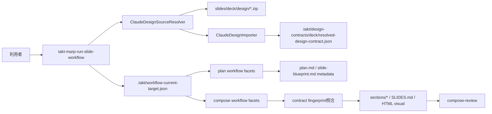
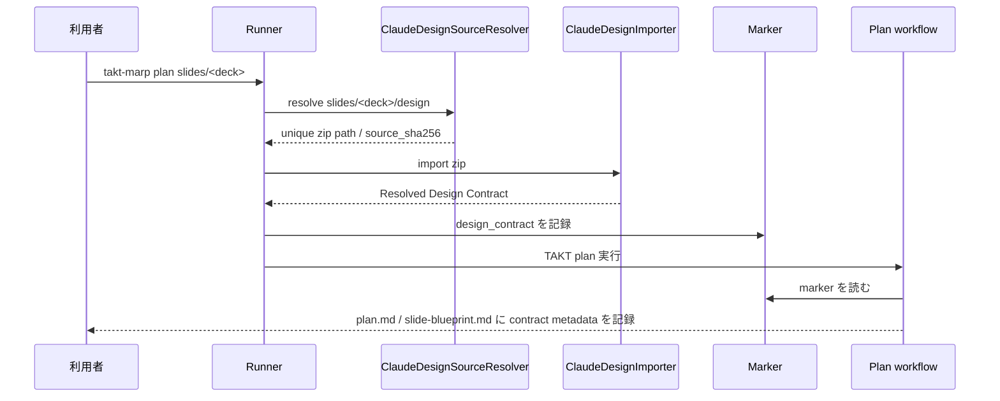
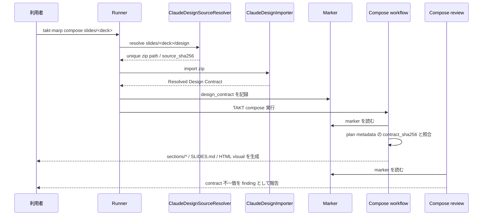

# 設計ドキュメント

## 概要

この機能は、Claude Design Source（Claude Designソース）を唯一の user-facing design system 入力として受け取り、workflow が読める Resolved Design Contract（解決済みデザイン契約）へ正規化する。

利用者は Claude Design から export した `.zip` を `slides/<deck>/design/` に配置する。Workflow Runner（ワークフローランナー）は `plan` / `compose` 実行前に zip を解決し、manifest と token CSS を検証し、`.takt/design-contracts/<deck>/resolved-design-contract.json` を生成する。`--force` 再実行では、既存成果物の archive / clean 前に import / validation だけを行い、Resolved Design Contract の保存は archive / clean 成功後に遅延する。`plan` はこの契約を layout / visual / density の制約として参照するだけで CSS を生成しない。`compose` は `plan` が記録した contract fingerprint と現在の fingerprint を照合し、一致した場合だけ `SLIDES.md` front matter CSS、`_class`、section HTML/CSS、visual source を生成する。

### 目標

- Claude Design zip を唯一の user-facing design system 入力として固定する。
- Claude Design zip の schema 依存を importer に閉じ込め、workflow/facet は Resolved Design Contract だけを読む。
- `plan` と `compose` が同じ contract source と fingerprint を参照する状態を検証可能にする。
- `design-system.md` を compose の canonical source artifact、override 条件、success assertion から外す。
- no-copy 実行と `plan / compose / polish / deliver` の command surface を維持する。
- smoke / foundation / package / no-copy validation で Claude Design Source import を固定する。

### 非目標

- 新しい top-level `design` command、`design:approve`、Design Contract 専用 approval command は追加しない。
- 手書き `design-contract.md`、package 側の default design input、deck-local Markdown override は実装しない。
- `plan` は CSS、front matter style、`_class` の style 定義を生成しない。
- PDF / PPTX / standalone HTML export、Claude Design `/design-sync` の repo 更新形式は初期 scope に含めない。
- Claude Design zip 内の `components` が空であることを失敗条件にしない。
- 既存 deck の `SLIDES.md`、`sections/*`、`images/*` を自動的に全面再生成しない。
- `slide-workflow-visual-review` が所有する render evidence の multimodal 視覚判定は扱わない。

## 境界コミットメント

### このスペックが所有するもの

- `slides/<deck>/design/` から Claude Design zip を一意に解決する規則。
- Claude Design zip の required / optional files、manifest fields、token consistency の validation。
- Resolved Design Contract の JSON shape、path、fingerprint、marker payload。
- `--force` 再実行時に、source validation と Resolved Design Contract 保存を分離する preflight / invalidation 順序。
- malformed な既存 marker を読み捨て、保存済み Resolved Design Contract marker へ復旧する規則。
- `plan.md` / `slide-blueprint.md` に Design Contract metadata を記録し、`compose` で fingerprint を照合する契約。
- `compose` workflow から `design_system` step と `design-system.md` canonical artifact を除外する workflow / facet / docs 更新。
- Design Contract を持たない既存 deck でも `polish` が render evidence と source artifact の範囲で検査・修正できる legacy path。
- smoke / foundation / package / no-copy validation の success criteria 更新。

### 境界外

- Claude Design Source 以外の user-facing design system 入力。
- consumer workspace への `.takt/workflows` / `.takt/facets` 自動コピー。
- legacy `design-system.md` から Resolved Design Contract への自動変換。
- plan / compose の human approval 所有権変更。
- research artifacts と Claude Design Source の統合や混同。

### 許可する依存

- `docs/adr/0001-slide-workflow-command-model.md`: command surface と approval 所有権。
- `docs/adr/0003-design-contract-as-reusable-slide-style-input.md`: Claude Design Source を唯一の design input にする判断。
- `slide-workflow-orchestration`: command state、report sync、approval freshness。
- `slide-workflow-quality-uplift`: layout vocabulary、visual component、review severity。
- `takt-marp-global-installer`: package-bundled template と no-copy 経路。
- 既存 runner marker `.takt/workflow-current-target.json`。
- `fflate 0.8.3`: Claude Design zip の read と smoke fixture zip 生成。利用箇所は `ZipArchiveReader` adapter に限定する。

### 再検証トリガー

- Claude Design zip の accepted file set、required manifest fields、token consistency rule を変える場合。
- invalid sibling zip や malformed manifest の扱いを変える場合。
- Resolved Design Contract JSON shape、path、fingerprint 算出方法を変える場合。
- marker の `design_contract` shape、path 形式、source enum を変える場合。
- `--force` 時の source validation、artifact invalidation、Resolved Design Contract 保存の順序を変える場合。
- Design Contract なし legacy deck に対する `polish` の許容範囲を変える場合。
- `plan.md` / `slide-blueprint.md` に記録する contract metadata を変える場合。
- compose source artifact、review finding、smoke assertion の成功条件を変える場合。
- no-copy または `eject` の user-facing contract を変える場合。

## アーキテクチャ

### 既存アーキテクチャ分析

- `scripts/takt-marp-run-slide-workflow.mjs` が command preflight、marker 書き出し、TAKT 起動、report sync を担当している。
- `.takt/workflow-current-target.json` は `command`、`target`、`deck`、research metadata を workflow/facet へ渡す handoff marker として既に使われている。
- `templates/project/workflows` と `.takt/workflows` は同じ workflow YAML を保持し、`scripts/takt-marp-sync-project-templates.mjs` が drift を検出する。
- workflow/facet template は通常実行では consumer workspace にコピーされず、package-bundled path から TAKT に渡される。
- 現行 `compose` は `design_system` step によって `design-system.md` を作るため、デザイン正本が deck-local generated artifact に寄っている。

### アーキテクチャパターンと境界マップ

- **採用パターン**: runner-side source resolver + importer + marker handoff + facet consumption。
- **責任分割**: runner は source 解決、import、fingerprint、marker だけを担当する。plan/compose facet は Resolved Design Contract を読み、成果物へ反映する。validator は source 解決と適用を検証する。
- **維持する既存パターン**: command runner、template source resolver、report sync、template drift validation、smoke fixture。
- **新規コンポーネントの根拠**: Claude Design zip の file schema 依存を workflow step に漏らすと、各 facet が zip 内部構造を知ることになる。importer を runner library に閉じることで、workflow は安定した JSON contract だけを読む。



### 技術スタック

| レイヤー | 選択 | 機能内での役割 | メモ |
|----------|------|----------------|------|
| CLI / Runner | Node.js ESM | source 解決、import、marker 書き出し、preflight error | 既存 script 構成を維持する |
| Zip 読み込み | `ZipArchiveReader` adapter + `fflate 0.8.3` | zip entry の列挙、byte read、smoke fixture zip 生成 | 外部 `unzip` command には依存しない。implementation で `fflate` を `package.json` / `package-lock.json` に追加する |
| Workflow | TAKT YAML + facets | plan / compose / review / fix の指示更新 | 新 command は追加しない |
| Storage | JSON marker + JSON contract | normalized token metadata、fingerprint、report metadata | DB は使わない |
| Validation | 既存 npm scripts | smoke、foundation、package、no-copy | `design-system.md` 存在検証を置換する |

## ファイル構造計画

### ディレクトリ構造

```text
slides/<deck>/
└── design/
    └── <claude-design-export>.zip       # 利用者が置く唯一の design input

.takt/
├── design-contracts/
│   └── <deck>/
│       └── resolved-design-contract.json # workflow-managed internal artifact
├── workflow-current-target.json          # marker に design_contract を追加
├── facets/                               # 既存 facet。Design Contract 参照へ更新
└── workflows/                            # 既存 workflow。compose の design_system step を削除

templates/project/
├── facets/
└── workflows/

scripts/lib/
├── takt-marp-claude-design-source.mjs    # 新規。source resolve / import / validation
└── takt-marp-zip-archive.mjs             # 新規。zip reader adapter
```

### 変更対象ファイル

- `package.json` / `package-lock.json` - zip read/write 用 dependency として `fflate` を追加する。
- `scripts/lib/takt-marp-zip-archive.mjs` - zip entry list / read API を実装し、zip dependency をここに閉じる。
- `scripts/lib/takt-marp-claude-design-source.mjs` - resolver、importer、token parser、fingerprint 算出、marker payload 作成を実装する。
- `scripts/takt-marp-run-slide-workflow.mjs` - `plan` と `compose` 実行前に importer を呼び、marker に `design_contract` を書く。
- `templates/project/workflows/takt-marp-slide-plan.yaml` と `.takt/workflows/takt-marp-slide-plan.yaml` - plan step は marker の Design Contract を読む。
- `templates/project/workflows/takt-marp-slide-compose.yaml` と `.takt/workflows/takt-marp-slide-compose.yaml` - `design_system` step を削除し、`compose_sections` を初期 step にする。
- `templates/project/facets/instructions/takt-marp-plan.md` と `.takt/facets/instructions/takt-marp-plan.md` - plan metadata と CSS 非生成を明記する。
- `templates/project/facets/instructions/takt-marp-compose-sections.md` と `.takt/facets/instructions/takt-marp-compose-sections.md` - `design-system.md` ではなく Resolved Design Contract を読む。
- `templates/project/facets/instructions/takt-marp-assemble-slides.md` と `.takt/facets/instructions/takt-marp-assemble-slides.md` - token CSS / `_class` 生成規則を更新する。
- `templates/project/facets/instructions/takt-marp-compose-review.md` と `.takt/facets/instructions/takt-marp-compose-review.md` - fingerprint / token adherence review を追加する。
- `templates/project/facets/instructions/takt-marp-compose-work-summary.md` と `.takt/facets/instructions/takt-marp-compose-work-summary.md` - compose report の design metadata を更新する。
- `templates/project/facets/instructions/takt-marp-compose-fix.md` と `.takt/facets/instructions/takt-marp-compose-fix.md` - fix scope から `design-system.md` を外す。
- `templates/project/facets/knowledge/takt-marp-repo-conventions.md` と `.takt/facets/knowledge/takt-marp-repo-conventions.md` - deck が `design-system.md` を持つ前提を削除する。
- `templates/project/facets/policies/takt-marp-slide-quality.md` と `.takt/facets/policies/takt-marp-slide-quality.md` - source artifact 境界を更新する。
- `templates/project/facets/policies/takt-marp-visual-composition.md` と `.takt/facets/policies/takt-marp-visual-composition.md` - token 駆動の source を Resolved Design Contract に変更する。
- `scripts/takt-marp-validate-slide-workflow-smoke.mjs` - `design-system.md` assertion を Claude Design Source import / plan metadata / compose CSS assertion に置き換える。
- `scripts/takt-marp-validate-slide-workflow-foundation.mjs` - marker shape、plan metadata、facet 文言、legacy `design-system.md` 非依存を検証する。
- `scripts/takt-marp-validate-package-boundary.mjs` - importer library と fixture builder が package に含まれることを検証する。
- `scripts/takt-marp-validate-global-install.mjs` - global install package から importer が実行でき、no-copy を破らないことを検証する。
- `scripts/takt-marp-validate-bundled-research-no-copy.mjs` - research metadata と design metadata が混同されず、template copy が発生しないことを検証する。
- `docs/marp-slide-workflow.md` - workflow artifact と Claude Design Source 契約を更新する。

## システムフロー

### plan



### compose



## データモデル

### Claude Design Source

初期 scope の accepted source は `_ds_manifest.json` を含む `.zip` archive とする。

Required files:

- `_ds_manifest.json`
- `styles.css`
- `tokens/colors.css`
- `tokens/typography.css`
- `tokens/spacing.css`

Optional files:

- `.thumbnail`
- `_ds_bundle.js`
- `_adherence.oxlintrc.json`
- `tokens/fonts.css`
- `SKILL.md`
- `readme.md` / `README.md`
- `components/**/*.prompt.md`
- `guidelines/*.card.html`
- `slides/*.html`
- `templates/**/*.dc.html`
- `assets/*`

Required manifest fields:

- `namespace`
- `globalCssPaths`
- `tokens`

Optional manifest fields:

- `source`
- `components`
- `startingPoints`
- `cards`
- `templates`
- `themes`
- `fonts`
- `brandFonts`

### Resolved Design Contract JSON

```json
{
  "schema_version": 1,
  "source": {
    "kind": "claude-design-zip",
    "path": "slides/example/design/Example Design System.zip",
    "sha256": "source-zip-sha256",
    "namespace": "ExampleDesignSystem_abcdef",
    "export_source": "spa"
  },
  "fingerprint": {
    "source_sha256": "source-zip-sha256",
    "contract_sha256": "normalized-json-sha256"
  },
  "global_css_paths": [
    "tokens/fonts.css",
    "tokens/colors.css",
    "tokens/typography.css",
    "tokens/spacing.css",
    "styles.css"
  ],
  "required_files": [
    "_ds_manifest.json",
    "styles.css",
    "tokens/colors.css",
    "tokens/typography.css",
    "tokens/spacing.css"
  ],
  "optional_files_present": [
    "_adherence.oxlintrc.json",
    "tokens/fonts.css"
  ],
  "token_counts": {
    "total": 119,
    "color": 56,
    "typography": 31,
    "spacing": 23,
    "radius": 5,
    "shadow": 4,
    "font": 0,
    "other": 0
  },
  "brand_fonts": [
    "Noto Sans JP",
    "Noto Serif JP",
    "JetBrains Mono"
  ],
  "components": {
    "count": 2,
    "empty": false,
    "names": ["ExampleComponent", "ExampleVisual"]
  },
  "adherence": {
    "available": true,
    "rule_messages": ["Raw hex color -- use a design-system color token via var()."],
    "x_omelette_token_count": 119
  },
  "guidance": {
    "available": true,
    "documents": [
      {
        "path": "SKILL.md",
        "kind": "skill",
        "sha256": "sha256",
        "size_bytes": 2048,
        "text": "Design System usage guidance...",
        "truncated": false
      }
    ],
    "component_prompts": [
      {
        "path": "components/example/ExampleComponent.prompt.md",
        "kind": "component_prompt",
        "sha256": "sha256",
        "size_bytes": 512,
        "text": "Component usage guidance...",
        "truncated": false
      }
    ]
  },
  "source_catalog": {
    "counts": {
      "components": 2,
      "cards": 8,
      "templates": 1,
      "sample_slides": 4,
      "guidelines": 3,
      "assets": 2,
      "guidance_documents": 2,
      "component_prompts": 2
    },
    "components": [
      {
        "name": "ExampleComponent",
        "sourcePath": "components/example/ExampleComponent.jsx",
        "prompt_path": "components/example/ExampleComponent.prompt.md",
        "related_files": ["components/example/ExampleComponent.jsx", "components/example/ExampleComponent.prompt.md"]
      }
    ],
    "cards": [],
    "templates": [],
    "sample_slides": [],
    "guidelines": [],
    "assets": []
  },
  "tokens": [
    {
      "name": "--color-background",
      "value": "#ffffff",
      "kind": "color",
      "defined_in": "tokens/colors.css",
      "category": "color"
    }
  ]
}
```

`contract_sha256` は normalized JSON の stable stringify 結果から算出する。`source.sha256` は zip bytes の SHA-256 とする。`compose` は `contract_sha256` を plan metadata と照合し、report には `source.sha256` も残す。

### marker payload

`.takt/workflow-current-target.json` に以下を追加する。

```json
{
  "design_contract": {
    "source": {
      "kind": "claude-design-zip",
      "path": "slides/example/design/Example Design System.zip",
      "sha256": "source-zip-sha256",
      "namespace": "ExampleDesignSystem_abcdef",
      "export_source": "spa"
    },
    "path": ".takt/design-contracts/example/resolved-design-contract.json",
    "fingerprint": {
      "source_sha256": "source-zip-sha256",
      "contract_sha256": "normalized-json-sha256"
    },
    "namespace": "ExampleDesignSystem_abcdef",
    "token_counts": {
      "total": 119,
      "color": 49,
      "typography": 31,
      "spacing": 32
    },
    "brand_fonts": ["Noto Sans JP", "Noto Serif JP", "JetBrains Mono"],
    "component_count": 2,
    "adherence_available": true
  }
}
```

`source.path` と `path` は repo root relative path とする。worker は marker の `design_contract.path` が指す JSON を開き、詳細 token、guidance、source catalog を読む。

### plan metadata

`plan.md` と `slide-blueprint.md` は CSS を含めず、次の contract metadata を本文または front matter に記録する。

```yaml
design_contract:
  source_kind: claude-design-zip
  source_path: slides/example/design/Example Design System.zip
  namespace: ExampleDesignSystem_abcdef
  source_sha256: source-zip-sha256
  contract_sha256: normalized-json-sha256
  token_counts:
    total: 119
    color: 49
    typography: 31
    spacing: 32
  component_count: 0
  adherence_available: true
```

`compose` は marker の `design_contract.fingerprint.contract_sha256` と plan metadata の `contract_sha256` を照合する。不一致の場合、source artifact 生成を成功扱いせず、re-plan または Claude Design Source 更新が必要な finding を残す。

## コンポーネントとインターフェース

| コンポーネント | レイヤー | 意図 | 要件カバー範囲 | 契約 |
|----------------|----------|------|----------------|------|
| ClaudeDesignSourceResolver | runner library | target deck の Claude Design zip を一意に解決する | 1, 7, 9 | Service |
| ZipArchiveReader | runner library | zip entry list / byte read を提供する | 1, 2, 8 | Adapter |
| ClaudeDesignImporter | runner library | manifest / token CSS を Resolved Design Contract に正規化する | 2, 3, 8 | Service |
| WorkflowHandoffMarker | runner state | Resolved Design Contract を workflow に渡す | 3, 4, 5, 6, 7 | State |
| PlanFacetContract | workflow facets | contract 制約で plan / blueprint を作る | 4, 7, 9 | File contract |
| ComposeFacetContract | workflow facets | contract に従い source artifacts を生成する | 5, 6, 9 | File contract |
| ValidationSurface | validation scripts | smoke / foundation / package / no-copy を更新する | 1, 2, 3, 5, 6, 7, 8, 9 | Batch |

### ClaudeDesignSourceResolver

**責務と制約**

- target deck の `slides/<deck>/design/` を見る。
- `.zip` file を列挙し、0 件なら `CLAUDE_DESIGN_SOURCE_MISSING` とする。
- `.zip` file が unreadable、malformed、または `_ds_manifest.json` を含まない場合は `CLAUDE_DESIGN_SOURCE_INVALID` とする。valid zip が 1 件あっても invalid sibling zip が同居する場合は、壊れた新規 export を無視して古い valid export を使わないため invalid とする。
- `_ds_manifest.json` を含む zip が 2 件以上ある場合は `CLAUDE_DESIGN_SOURCE_AMBIGUOUS` とする。
- `design-system.md`、`design-contract.md`、package default は候補にしない。
- consumer workspace へ template assets をコピーしない。

**サービスインターフェース**

```typescript
interface ClaudeDesignSourceResolver {
  resolveClaudeDesignSource(input: {
    projectRoot: string;
    target: string;
    deckName: string;
  }): Promise<ClaudeDesignSource>;
}

interface ClaudeDesignSource {
  kind: "claude-design-zip";
  path: string;
  displayPath: string;
  sha256: string;
  entries: string[];
}
```

### ZipArchiveReader

**責務と制約**

- `fflate` dependency を `scripts/lib/takt-marp-zip-archive.mjs` 内へ閉じる。
- path traversal を防ぐため、entry name に absolute path、`..` segment、NUL byte が含まれる zip は invalid とする。
- leading `./` は common zip convention として正規化し、`tokens/colors.css` のように参照可能にする。
- archive byte size、entry count、total uncompressed size には上限を設け、zip bomb による local / CI の availability 低下を防ぐ。
- entry read は Buffer を返し、text decode は importer 側で UTF-8 として行う。
- `.thumbnail` の binary content は hash と existence だけ扱い、report に binary body を出さない。

**サービスインターフェース**

```typescript
interface ZipArchiveReader {
  listEntries(zipPath: string): Promise<string[]>;
  readEntry(zipPath: string, entryName: string): Promise<Buffer>;
}
```

### ClaudeDesignImporter

**責務と制約**

- required files と required manifest fields を検証する。
- `_ds_manifest.json` は JSON object であることを検証し、`null`、文字列、配列などは `CLAUDE_DESIGN_SOURCE_INVALID` とする。
- manifest token と CSS custom property の名前と値の一致を検証する。
- `_adherence.oxlintrc.json` がある場合は `x-omelette.tokens` / `x-omelette.components` の counts と review rule names を取り込む。
- `SKILL.md` / `readme.md` / component prompt がある場合は `guidance` として取り込む。
- components / cards / templates / sample slides / guidelines / assets がある場合は `source_catalog` として取り込む。
- `components` が空でも token が有効なら成功する。非空の場合も特定ドメインに固定せず、汎用 catalog として扱う。
- token category は manifest `kind`、token name prefix、source CSS path の組み合わせで決定する。
- `styles.css` は global entry point として hash / import path を記録するが、inline rule の存在を必須にしない。

**サービスインターフェース**

```typescript
interface ClaudeDesignImporter {
  importClaudeDesignSource(input: {
    projectRoot: string;
    deckName: string;
    source: ClaudeDesignSource;
  }): Promise<ResolvedDesignContract>;
}

interface ResolvedDesignContract {
  schema_version: 1;
  source: {
    kind: "claude-design-zip";
    path: string;
    sha256: string;
    namespace: string;
    export_source: string | null;
  };
  fingerprint: {
    source_sha256: string;
    contract_sha256: string;
  };
  global_css_paths: string[];
  required_files: string[];
  optional_files_present: string[];
  token_counts: Record<string, number>;
  brand_fonts: string[];
  components: {
    count: number;
    empty: boolean;
    names: string[];
  };
  adherence: {
    available: boolean;
    rule_messages: string[];
    x_omelette_token_count: number;
  };
  guidance: {
    available: boolean;
    documents: unknown[];
    component_prompts: unknown[];
  };
  source_catalog: {
    counts: Record<string, number>;
  };
  tokens: unknown[];
}
```

### WorkflowHandoffMarker

**責務と制約**

- `plan` と `compose` で `design_contract` を marker に書く。
- `research` metadata と同じ marker に共存させるが、research input とは別 field とする。
- marker payload は report と facet が読める summary に絞り、詳細 token list は `design_contract.path` の JSON へ置く。
- `plan` / `compose --force` では Claude Design Source の import / validation を force invalidation 前に済ませるが、Resolved Design Contract の保存は `archiveCommandArtifacts` と `cleanGeneratedOutputs` が成功した後に行う。
- force invalidation が失敗した場合は、旧 supervision / approval / generated output と旧 Resolved Design Contract を残し、古い source artifact と新しい contract だけが混在する状態を作らない。
- `polish`、`deliver`、`research` のように新しい Design Contract を生成しない command では、同一 target の既存 marker または `.takt/design-contracts/<deck>/resolved-design-contract.json` から `design_contract` を引き継ぐ。
- 既存 marker が malformed JSON の場合は marker を読み捨て、保存済み Resolved Design Contract marker または `null` にフォールバックして新しい marker を書く。

### PlanFacetContract

**責務と制約**

- `takt-marp-plan.md` は `.takt/workflow-current-target.json` を読み、`design_contract.path` の JSON を参照する。
- `Layout` は既存 slide workflow の layout vocabulary または許可された `custom:` 拡張形式だけを使う。
- `Visual Strategy` は token constraints、density hints、adherence rules、既存 visual vocabulary に従う。
- Claude Design zip の `components` が空でも plan を失敗させない。
- CSS、front matter style、`_class` style 定義は plan artifact に出力しない。
- `plan.md` と `slide-blueprint.md` に contract metadata を記録する。

### ComposeFacetContract

**責務と制約**

- `compose_sections` は `plan.md`、`slide-blueprint.md`、Resolved Design Contract を読む。
- `assemble_slides` は Resolved Design Contract の token を `SLIDES.md` front matter CSS と `_class` に写像する。
- `design_system` step は削除し、`design-system.md` は compose source artifact に含めない。
- `compose` は `contract_sha256` mismatch を blocker として扱う。
- raw hex color、raw px value、unsupported font-family は `_adherence.oxlintrc.json` がある場合に review finding として扱う。
- Resolved Design Contract 由来の `:root { --token: raw-value; }` 形式の custom property 定義は正当な token 定義として扱い、raw value finding から除外する。token 定義外の直書きだけを finding 対象にする。

### PolishFacetContract

**責務と制約**

- `polish-inspect` と `polish-fix` は marker に `design_contract.path` がある場合、Resolved Design Contract を読み token drift / Design Contract 不一致を確認する。
- `design_contract` がない既存 deck は legacy path として扱い、Design Contract fingerprint や token drift の判定をスキップする。
- legacy path でも render evidence と既存 source artifact から判断できる visual/layout/render finding は記録・修正できる。
- Design Contract 不在そのものを blocked finding または blocked fix 理由にしない。

## エラー設計

| code | 条件 | user-facing message の要点 |
|------|------|----------------------------|
| `CLAUDE_DESIGN_SOURCE_MISSING` | `slides/<deck>/design/` に `.zip` file がない | Claude Design zip の配置先を示す |
| `CLAUDE_DESIGN_SOURCE_AMBIGUOUS` | valid zip 候補が複数ある | 候補一覧と 1 件に絞る必要を示す |
| `CLAUDE_DESIGN_SOURCE_INVALID` | zip / manifest / token CSS が invalid、または invalid sibling zip が同居する | 欠けた file / field、非 object manifest、token mismatch、invalid zip path を示す |
| OS write error | Resolved Design Contract を `.takt/` に書けない | path と OS error を表示し、TAKT 起動前に停止する |
| compose `needs_input` / review blocker | plan metadata と current contract の fingerprint が違う | re-plan または source 更新確認が必要と示す |

すべての error は `SlideWorkflowError` の既存表示経路に乗せる。error message には absolute path より repo-relative path を優先し、debug detail が必要な場合だけ cause に保持する。

## Review / Validation 設計

### smoke validation

- fixture deck に `slides/<deck>/design/<sample>.zip` を用意する。
- binary fixture を直接 commit せず、validator が text fixture から deterministic な zip を temp directory に生成する。
- sample は `_ds_manifest.json`、`styles.css`、`tokens/colors.css`、`tokens/typography.css`、`tokens/spacing.css`、`_adherence.oxlintrc.json`、`SKILL.md` / `readme.md`、component prompt、card、sample slide、template、asset を含み、guidance / source_catalog の生成を検証する。
- smoke は `design-system.md` の存在ではなく、marker `design_contract`、Resolved Design Contract JSON、plan metadata、compose CSS token application、fingerprint match を検証する。

### foundation validation

- `.takt/workflow-current-target.json` に `design_contract` が入ることを検証する。
- plan / blueprint が `contract_sha256` を記録し、CSS を含まないことを検証する。
- compose workflow から `design_system` step が消えていることを検証する。
- facet 文言が `design-system.md` を canonical source artifact として要求していないことを検証する。
- invalid sibling zip、JSON object ではない manifest、`--force` archive 失敗時の Resolved Design Contract 非保存、malformed marker からの復旧を検証する。
- Design Contract なしの legacy polish path で inspect / fix が blocked にならないことを facet 文言として検証する。

### package / global install / no-copy validation

- `scripts/lib/takt-marp-claude-design-source.mjs` と zip adapter が package `files` に含まれることを検証する。
- global install smoke で importer が package path から実行できることを検証する。
- no-copy validation は Claude Design Source import 後も consumer workspace に `.takt/workflows` / `.takt/facets` が生成されないことを検証する。
- `eject` は workflow/facet template の既存契約だけを維持し、Claude Design Source や internal Design Contract を package default として生成しない。

## Migration / Compatibility

- 既存 deck に `design-system.md` が残っていても、それだけを理由に `plan` / `compose` を失敗させない。
- 既存 deck に Claude Design Source がない場合は missing source として失敗する。`design-system.md` から暗黙移行しない。
- 既存 `SLIDES.md`、`sections/*`、`images/*` は自動全面再生成しない。
- 移行案内は `slides/<deck>/design/` に Claude Design zip を 1 件置くことに限定する。
- Claude Design Source 導入前に compose 済みで Resolved Design Contract を持たない deck でも、`polish` は legacy path として render evidence と既存 source artifact の範囲で検査・修正できる。

## 要件トレーサビリティ

| 要件 | 設計要素 |
|------|----------|
| 1.1 | ClaudeDesignSourceResolver, `slides/<deck>/design/` discovery |
| 1.2 | `CLAUDE_DESIGN_SOURCE_MISSING` |
| 1.3 | `CLAUDE_DESIGN_SOURCE_AMBIGUOUS` |
| 1.4 | ZipArchiveReader, `CLAUDE_DESIGN_SOURCE_INVALID` |
| 1.5 | resolver exclusion rule, Migration / Compatibility |
| 1.6 | invalid sibling zip handling |
| 2.1 | Claude Design Source required files |
| 2.2 | optional files import |
| 2.3 | required manifest fields |
| 2.4 | token list validation |
| 2.5 | manifest / CSS token consistency |
| 2.6 | empty/non-empty catalog compatibility |
| 2.7 | token category classification |
| 3.1 | `.takt/design-contracts/<deck>/resolved-design-contract.json` |
| 3.2 | Resolved Design Contract JSON |
| 3.3 | marker payload |
| 3.4 | importer failure semantics |
| 3.5 | marker field separation |
| 3.6 | force validation/save ordering |
| 3.7 | malformed marker recovery |
| 4.1 | PlanFacetContract |
| 4.2 | existing layout vocabulary fallback |
| 4.3 | catalog-aware visual planning |
| 4.4 | plan CSS non-generation |
| 4.5 | plan metadata |
| 4.6 | plan finding semantics |
| 5.1 | compose fingerprint check |
| 5.2 | compose `needs_input` / review blocker |
| 5.3 | ComposeFacetContract |
| 5.4 | token-driven CSS generation |
| 5.5 | HTML visual token constraints |
| 5.6 | `design_system` step removal |
| 5.7 | legacy `design-system.md` non-canonical rule |
| 5.8 | compose report metadata |
| 6.1 | compose review fingerprint check |
| 6.2 | `_class` / style token review |
| 6.3 | HTML visual review |
| 6.4 | adherence metadata review |
| 6.5 | compose review finding rules |
| 6.6 | re-plan / source update report |
| 7.1 | command surface preservation |
| 7.2 | no design command |
| 7.3 | approval ownership unchanged |
| 7.4 | no-copy validation for workflow/facet template assets |
| 7.5 | eject contract preservation |
| 8.1 | smoke validation |
| 8.2 | fixture zip generation |
| 8.3 | foundation validation |
| 8.4 | package boundary validation |
| 8.5 | no-copy validation |
| 8.6 | validation error reporting |
| 8.7 | hardening regression validation |
| 9.1 | Migration / Compatibility |
| 9.2 | legacy `design-system.md` non-failure |
| 9.3 | no implicit migration |
| 9.4 | migration guidance |
| 9.5 | legacy polish without Design Contract |

## リスクと緩和策

- **Claude Design export schema が未公開**: importer は required files / fields / token consistency に絞る。schema が変わった場合は曖昧に fallback せず `CLAUDE_DESIGN_SOURCE_INVALID` にする。
- **Design System ごとの要素差分**: component / card / template の存在や名前を workflow に固定しない。importer は guidance / source_catalog へ正規化し、facet はその catalog を読んで deck ごとに選定する。
- **token `kind` が semantic category と一致しない**: manifest `kind`、token name prefix、source CSS path を併用して分類する。
- **zip dependency が workflow に漏れる**: `fflate` は `ZipArchiveReader` adapter に閉じ、facets は Resolved Design Contract JSON だけを読む。
- **既存 facet に残る `design-system.md` 参照**: implementation tasks で `templates/project` と `.takt` の両方を更新し、foundation / drift check で同期漏れを検出する。
- **contract 変更後の compose drift**: `contract_sha256` を plan artifact と marker に記録し、compose と review で一致を確認する。
- **no-copy regression**: global install / bundled research no-copy validation に Claude Design import 後の `.takt/workflows` / `.takt/facets` 非生成 assertion を追加する。

## 参考資料

- `CONTEXT.md` - Claude Design Source / Design Contract / Resolved Design Contract の用語定義。
- `docs/adr/0001-slide-workflow-command-model.md` - command surface と approval 所有権の制約。
- `docs/adr/0003-design-contract-as-reusable-slide-style-input.md` - Claude Design Source を唯一の design system input にする判断。
- `.kiro/specs/slide-workflow-design-contract/research.md` - Claude Design export sample discovery。
- `.kiro/specs/slide-workflow-design-contract/requirements.md` - 本設計の要求仕様。
- `docs/marp-slide-workflow.md` - 現行 workflow 契約と変更対象。
