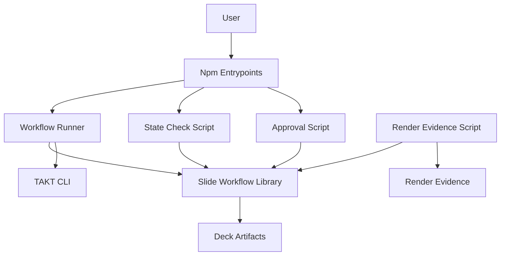

# 設計ドキュメント

## 概要

`slide-workflow-foundation` は、Marp slide workflow の再設計を進めるための deterministic foundation です。ユーザー向け entrypoint を `plan / compose / polish / deliver` にそろえ、`slides/<deck>` target、front matter schema、approval file、rerun/force semantics、render evidence foundation を scripts と docs で固定します。

この spec は workflow runner と state contract を扱います。TAKT workflow YAML/facet/output-contract の置換は後続 `slide-workflow-orchestration` が扱います。

### 目標

- `slides/<deck>` を唯一の slide workflow target にする
- report/approval の YAML front matter contract を docs と script validation で固定する
- supervision、approval、finding、loop monitor の freshness と共通語彙を foundation contract として固定する
- approval file を人間の意思決定記録として TAKT 生成物から分離する
- successful rerun、rejected rerun、`--force` invalidation の挙動を TAKT 起動前に決定する
- render evidence の保存先と metadata foundation を official deliverable から分離する
- `package.json` の `slide:*` scripts を wrapper script 経由にする

### 非目標

- `takt-marp-slide-compose`、`takt-marp-slide-polish`、`takt-marp-slide-deliver` の完成版 workflow YAML 実装
- 既存 facet/output-contract の大規模 rename または `extends` 再構成
- smoke deck の完全 end-to-end 実行と収束修正
- 旧 command の互換 alias
- full YAML parser 依存の導入

## 境界コミットメント

### このスペックが所有するもの

- command/state model の ADR と workflow docs/schema docs
- `slides/<deck>` target validation と deck path resolution
- documented subset の YAML front matter parsing
- supervision state validation と approval validation
- approval file generation CLI
- runner preflight、rerun protection、force invalidation、archive/cleanup helpers
- workflow YAML availability check と未実装 workflow 用 actionable error
- render evidence script の foundation と metadata contract
- `package.json` の `slide:*` wrapper entrypoints
- foundation-level script validation

### 境界外

- TAKT workflow YAML の canonical 4 workflow への完全置換
- TAKT agent が出す report 本文の品質設計
- built-in facet `extends` の全面適用
- visual repair loop の品質調整
- source artifacts の自動再生成方針
- `dist/<deck>/` official artifact の最終 delivery 検証

### 許可する依存

- Node.js ESM script と標準 library
- 既存 devDependency の `takt` と `@marp-team/marp-cli`
- `./node_modules/.bin/takt` の direct invocation
- 既存 `.takt/workflows/takt-marp-slide-plan.yaml` と後続で追加される canonical workflow names への workflow identity 参照
- `docs/marp-slide-workflow-redesign/*` と `.kiro/steering/roadmap.md` の command/state decision

### 再検証トリガー

- report front matter field、enum、file path の追加・改名・削除
- approval を許可する command の変更
- runner が起動する TAKT CLI path または必須 option の変更
- force invalidation が archive または clean する対象範囲の変更
- render evidence directory と `dist/<deck>/` の役割変更
- 後続 workflow YAML が supervision/approval file name を変更したとき

## アーキテクチャ

### 既存アーキテクチャ分析

現在の `package.json` は `slide:plan`、`slide:draft`、`slide:review-revise`、`slide:build-qa` から直接 TAKT workflow を起動しています。`scripts/` には slide workflow 用 helper がなく、state 判定は workflow report の存在や人間の読み取りに寄っています。

既存 deck は `slides/<deck>/brief.md`、`brief.normalized.md`、`plan.md`、`design-system.md`、`SLIDES.md`、`images/*.svg`、`review/*.md` の形を持っています。foundation はこの deck-local artifact layout を維持しながら、target を deck directory に固定します。

### アーキテクチャパターンと境界マップ

採用パターン: thin CLI wrappers plus shared deterministic library。`package.json` は wrapper scripts だけを公開し、validation、archive、cleanup、front matter parse は shared library に集約します。TAKT workflow は runner の downstream として扱い、preflight に失敗した場合は起動しません。



主要な決定:

- Shared library は state mechanics を持ち、workflow YAML の構造は持たない。
- Approval script は `plan` と `compose` だけを受け付け、TAKT agent が approval file を生成する余地を作らない。
- Runner は successful state の rerun を拒否し、rejected state の rerun は archive 後に許可する。
- `--force` は command 以降の canonical reports/approvals を archive し、generated outputs を clean するが、source artifacts は削除しない。
- Render evidence は `.takt/render/<deck>/cycle-{n}/` に置き、`dist/<deck>/` の official artifacts とは分離する。

### 技術スタック

| Layer | Choice / Version | Role in Feature | Notes |
|-------|------------------|-----------------|-------|
| CLI scripts | Node.js ESM | target/state/approval/runner/evidence CLI | 標準 library を優先する |
| Front matter parse | documented subset parser | report/approval state 判定 | 新規 dependency は追加しない |
| Workflow execution | `./node_modules/.bin/takt` | TAKT workflow 起動 | 常に `--pipeline --skip-git` |
| Render evidence | Marp CLI foundation | polish 用 evidence 生成土台 | full visual inspection は対象外 |
| Documentation | Markdown | ADR、workflow docs、schema docs | 日本語で記述する |
| Validation | Node.js script tests または npm-checkable scripts | foundation regression | smoke 完全実行は対象外 |

## ファイル構造計画

### 作成するファイル

- `docs/adr/0001-slide-workflow-command-model.md` — `plan / compose / polish / deliver`、human approval、state/report schema の決定を記録する。既存 ADR がある場合は次番号を使う。
- `docs/marp-slide-workflow-reports.md` — report、supervision、approval、loop monitor、finding、failure reason、archive naming の schema docs。
- `scripts/lib/takt-marp-slide-workflow.mjs` — target resolution、front matter parse、state/approval validation、archive、cleanup、approval file writing helper。
- `scripts/takt-marp-check-slide-workflow-state.mjs` — `--require` で supervision/approval state を検証する CLI。
- `scripts/takt-marp-approve-slide-workflow-state.mjs` — `plan`/`compose` approval file を作る CLI。
- `scripts/takt-marp-run-slide-workflow.mjs` — command preflight、rerun protection、force invalidation、TAKT invocation を行う CLI。
- `scripts/takt-marp-render-slide-workflow-evidence.mjs` — render evidence directory、metadata、optional raster availability を扱う foundation CLI。
- `scripts/takt-marp-validate-slide-workflow-foundation.mjs` — target/state/approval/parser/npm scripts の foundation regression を検証する CLI。

### 変更するファイル

- `docs/marp-slide-workflow.md` — canonical command、target contract、approval placement、output directories、旧 command 廃止を反映する。
- `package.json` — `slide:plan`、`slide:compose`、`slide:polish`、`slide:deliver`、`slide:check-state`、`slide:approve`、foundation validation entrypoint を wrapper script へ更新し、旧 `slide:draft`、`slide:review-revise`、`slide:build-qa` を削除する。

### この spec で明示的に変更しないファイル

- `.takt/workflows/*.yaml` — 後続 spec の所有。runner は workflow identity を参照できるが、YAML の再編はしない。
- `.takt/facets/**/*.md` — 後続 spec の所有。
- `slides/<deck>/SLIDES.md`、`plan.md`、`images/*.svg` — runner の archive/cleanup 対象ではない source artifacts。

## 要件トレーサビリティ

| Requirement | Summary | Components | Interfaces | Flows |
|-------------|---------|------------|------------|-------|
| 1.1 | canonical commands が `slides/<deck>` を受け付ける | NpmEntrypoints, WorkflowRunner, TargetResolver | CLI args | Command preflight |
| 1.2 | invalid target を TAKT 前に拒否する | TargetResolver, WorkflowRunner | CLI error | Command preflight |
| 1.3 | wrapper entrypoint を scripts に表示する | NpmEntrypoints | package scripts | Script discovery |
| 1.4 | 旧 command を正規 surface から外す | NpmEntrypoints | package scripts | Script discovery |
| 2.1 | report schema docs を定義する | DocsSchema, FrontMatterParser | Markdown schema | State validation |
| 2.2 | supervision schema を検証可能にする | DocsSchema, StateValidator | front matter | State validation |
| 2.3 | approval schema を検証可能にする | DocsSchema, ApprovalRecorder | front matter | Approval recording |
| 2.4 | freshness contract を検証可能にする | DocsSchema, StateValidator, ApprovalRecorder | front matter | State validation |
| 2.5 | finding/loop monitor schema を定義する | DocsSchema | Markdown schema | Loop monitoring |
| 2.6 | parser dependency を追加しない | FrontMatterParser | parser contract | State validation |
| 3.1 | `slide:check-state` の require 検証 | StateCheckScript, StateValidator | CLI args | State validation |
| 3.2 | missing/invalid state の actionable error | StateCheckScript, StateValidator | CLI error | State validation |
| 3.3 | `plan`/`compose` approval 生成 | ApprovalScript, ApprovalRecorder | CLI args | Approval recording |
| 3.4 | `polish`/`deliver` approval 拒否 | ApprovalScript | CLI error | Approval recording |
| 3.5 | `--by` 必須化 | ApprovalScript, ApprovalRecorder | CLI args | Approval recording |
| 3.6 | TAKT agent approval 生成を前提にしない | DocsSchema, ApprovalRecorder | docs contract | Approval recording |
| 4.1 | runner preflight | WorkflowRunner, StateValidator | CLI args | Runner execution |
| 4.2 | successful rerun rejection | WorkflowRunner, StateValidator | CLI error | Runner execution |
| 4.3 | rejected rerun archive | WorkflowRunner, ReportArchive | filesystem archive | Runner execution |
| 4.4 | force invalidation | WorkflowRunner, ReportArchive, GeneratedOutputCleaner | filesystem archive and cleanup | Runner execution |
| 4.5 | source artifacts を保持する | GeneratedOutputCleaner | cleanup policy | Runner execution |
| 4.6 | TAKT direct invocation | WorkflowRunner | child process | Runner execution |
| 4.7 | missing workflow YAML を TAKT 前に拒否する | WorkflowRunner | filesystem | Runner execution |
| 5.1 | evidence root と cycle 検証 | RenderEvidenceScript, TargetResolver | CLI args | Evidence foundation |
| 5.2 | evidence metadata | RenderEvidenceScript | metadata JSON | Evidence foundation |
| 5.3 | optional raster degraded mode | RenderEvidenceScript | metadata JSON | Evidence foundation |
| 5.4 | `dist` と evidence の分離 | RenderEvidenceScript, GeneratedOutputCleaner | filesystem policy | Evidence foundation |
| 6.1 | major path validation | FoundationValidation | validation CLI | Regression validation |
| 6.2 | parser/validator validation | FoundationValidation, FrontMatterParser | validation CLI | Regression validation |
| 6.3 | package scripts validation | FoundationValidation, NpmEntrypoints | package scripts | Regression validation |
| 6.4 | YAML/facet/smoke を対象外にする | FoundationValidation | validation scope | Regression validation |

## コンポーネントとインターフェース

| Component | Domain/Layer | Intent | Requirement Coverage | Key Dependencies | Contracts |
|-----------|--------------|--------|----------------------|------------------|-----------|
| DocsSchema | Documentation | command/state/report/approval/finding/loop monitor の契約を人間と agent が参照できる形で固定する | 2.1, 2.2, 2.3, 2.4, 2.5, 3.6 | roadmap P0 | State |
| NpmEntrypoints | Package | ユーザー向け `slide:*` scripts を wrapper にそろえる | 1.1, 1.3, 1.4, 6.3 | package.json P0 | Batch, State |
| SlideWorkflowLibrary | Script | CLI 群が共有する deterministic helper を提供する | 1.2, 2.2, 2.3, 2.4, 4.3, 4.4, 4.5 | Node.js P0 | Service |
| TargetResolver | Script | `slides/<deck>` target だけを deck directory として解決する | 1.1, 1.2, 5.1 | filesystem P0 | Service |
| FrontMatterParser | Script | documented subset の front matter を parse する | 2.1, 2.2, 2.3, 2.4, 6.2 | Node.js P0 | Service |
| StateValidator | Script | supervision と required state を判定する | 2.2, 3.1, 3.2, 4.1, 4.2 | FrontMatterParser P0 | Service |
| ApprovalRecorder | Script | approval validation と approval file generation を扱う | 2.3, 2.4, 3.3, 3.4, 3.5, 3.6 | StateValidator P0 | Batch |
| ReportArchive | Script | canonical report と approval の history snapshot を作る | 4.3, 4.4 | filesystem P0 | Service |
| GeneratedOutputCleaner | Script | stale generated outputs を clean し source artifacts を保持する | 4.4, 4.5, 5.4 | filesystem P0 | Service |
| WorkflowRunner | Script | preflight、workflow availability、rerun/force 制御、TAKT invocation を統合する | 4.1, 4.2, 4.3, 4.4, 4.5, 4.6, 4.7 | takt CLI P0 | Batch |
| StateCheckScript | Script | `slide:check-state` の CLI surface を提供する | 3.1, 3.2 | StateValidator P0 | Batch |
| ApprovalScript | Script | `slide:approve` の CLI surface を提供する | 3.3, 3.4, 3.5 | ApprovalRecorder P0 | Batch |
| RenderEvidenceScript | Script | polish 用 evidence directory と metadata foundation を提供する | 5.1, 5.2, 5.3, 5.4 | Marp CLI P1 | Batch |
| FoundationValidation | Validation | foundation scope の regression を検出する | 6.1, 6.2, 6.3, 6.4 | scripts and fixtures P0 | Batch |

### 共有 script library

#### TargetResolver

**責務**

- target は `slides/<deck>` の deck directory だけ受け付ける。
- `slides/<deck>/brief.md`、`.md` file、`slides/` 外 path は拒否する。
- deck name は path traversal を含まない normalized relative path として扱う。

**Service Contract**

```typescript
interface DeckTarget {
  readonly deckName: string;
  readonly deckPath: string;
  readonly reviewPath: string;
}

type TargetResolution =
  | { readonly ok: true; readonly target: DeckTarget }
  | { readonly ok: false; readonly message: string; readonly expected: "slides/<deck>" };
```

#### FrontMatterParser

**責務**

- Markdown 先頭の `---` から次の `---` までを front matter として読む。
- documented subset として scalar string、number、boolean、empty array `[]`、single-line array を扱う。
- unsupported syntax は silent fallback せず actionable parse error にする。

**採用判断**

新規 YAML parser dependency は導入しません。今回必要なのは workflow report の documented subset 判定であり、full YAML compatibility は scope 外です。

#### StateValidator

**責務**

- `review/{command}-supervision.md` の `command`、`step: supervision`、`state`、`result` を検証する。
- `--require command:state:approved` では matching approval file も検証する。
- rejected state は successful state として扱わない。

#### ApprovalRecorder

**責務**

- `plan` と `compose` だけ approval file を生成する。
- `--by` を必須にする。
- matching supervision が `result: passed` のときだけ approval を作る。
- default では既存 approval を上書きしない。
- output は YAML front matter と Markdown body を持つ。

#### ReportArchive

**責務**

- canonical report を `review/history/` へ timestamped snapshot として移動する。
- rejected rerun と force invalidation で archive reason を file name に含める。
- approval file は通常 archive しないが、force invalidation では archive 対象にする。

#### GeneratedOutputCleaner

**責務**

- force invalidation 時に stale generated output を clean する。
- `dist/<deck>/` と `.takt/render/<deck>/` は clean 対象にできる。
- `brief.md`、`brief.normalized.md`、`plan.md`、`design-system.md`、`SLIDES.md`、`images/*.svg` は削除しない。

### CLI scripts

#### WorkflowRunner

**Batch Contract**

- Trigger: `node scripts/takt-marp-run-slide-workflow.mjs <command> <target> [--force]`
- Allowed commands: `plan`、`compose`、`polish`、`deliver`
- Preconditions: valid target、command prerequisites、`.takt/workflows/takt-marp-slide-{command}.yaml` availability、TAKT executable availability、rerun/force rules
- Invocation: `./node_modules/.bin/takt --pipeline --skip-git -w takt-marp-slide-{command} -t slides/<deck>`
- Exit behavior: preflight failure と workflow YAML missing は TAKT を起動せず非ゼロ。preflight failure では archive/cleanup も実行しない。TAKT 起動後は child process の exit code を返す。

#### StateCheckScript

**Batch Contract**

- Trigger: `node scripts/takt-marp-check-slide-workflow-state.mjs <target> --require <command>:<state>[:approved]`
- Validation: supervision の `target`、`state`、`result`、`workflow_run_id` と、approval が参照する `supervision_workflow_run_id` を照合する。Supervision の `generated_at` と approval の `approved_at` は ISO 8601 として parse 必須だが、時間経過だけでは stale と判定しない。Approval 自体に `generated_at` または `workflow_run_id` は要求しない。
- Output: passed state では zero exit、missing/invalid/stale state では actionable error と non-zero exit

#### ApprovalScript

**Batch Contract**

- Trigger: `node scripts/takt-marp-approve-slide-workflow-state.mjs <target> <command> --by <name> [--force]`
- Output: `slides/<deck>/review/{command}-approval.md`
- Rejection: `polish`、`deliver`、missing `--by`、missing/pending/rejected supervision、existing approval without `--force`

#### RenderEvidenceScript

**Batch Contract**

- Trigger: `node scripts/takt-marp-render-slide-workflow-evidence.mjs <target> --cycle <n>`
- Output root: `.takt/render/<deck>/cycle-{n}/`
- Metadata: HTML/PNG attempt、PDF attempt、PDF raster attempt、tool availability、degraded reasons
- Foundation limit: visual inspection、repair、official artifact delivery は扱わない。

## データ契約

### Supervision front matter

```yaml
command: plan
target: slides/my-talk
generated_at: 2026-06-05T17:10:00+09:00
workflow_run_id: 20260605-171000-my-talk-plan
step: supervision
cycle: 1
state: planned
result: passed
human_gate: required
approval_required: true
blocking_findings: 0
major_findings: 0
minor_findings: 0
info_findings: 0
waived_major_findings: 0
decision_items_count: 0
```

### Approval front matter

```yaml
status: approved
command: plan
target: slides/my-talk
approved_state: planned
supervision_workflow_run_id: 20260605-171000-my-talk-plan
approved_by: j5ik2o
approved_at: 2026-06-05T17:11:11+09:00
waivers: []
decisions: []
```

Approval file は approval 自体の `generated_at` / `workflow_run_id` を持たず、`approved_at` と `supervision_workflow_run_id` によって freshness を判定する。

### Finding front matter

```yaml
command: polish
target: slides/my-talk
generated_at: 2026-06-05T17:20:00+09:00
workflow_run_id: 20260605-172000-my-talk-polish
step: inspect_render
role: inspect
cycle: 2
result: needs_fix
finding_id: POLISH-001
severity: major
status: persists
```

Stable finding model は `finding_id` を command 内で再利用し、同じ問題の再発を別 ID にしない。Severity は `blocker`、`major`、`minor`、`info` のいずれか、finding `status` は `new`、`resolved`、`persists`、`reopened` のいずれかに固定する。

### Loop monitor configuration

```yaml
loop_monitors:
  - cycle:
      - inspect_render
      - fix_polish
      - render_evidence
    threshold: 3
    judge:
      persona: takt-marp-slide-supervisor
      instruction: loop-monitor-reviewers-fix
      rules:
        - condition: 健全（進捗あり）
          next: inspect_render
        - condition: 非生産的（同じ指摘の反復・修正未反映）
          next: ABORT
```

Loop monitoring は deck-local report front matter ではなく TAKT workflow 直下の `loop_monitors` として定義する。`cycle` は実際に反復する step 名を順番に並べ、非生産的な反復は success supervision に進めず `ABORT` へ遷移させる。

### Render evidence metadata

```json
{
  "deck": "my-talk",
  "cycle": 1,
  "target": "slides/my-talk",
  "html_png": {
    "status": "pending",
    "files": []
  },
  "pdf": {
    "status": "pending",
    "file": null
  },
  "pdf_raster": {
    "status": "degraded",
    "reason": "pdftoppm not found",
    "files": []
  }
}
```

## エラー処理

- Invalid target は expected target と actual target を表示する。
- Missing supervision は expected file path と required front matter を表示する。
- Missing approval は `npm run slide:approve -- "slides/<deck>" <command> --by <name>` の形を案内する。
- Stale supervision/approval は expected target、observed target、canonical supervision workflow_run_id、approval が参照している supervision_workflow_run_id を表示する。Approval の `supervision_workflow_run_id` が canonical passed supervision の `workflow_run_id` と一致しない場合は stale と判定する。
- Successful rerun rejection は `--force` の効果と archive/cleanup 対象を表示する。
- Unsupported approval command は `plan` と `compose` だけが対象であることを表示する。
- Missing workflow YAML は expected path `.takt/workflows/takt-marp-slide-{command}.yaml` と、後続 `slide-workflow-orchestration` が workflow 本体を所有することを表示する。
- TAKT executable missing は `npm install` または dependency availability を確認する message にする。

## テスト戦略

- Target validation: valid `slides/<deck>` と invalid `slides/<deck>/brief.md`、外部 path を検証する。
- Parser validation: documented subset の scalar、boolean、number、empty array、unsupported syntax error を検証する。
- State validation: passed supervision、rejected supervision、missing approval、approved state、stale supervision/approval を検証する。
- Approval validation: `plan`/`compose` 作成、`polish`/`deliver` 拒否、missing `--by` 拒否、overwrite refusal を検証する。
- Runner validation: successful rerun refusal、rejected rerun archive、force invalidation archive/cleanup/source preservation、invalid target と missing workflow YAML の preflight failure before TAKT invocation を検証する。
- Render evidence validation: evidence root と `metadata.json` の生成、optional raster degraded mode、`dist/<deck>/` と分離された path を検証する。
- Package validation: `slide:*` scripts が wrapper scripts にそろい、旧 command scripts が残っていないことを検証する。

## 実装メモ

- `scripts/lib/takt-marp-slide-workflow.mjs` は複数 CLI の共有点ですが、抽象化は target/state/archive/cleanup の実需要に限定します。
- Foundation validation は fixture を一時 directory に作り、既存 `slides/` の source artifacts を変更しない形にします。
- `takt-marp-render-slide-workflow-evidence.mjs` は foundation として metadata と保存先契約を優先し、後続 `polish` workflow が使う完全な render/inspect loop は実装しません。
- `research.md` は通常の design skill では作成対象ですが、この spec ではユーザー指定により spec directory 配下の生成対象を4ファイルに限定します。
