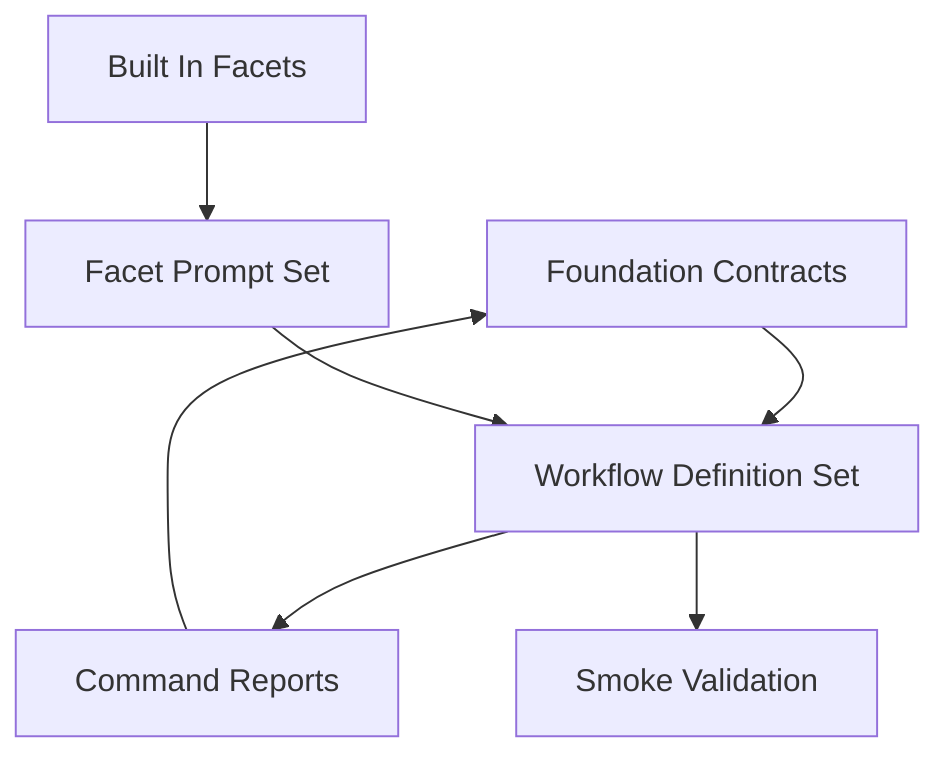

# 設計ドキュメント

## 概要

`slide-workflow-orchestration` は、Marp slide workflow の TAKT orchestration layer を `plan / compose / polish / deliver` の4 commandへ置き換える設計です。`slide-workflow-foundation` が提供する `slides/<deck>` target、supervision/approval front matter、runner preflight、render evidence foundation を依存契約として扱い、この spec は workflow YAML と facet/output-contract のみを所有します。

### 目標

- `.takt/workflows/` を4つの canonical workflow にそろえる
- 旧 `draft`、`review-revise`、`build-qa` workflow を alias なしで削除する
- 各 workflow に work、review/inspect/verify、fix、supervision を閉じ込め、TAKT `loop_monitors` で反復を監視する
- report 名を `{command}-{role}.md` に統一し、foundation の front matter contract に合わせる
- 汎用 mechanics を built-in facet の `{extends:<parent>}` に寄せ、local facet を Marp/slide 固有の thin-diff にする
- supervision と loop monitor の persona を追加して責務を分離する

### 非目標

- `scripts/` 配下の deterministic helper 実装
- `slide:approve`、front matter parser、workflow runner の実装
- smoke deck の実行、render 品質の収束修正、成果物の最終調整
- workflow 内 git 操作
- 旧 workflow 名の互換 alias

## 境界コミットメント

### このスペックが所有するもの

- `.takt/workflows/takt-marp-slide-plan.yaml`
- `.takt/workflows/takt-marp-slide-compose.yaml`
- `.takt/workflows/takt-marp-slide-polish.yaml`
- `.takt/workflows/takt-marp-slide-deliver.yaml`
- `.takt/workflows/takt-marp-slide-draft.yaml`、`.takt/workflows/takt-marp-slide-review-revise.yaml`、`.takt/workflows/takt-marp-slide-build-qa.yaml` の削除判断
- `.takt/facets/personas/` の slide workflow 向け persona 再編
- `.takt/facets/policies/` の slide/Marp/SVG/worker boundary policy 再編
- `.takt/facets/instructions/` の command step 用 instruction 再編
- `.takt/facets/output-contracts/` の canonical report contract 再編
- workflow と facet の参照整合性検証

### 境界外

- `scripts/lib/takt-marp-slide-workflow.mjs`、state check、approval、runner、render evidence script の変更
- `package.json` の command surface 変更
- `docs/marp-slide-workflow*.md` と ADR の foundation 契約変更
- `slides/<deck>` の source artifacts 生成または修正
- smoke deck 実行で見つかる文面、SVG、layout の最終調整
- TAKT built-in facet 本体の変更

### 許可する依存

- `slide-workflow-foundation` の report schema、approval ownership、runner preflight、force/rerun、render evidence foundation
- TAKT workflow YAML schema、parallel step、rules、`COMPLETE`、`ABORT`
- TAKT facet の persona、policy、instruction、knowledge、output contract の合成規則
- instruction、policy、knowledge、output contract facet の `{extends:<parent>}` 機構
- TAKT built-in facets: `supervisor` persona、`qa`、`review`、`coding`、`design-fidelity` policy、`fix`、`loop-monitor-reviewers-fix`、`supervise` instruction、`supervisor-validation` output contract
- 既存 `.takt/facets/knowledge/takt-marp-repo-conventions.md`

### 再検証トリガー

- foundation の supervision front matter field、state enum、approval policy、render evidence path が変わる
- TAKT の `{extends:<parent>}` 解決ルールまたは persona 継承可否が変わる
- runner が期待する workflow name または `slides/<deck>` target contract が変わる
- canonical report 名 `{command}-{role}.md` または role set を変更する
- `polish` と `deliver` の責務境界を変える

### Foundation readiness gate

この spec は `slide-workflow-foundation` の実装完了を blocking prerequisite とする。実装に入る前に、少なくとも次が現在の worktree で確認できなければならない。

- `package.json` の `slide:plan`、`slide:compose`、`slide:polish`、`slide:deliver` が `scripts/takt-marp-run-slide-workflow.mjs` 経由になっている。
- `scripts/takt-marp-run-slide-workflow.mjs`、`scripts/takt-marp-check-slide-workflow-state.mjs`、`scripts/takt-marp-approve-slide-workflow-state.mjs`、`scripts/takt-marp-render-slide-workflow-evidence.mjs`、`scripts/takt-marp-validate-slide-workflow-foundation.mjs` が存在する。
- foundation validation command が成功し、runner が `slides/<deck>` target、state prerequisites、approval freshness、rerun/force semantics を TAKT 起動前に検証できる。
- `docs/marp-slide-workflow-reports.md` または同等の schema docs で supervision、finding、loop monitor、approval front matter contract が確定している。

この gate が満たされない場合、orchestration workflow/facet を実装してはいけない。先に `slide-workflow-foundation` を完了させるか、foundation spec の状態を修正してから本 spec に戻る。

## アーキテクチャ

### 既存状態

現在の `.takt/workflows/` は `takt-marp-slide-plan`、`takt-marp-slide-draft`、`takt-marp-slide-review-revise`、`takt-marp-slide-build-qa` の4本です。`review-revise` は review/fix をトップレベル command として露出し、`build-qa` は build、render inspection、visual repair、delivery に近い確認を混在させています。

既存 facet には `takt-marp-slide-planner`、`takt-marp-slide-writer`、`takt-marp-slide-reviewer`、`takt-marp-slide-reviser`、`takt-marp-slide-qa` と Marp 固有 instruction/output contract が揃っています。一方で、loop monitor と final supervision は専用 persona になっておらず、report 名も `plan-gate.md`、`draft-gate.md`、`qa-report.md` のように command/state model と揃っていません。

### 採用パターン

採用パターン: canonical workflow set plus thin-diff facets。workflow YAML は4 command の実行順とルーティングを宣言し、共通の判断形式は output contract と built-in extends へ寄せます。local facets は Marp/slide 固有の制約、成果物境界、report front matter の差分だけを持ちます。

主要な決定:

- `review`、`fix`、`supervise` は workflow step であり、ユーザー向け command ではない。Loop monitoring は workflow 直下の `loop_monitors` 設定で扱う。
- `compose` は render output を要求しない。render evidence は `polish` の依存契約として扱う。
- `plan.md` は delivery artifact request の owner であり、`deliverables: [html|pdf|pptx]` を authoritative field として持つ。
- `polish` は最初に foundation の render evidence script を呼び、生成された `.takt/render/<deck>/cycle-{n}/metadata.json` を inspection の入力にする。
- `polish` は `design-system.md`、`SLIDES.md`、`images/*.svg` の visual/layout/render/design-token 関連修正に限定し、plan-level content を変更しない。
- `deliver` は official artifact の build/verification だけを扱い、visual inspection は再実施しない。
- 通常の `deliver` 実行における `dist/<deck>/` pre-clean は orchestration の `build_delivery` step が所有し、foundation の `--force` cleanup とは別の通常実行責務として扱う。
- TAKT `loop_monitors` は fix/review cycle の反復を監視し、supervision は詳細 review の再実施ではなく完了契約の検証を担う。
- persona facet は TAKT の継承対象外なので built-in supervisor を直接 extends せず、local persona として役割を定義する。
- canonical report は `{command}-{role}.md` ごとに1つだけ生成する。複数の work substep が同じ `plan-work.md` や `compose-work.md` を直接出力してはならない。複数 substep の成果は専用の work summary step で集約し、canonical work report はその step だけが出力する。
- deterministic side effect を持つ step は、agent の自己申告だけで成功扱いしない。`render_evidence`、`build_delivery`、`verify_delivery` は command gate または同等の機械検証で、期待ファイルの存在、front matter/schema、clean/export 結果を確認してから次 step へ進める。

## ファイル構造計画

### 作成するファイル

- `.takt/workflows/takt-marp-slide-compose.yaml` — compose command の design system、slide/SVG composition、compose review/fix/supervision と TAKT `loop_monitors` を定義する。
- `.takt/workflows/takt-marp-slide-polish.yaml` — render evidence 参照、visual/layout/render inspection、修正ループ、polish supervision を定義する。
- `.takt/workflows/takt-marp-slide-deliver.yaml` — official artifact build/verification、delivery fix loop、deliver supervision を定義する。
- `.takt/facets/personas/takt-marp-slide-supervisor.md` — command 全体の完了契約を検証する final supervision persona。
- `.takt/facets/policies/takt-marp-general-slide-quality.md` — slide 一般の品質基準を持つ local policy。利用可能なら built-in `qa` を `{extends:qa}` する。
- `.takt/facets/instructions/takt-marp-compose-review.md` — compose 成果物を content/design/SVG の観点で検証する instruction。
- `.takt/facets/instructions/takt-marp-compose-fix.md` — compose review finding だけを反映する fix instruction。
- `.takt/facets/instructions/takt-marp-polish-inspect.md` — render evidence と source artifacts を照合する polish inspection instruction。
- `.takt/facets/instructions/takt-marp-polish-fix.md` — visual/layout/render finding だけを修正する instruction。
- `.takt/facets/instructions/takt-marp-deliver-build.md` — official delivery artifact の build を扱う instruction。
- `.takt/facets/instructions/takt-marp-deliver-verify.md` — `dist/<deck>/` の delivery completeness を検証する instruction。
- `.takt/facets/instructions/takt-marp-deliver-fix.md` — delivery verification finding だけを修正する instruction。
- `.takt/facets/instructions/takt-marp-supervise-command.md` — built-in `supervise` を可能なら `{extends:supervise}` し、slide command completion を追加する instruction。
- `.takt/facets/output-contracts/takt-marp-command-work.md` — work step 用の canonical front matter と body contract。
- `.takt/facets/output-contracts/takt-marp-command-review.md` — review/inspect/verify step 用の finding contract。
- `.takt/facets/output-contracts/takt-marp-command-fix.md` — fix step 用の対応記録 contract。
- `.takt/facets/output-contracts/takt-marp-supervision.md` — foundation の supervision front matter と一致する final supervision contract。

### 変更するファイル

- `.takt/workflows/takt-marp-slide-plan.yaml` — plan command を intake/normalize/plan/review/fix/supervise と TAKT `loop_monitors` の閉じた workflow に更新する。
- `.takt/facets/personas/takt-marp-slide-planner.md` — plan の work/review/fix で使える境界に整理する。
- `.takt/facets/personas/takt-marp-slide-writer.md` — compose の writing/SVG generation 境界に整理する。
- `.takt/facets/personas/takt-marp-slide-reviewer.md` — command-local review/inspect/verify に寄せる。
- `.takt/facets/personas/takt-marp-slide-reviser.md` — command-local fix に寄せる。
- `.takt/facets/personas/takt-marp-slide-qa.md` — top-level QA command 用ではなく polish/deliver の検証補助として残すか、参照されない場合は削除候補にする。
- `.takt/facets/policies/takt-marp-slide-quality.md` — Marp Markdown/front matter/slide artifact 固有制約に縮小する。
- `.takt/facets/policies/takt-marp-svg-first-visual.md` — SVG-first visual policy に限定し、利用可能なら built-in `design-fidelity` を `{extends:design-fidelity}` する。
- `.takt/facets/policies/takt-marp-worker-boundary.md` — TAKT worker の禁止事項と `--skip-git` 前提に限定し、利用可能なら built-in `coding` を `{extends:coding}` する。
- `.takt/facets/instructions/takt-marp-intake.md`、`takt-marp-normalize-brief.md`、`takt-marp-plan.md` — plan work step の成果物境界と report contract に合わせる。
- `.takt/facets/instructions/takt-marp-design-system.md`、`takt-marp-draft.md`、`takt-marp-visual-generate.md` — compose 命名と成果物境界に合わせる。
- `.takt/facets/output-contracts/takt-marp-plan.md`、`takt-marp-design-system.md` — canonical work report family へ統合または thin wrapper 化する。
- `.takt/facets/output-contracts/takt-marp-review.md`、`takt-marp-revision-log.md`、`takt-marp-qa-report.md`、`takt-marp-visual-fix-log.md`、`takt-marp-human-gate.md` — canonical output contract family へ統合または削除候補にする。

### 削除するファイル

- `.takt/workflows/takt-marp-slide-draft.yaml`
- `.takt/workflows/takt-marp-slide-review-revise.yaml`
- `.takt/workflows/takt-marp-slide-build-qa.yaml`
- canonical workflow から参照されなくなった旧 instruction/output-contract/persona facet。削除は参照グラフ確認後に行う。

### 変更しないファイル

- `scripts/**/*.mjs`
- `package.json`
- `docs/**/*.md`
- `slides/**`
- `.kiro/specs/slide-workflow-foundation/**`

## Workflow Contract

### takt-marp-slide-plan

| Step | Role | Primary artifacts | Report |
|------|------|-------------------|--------|
| `intake` | work | brief availability decision | - |
| `normalize_brief` | work | `brief.normalized.md` | - |
| `plan_deck` | work | `plan.md` | - |
| `summarize_plan_work` | work | work step evidence summary | `plan-work.md` |
| `review_plan` | review | plan findings | `plan-review.md` |
| `fix_plan` | fix | corrected normalized brief or plan | `plan-fix.md` |
| `supervise_plan` | supervision | command completion decision | `plan-supervision.md` |

`plan-work.md` は `summarize_plan_work` だけが出力する。`intake`、`normalize_brief`、`plan_deck` は source artifact を作成・更新するが、同じ canonical report を重複出力しない。

### takt-marp-slide-compose

| Step | Role | Primary artifacts | Report |
|------|------|-------------------|--------|
| `design_system` | work | `design-system.md` | - |
| `compose_slides` | work | `SLIDES.md` | - |
| `generate_visuals` | work | `images/*.svg` | - |
| `summarize_compose_work` | work | work step evidence summary | `compose-work.md` |
| `review_compose` | review | compose findings | `compose-review.md` |
| `fix_compose` | fix | corrected compose source artifacts | `compose-fix.md` |
| `supervise_compose` | supervision | command completion decision | `compose-supervision.md` |

`compose-work.md` は `summarize_compose_work` だけが出力する。`design_system`、`compose_slides`、`generate_visuals` は source artifact を作成・更新するが、同じ canonical report を重複出力しない。

### takt-marp-slide-polish

| Step | Role | Primary artifacts | Report |
|------|------|-------------------|--------|
| `render_evidence` | work | `.takt/render/<deck>/cycle-{n}/metadata.json` | `polish-work.md` |
| `inspect_render` | inspect | render evidence findings | `polish-inspect.md` |
| `fix_polish` | fix | visual/layout/render/design-token-only source corrections | `polish-fix.md` |
| `supervise_polish` | supervision | command completion decision | `polish-supervision.md` |

`polish` は foundation の render evidence script を workflow step から呼ぶが、script 自体は実装しない。修正対象は `design-system.md`、`SLIDES.md`、`images/*.svg` の visual/layout/render/design-token 関連に限定する。

`render_evidence` は `scripts/takt-marp-render-slide-workflow-evidence.mjs` を呼び、command gate で `.takt/render/<deck>/cycle-{n}/metadata.json` の存在、target、cycle、HTML/PDF status、degraded reason の schema を検証する。metadata が missing または invalid の場合は `inspect_render` へ進まず `ABORT` に進む。

### takt-marp-slide-deliver

| Step | Role | Primary artifacts | Report |
|------|------|-------------------|--------|
| `build_delivery` | work | `dist/<deck>/` artifacts | `deliver-work.md` |
| `verify_delivery` | verify | delivery completeness findings | `deliver-verify.md` |
| `fix_delivery` | fix | delivery-only corrections | `deliver-fix.md` |
| `supervise_delivery` | supervision | command completion decision | `deliver-supervision.md` |

`deliver` は visual inspection を再実施せず、official artifact の存在、読み取り可能性、metadata/report contract の整合だけを扱う。`build_delivery` は export 前に `dist/<deck>/` を clean する。作る artifact 種別は `plan.md` の `deliverables` を authoritative input とし、`brief.md` の自由記述を直接解釈しない。未対応の deliverable は plan review finding として扱い、deliver step では新規種別を追加しない。

`build_delivery` は command gate で `dist/<deck>/` が export 前に clean されたことと、`plan.md` の `deliverables` に対応する official artifacts だけが生成されたことを検証する。`verify_delivery` は agent の report だけでなく、`dist/<deck>/` の存在、読み取り可能性、不要 artifact の absence を検証対象に含める。

## Facet Contract

### Policy split

| Policy | 役割 | extends 方針 |
|--------|------|--------------|
| `takt-marp-general-slide-quality` | slide 一般の品質、finding severity、完了判定 | `{extends:qa}` を候補にする |
| `takt-marp-slide-quality` | Marp Markdown、front matter、deck local artifacts | `takt-marp-general-slide-quality` または local-only thin diff |
| `takt-marp-svg-first-visual` | SVG-first visual、Kroki/SVG、text overflow、viewport | `{extends:design-fidelity}` を候補にする |
| `takt-marp-worker-boundary` | workflow agent の禁止事項、git 操作禁止、approval 生成禁止 | `{extends:coding}` を候補にする |

### Persona split

| Persona | 役割 |
|---------|------|
| `takt-marp-slide-planner` | brief normalization と plan 作成 |
| `takt-marp-slide-writer` | design system、SLIDES.md、SVG source 作成 |
| `takt-marp-slide-reviewer` | command-local review/inspect/verify |
| `takt-marp-slide-reviser` | command-local fix |
| `takt-marp-slide-supervisor` | command completion contract の final validation |

### Output contract family

| Contract | 用途 | 必須 front matter |
|----------|------|-------------------|
| `takt-marp-command-work` | work step の成果物要約 | `command`, `step`, `role`, `cycle`, `result` |
| `takt-marp-command-review` | review/inspect/verify finding | `command`, `step`, `role`, `cycle`, `result`, finding counts |
| `takt-marp-command-fix` | finding 対応結果 | `command`, `step`, `role`, `cycle`, `result`, `resolved_finding_ids`, `persisting_finding_ids`, `introduced_finding_ids` |
| `takt-marp-supervision` | final supervision | foundation の supervision front matter field |

## 要件トレーサビリティ

| Requirement | Summary | Components | Interfaces | Flows |
|-------------|---------|------------|------------|-------|
| 1.1 | 4 canonical workflow を提供する | WorkflowDefinitionSet | TAKT workflow YAML | Command surface |
| 1.2 | 旧 workflow を残さない | OldWorkflowRemoval | filesystem | Migration |
| 1.3 | alias を追加しない | WorkflowDefinitionSet | workflow names | Command surface |
| 1.4 | snake_case step 名 | WorkflowDefinitionSet | step schema | YAML validation |
| 2.1 | workflow 内部に品質ループを持つ | WorkflowLoopTopology | rules | Closed loop |
| 2.2 | fix と TAKT loop_monitors を経由する | WorkflowLoopTopology, LoopMonitorConfig | rules | Finding loop |
| 2.3 | 非収束を停止へ導く | LoopMonitorConfig | TAKT loop_monitors | Finding loop |
| 2.4 | supervision は完了契約を検証する | SupervisionFacet | report contract | Final validation |
| 3.1 | plan 成果物境界 | PlanWorkflow | report contract | Plan command |
| 3.2 | compose 成果物境界 | ComposeWorkflow | report contract | Compose command |
| 3.3 | polish 成果物境界 | PolishWorkflow | report contract | Polish command |
| 3.4 | deliver 成果物境界 | DeliverWorkflow | report contract | Deliver command |
| 3.5 | approval file を生成・要求しない | WorkflowDefinitionSet, WorkerBoundaryPolicy | policy | Human gate |
| 3.6 | `plan.md` deliverables を delivery request owner にする | PlanWorkflow, DeliverWorkflow | `plan.md` | Delivery command |
| 3.7 | deliver 前に `dist/<deck>/` を clean する | DeliverWorkflow | filesystem | Delivery command |
| 4.1 | report 名を統一する | CommandReportContracts | output contracts | Reporting |
| 4.2 | supervision schema を合わせる | SupervisionReportContract | front matter | State validation |
| 4.3 | TAKT loop_monitors を使う | LoopMonitorConfig | TAKT loop_monitors | Loop monitoring |
| 4.4 | QA を top-level 名に使わない | WorkflowDefinitionSet | naming | Command surface |
| 5.1 | built-in extends を採用する | BuiltInExtendsAdoption | facet directive | Prompt composition |
| 5.2 | persona extends を使わない | PersonaSet | persona facet | Prompt composition |
| 5.3 | policy 責務を分離する | PolicySet | policy facets | Prompt composition |
| 5.4 | supervisor persona を追加する | PersonaSet | persona facets | Prompt composition |
| 5.5 | output contract family を統一する | CommandReportContracts | output contracts | Reporting |
| 6.1 | YAML schema と参照解決を検証する | TaktWorkflowValidation | TAKT doctor | Validation |
| 6.2 | 旧 workflow 残存を検証する | OldWorkflowRemoval | filesystem | Validation |
| 6.3 | facet 参照を検証する | TaktWorkflowValidation | TAKT doctor | Validation |
| 6.4 | smoke を対象外にする | ValidationBoundary | validation scope | Handoff |

## コンポーネントとインターフェース

| Component | Domain/Layer | Intent | Requirement Coverage | Key Dependencies | Contracts |
|-----------|--------------|--------|----------------------|------------------|-----------|
| WorkflowDefinitionSet | TAKT YAML | 4 canonical workflow と command surface を定義する | 1.1, 1.3, 1.4, 3.5, 4.4 | foundation runner P0 | Batch, State |
| PlanWorkflow | TAKT YAML | plan command の閉じた品質ループを定義する | 2.1, 2.2, 3.1 | WorkflowDefinitionSet P0 | Batch |
| ComposeWorkflow | TAKT YAML | compose command の閉じた品質ループを定義する | 2.1, 2.2, 3.2 | WorkflowDefinitionSet P0 | Batch |
| PolishWorkflow | TAKT YAML | polish command の render evidence inspection と修正ループを定義する | 2.1, 2.2, 3.3 | foundation render evidence P0 | Batch |
| DeliverWorkflow | TAKT YAML | delivery artifact build/verification と修正ループを定義する | 2.1, 2.2, 3.4 | foundation delivery paths P0 | Batch |
| WorkflowLoopTopology | TAKT YAML | review/fix/supervise のルーティングと `loop_monitors` をそろえる | 2.1, 2.2, 2.3, 2.4 | TAKT rules P0 | State |
| OldWorkflowRemoval | Migration | 旧 workflow を alias なしで除去する | 1.2, 6.2 | filesystem P0 | Batch |
| FacetPromptSet | Facets | canonical workflows が参照する persona/policy/instruction/knowledge/output contract の集合を管理する | 5.3, 5.5, 6.3 | TAKT facet composition P0 | State |
| PersonaSet | Facets | slide-specific persona 境界を定義する | 5.2, 5.4 | TAKT persona composition P0 | State |
| PolicySet | Facets | slide/Marp/SVG/worker policy の責務を分離する | 5.1, 5.3 | built-in policies P1 | State |
| InstructionSet | Facets | command step ごとの手順を定義する | 2.1, 2.2, 3.1, 3.2, 3.3, 3.4 | built-in instructions P1 | Batch |
| CommandReportContracts | Facets | canonical report family を提供する | 4.1, 4.2, 5.5 | foundation report schema P0 | State |
| DeterministicStepGate | TAKT YAML | render evidence、delivery clean/export、artifact verification の機械実行と検証を保証する | 3.3, 3.7, 6.1 | foundation scripts P0 | Batch |
| LoopMonitorConfig | TAKT YAML | fix/review cycle の `cycle`、`threshold`、`judge` を定義する | 2.2, 2.3, 4.3 | TAKT loop_monitors P0 | State |
| SupervisionReportContract | Facets | final supervision report を foundation schema に合わせる | 2.4, 4.2 | CommandReportContracts P0 | State |
| SupervisionFacet | Facets | command completion contract を検証する | 2.4, 4.2 | built-in supervise P1 | State |
| BuiltInExtendsAdoption | Facets | local facets を thin-diff にする | 5.1, 5.2 | TAKT extends P1 | State |
| TaktWorkflowValidation | Validation | workflow/facet 参照と schema を検証する | 6.1, 6.3 | TAKT doctor P0 | Batch |
| ValidationBoundary | Validation | smoke と deterministic script 実装を対象外に保つ | 6.4 | roadmap P0 | State |

### Batch Contract: workflow invocation

- Trigger: foundation runner が `takt-marp-slide-{command}` を TAKT workflow name として起動する。
- Input target: `slides/<deck>`。target validation は foundation の責務。
- Workflow names: `takt-marp-slide-plan`、`takt-marp-slide-compose`、`takt-marp-slide-polish`、`takt-marp-slide-deliver`。
- Exit behavior: TAKT step routing が `COMPLETE` または `ABORT` に到達する。runner preflight と rerun/force はこの spec では変更しない。
- Prerequisite: foundation readiness gate が成功していること。runner、state check、approval、render evidence、foundation validation が存在しない状態では workflow YAML を実装しない。

### State Contract: canonical reports

Canonical reports は `slides/<deck>/review/` に配置され、front matter は foundation が読む documented subset に収まる。supervision report は少なくとも `command`、`step: supervision`、`state`、`result`、finding counts、approval requirement を持つ。

Canonical report file name は command 内で一意である。同じ workflow 実行内で同じ `{command}-{role}.md` を複数 step が出力してはならない。複数 work artifact の証跡は `summarize_*_work` step でまとめる。

## エラー処理

- Missing prerequisite は workflow 内で source artifact path と必要な prior command state を report に記録し、曖昧な成功にしない。
- Fix が安全に実行できない場合は `ABORT` へ進め、supervision の成功 report を出さない。
- Loop monitor が非収束を検出した場合は、同じ finding id と cycle history を report へ記録して停止する。
- Supervision が report schema 不一致、成果物境界違反、未解消 finding を検出した場合は `result: rejected` の supervision report を出す。
- Old workflow name は alias で受けず、存在しない workflow として扱う。

## テスト戦略

- Workflow file validation: 4 canonical YAML が TAKT workflow schema に合い、参照 facet が解決できることを確認する。
- Foundation readiness validation: foundation scripts、wrapper scripts、schema docs、foundation validation command が揃っていることを確認する。
- Removal validation: 旧3 workflow file が `.takt/workflows/` に残っていないことを確認する。
- Naming validation: step name が snake_case、report name が `{command}-{role}.md` であることを確認する。
- Report uniqueness validation: 同一 workflow 内で同じ canonical report name が複数 step から出力されないことを確認する。
- Deterministic step validation: `render_evidence`、`build_delivery`、`verify_delivery` に command gate または同等の機械検証があり、成果物 missing 時に次 step へ進まないことを確認する。
- Report contract validation: supervision と loop monitor output contract が foundation の schema field と一致することを確認する。
- Facet validation: persona に `{extends:<parent>}` がなく、instruction/policy/knowledge/output-contract だけが extends を使うことを確認する。
- Boundary validation: `compose` が render output を要求しない、`polish` が plan-level content を変更対象にしない、`deliver` が visual inspection を持たないことを YAML/facet 文面で確認する。
- Handoff validation: smoke deck 実行と deterministic script 実装が tasks の完了条件に混入していないことを確認する。

## 実装メモ

- 旧 facet の削除は、canonical workflow から参照されないことを確認してから行う。
- `{extends:<parent>}` は bare facet name だけを使う。path reference や `@scope` reference は使わない。
- built-in extends は採用候補を優先するが、Marp 固有の内容が過度に薄くならない場合だけ採用する。
- `QA` は過去の概念として説明に出す場合を除き、workflow name、step role、report role には使わない。
- この design では `research.md` を生成しない。ユーザー指定により spec directory 配下の生成対象を4ファイルに限定する。
