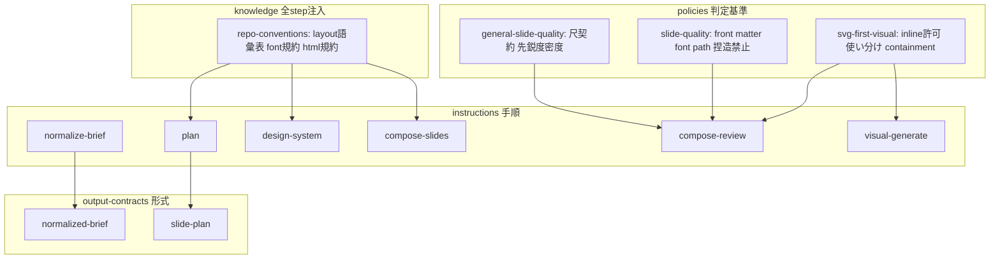
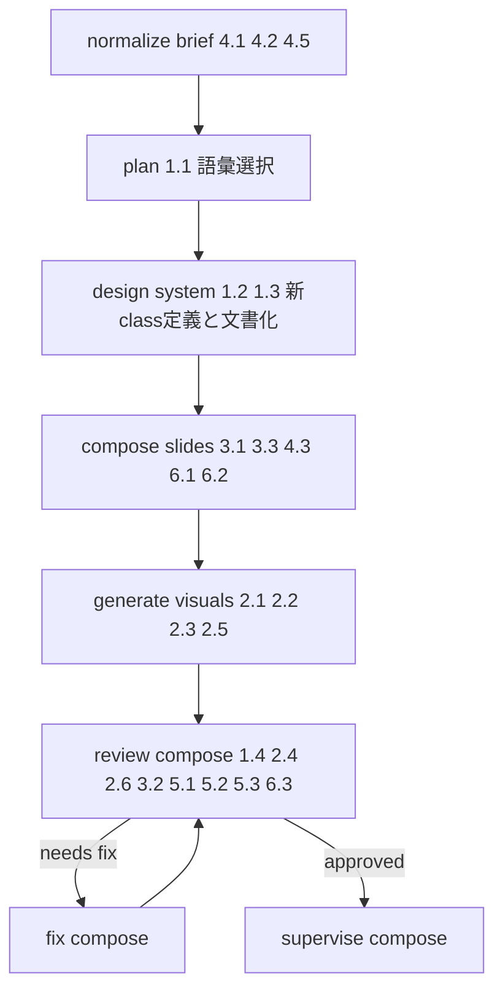

# 技術設計書: slide-workflow-quality-uplift

## 概要

**Purpose（目的）**: 本機能は slide workflow の利用者に対し、plan / compose / polish / deliver が産出するスライドの品質定義を実証済み到達水準(`slides/takt-sdd/SLIDES.md` HEAD)へ引き上げ、人手修正を構造的再構築から微調整へ縮小する価値を提供する。

**Users（ユーザー）**: workflow 利用者(deck 作成者)が brief 投入からスライド生成・review・修正の全工程で利用する。workflow メンテナが品質定義の保守と配布同期に利用する。

**Impact（影響）**: 現在の facets(品質次元を「定義していない・禁止している・存在チェック止まり」の状態)を、layout 語彙の開放、inline SVG のガードレール付き許可、speaker notes の尺契約、発表コンテキスト入力契約、先鋭度・密度 review 基準、機械的描画規約の明文化によって変更する。workflow の YAML 構造・scripts・report schema は変更しない。

### 目標

- plan が要求する layout が compose でそのまま実現され、未実現が review で blocker として検出される
- inline SVG が品質規約(フォントスタック・containment)つきで利用でき、規約逸脱が review で検出される
- 発表時間が確定した brief から、尺マーカーと強調点を含む speaker notes が生成される
- イベント名・登壇者・事実根拠が体系的に収集され、成果物に反映され、捏造が禁止される
- 全変更が既存契約(7.1)・配布同期(7.2)・mock smoke(7.3)・既存 deck 非破壊(7.4)と整合する

### 非目標

- workflow の command/state/report/approval contract の再設計
- render 結果の知覚に基づく視覚判定(後続 `slide-workflow-visual-review` が所有)
- repo-local な build 入口参照・font path の portability 問題の解決
- TAKT 本体・provider の変更、既存 deck(`slides/takt-sdd/` 等)の再生成
- 新規 policy / knowledge / workflow ファイルの追加(既存 facet の拡張に閉じる)

## 境界コミットメント

### このスペックが所有するもの

- facet(instructions / policies / output-contracts / knowledge)に記述される**品質定義の内容**: layout 語彙、inline SVG 規約、notes 尺契約、発表コンテキスト入力契約、先鋭度・密度基準、機械的描画規約
- layout 語彙の単一定義源(`takt-marp-repo-conventions.md` 内の語彙表)と、その参照規約
- compose-review の review 観点リスト(既存 report 契約・severity 分類の**利用**側)
- `docs/marp-slide-workflow.md` の brief テンプレート・Layout 語彙節(repo-local 人間向け文書)
- 変更した facet の `templates/project/facets/**` への同期

### 境界外

- report front matter schema・severity 分類の定義そのもの(`slide-workflow-foundation` 所有。本 spec は利用のみ)
- workflow YAML の step 構成・rules・loop monitor(`slide-workflow-orchestration` 所有。本 spec は YAML を変更しない)
- AI antipattern gate の判定範囲(`slide-workflow-ai-quality-gate` 所有。先鋭度・密度は通常品質であり gate 側に追加しない)
- template 同期・drift 検証の機構(`takt-marp-global-installer` 所有。本 spec は実行のみ)
- render evidence の生成機構・`polish-inspect` の観点(変更しない)
- 「ついでに」取り込んではならない変更: intake の hard-block 必須見出しの追加、`deliverables:` 行の形式変更、personas の改訂

### 許可する依存

- `output-contracts/takt-marp-command-review.md` の Findings テーブル形式と front matter schema(変更せず準拠)
- `policies/takt-marp-general-slide-quality.md` の severity 分類(blocker/major/minor/info。再定義せず利用)
- plan / compose 両 workflow の全 step に注入済みの `knowledge: takt-marp-repo-conventions` 配線
- `npm run installer:sync-templates` / `installer:check-templates` / `npm test` / `npm run slide:smoke`
- 違反してはならない制約: scripts(`scripts/**`)・workflow YAML(`.takt/workflows/**`)・`marp.config.mjs`・`package.json` を変更しない

### 再検証トリガー

以下の変更が起きた場合、依存スペック・利用側の再確認を要する。

- layout 語彙表の形式または置き場所の変更 → 後続 `slide-workflow-visual-review`(語彙を視覚判定に利用)の再確認
- `normalized-brief` / `slide-plan` contract の必須セクション変更 → plan / compose workflow の実行確認と template 再同期
- severity 既定マッピング(エラーハンドリング節)の変更 → compose-review / fix の挙動再確認
- 尺マーカー canonical format の変更 → review の整合判定(3.2)と参照実装の突合の再実施

## アーキテクチャ

### 既存アーキテクチャ分析

品質定義は 4 種の facet として workflow step に注入される(詳細は `research.md`):

- **knowledge**(`takt-marp-repo-conventions`)— plan / compose 両 workflow の全 step に注入済み。リポジトリ規約の単一置き場
- **policies** — 判定基準。general-slide-quality(一般品質+severity)/ slide-quality(Marp 固有)/ svg-first-visual(SVG)は相互に「扱うこと/扱わないこと」を宣言し合う
- **instructions** — step ごとの手順(normalize-brief、plan、design-system、compose-slides、visual-generate、compose-review 等)
- **output-contracts** — 成果物形式(normalized-brief、slide-plan は本文構造、command-review は front matter+Findings テーブル)

維持すべき統合ポイント: review⇄fix 閉ループ(loop monitor threshold 3)、`Report Directory` 正本ルール、`deliverables:` 行の script 解析、mock smoke の合成 report 検証。

解消する技術的負債: layout enum の 4 箇所重複(docs / plan instruction / slide-plan contract / design-system instruction)と既存不整合、`repo-conventions` の stale な Kroki 記述。

### アーキテクチャパターンと境界マップ



**Architecture Integration（アーキテクチャ統合）**:
- 採用パターン: 既存 facet 拡張のみ(新規ファイルゼロ)。「policy に判定基準、compose-review に観点、既存 severity と report 契約で報告」を全 review 系要件の統一パターンとする
- ドメイン境界: 語彙定義(knowledge)→ 判定基準(policy)→ 手順(instruction)→ 形式(contract)の既存 4 層を維持。依存方向は knowledge ← policy ← instruction の順に参照され、逆方向の参照を作らない
- 維持する既存パターン: `{extends:...}` ビルトイン継承、責務境界宣言(扱うこと/扱わないこと)、stable `finding_id`
- 新規コンポーネントの根拠: なし(synthesis で新 policy 2 件・新 knowledge 1 件を既存 facet 拡張に吸収。`research.md` 判断 D1/D3 参照)
- ステアリング準拠: roadmap の「facets/policy/output contract の品質定義を実証済み水準へ引き上げる」に整合

### 技術スタック

| レイヤー | 選択／バージョン | 機能内での役割 | メモ |
|-------|------------------|-----------------|-------|
| 品質定義 | Markdown facets(TAKT 0.44 形式) | 全変更の実体 | 新規依存なし |
| 検証 | 既存 npm scripts(test / slide:smoke / installer:*) | 回帰・同期検証 | 変更なし、実行のみ |
| 配布 | `templates/project/facets/**` + sync/check scripts | 7.2 の同期 | 機構は installer spec 所有 |

## ファイル構造計画

新規作成ファイルはない。すべて既存ファイルの変更と機械的同期である。

### 変更対象ファイル

**knowledge(C1)**
- `.takt/facets/knowledge/takt-marp-repo-conventions.md` — layout 語彙表(基本語彙+modifier 区分+構造ヒント)を追加。font 規約(スタック必須+@font-face 条件付き)と `html: true` 規約を追加。stale な Kroki 記述を削除

**layout 計画・実現(C2)**
- `.takt/facets/instructions/takt-marp-plan.md` — Layout 選択を「knowledge の基本語彙、または `custom:` 拡張句」に開放
- `.takt/facets/output-contracts/takt-marp-slide-plan.md` — 同上(contract 側の enum 制約を語彙表参照+`custom:` 句に置換)
- `.takt/facets/instructions/takt-marp-design-system.md` — 閉集合 enum を語彙表参照に置換。新 layout class の定義権限・命名規約(kebab-case)・deck-local `design-system.md` への文書化規約(用途+構造+使用スライド)を追加

**inline SVG(C3)**
- `.takt/facets/policies/takt-marp-svg-first-visual.md` — 禁止事項から inline SVG 行を削除。「外部 SVG と inline SVG の使い分け基準」節、「inline SVG 規約」節(フォントスタック・containment・長文禁止の適用)を追加
- `.takt/facets/instructions/takt-marp-visual-generate.md` — inline / 外部ファイル両形式の生成に対応。形式選択は使い分け基準に従う

**notes 尺契約・先鋭度・密度(C4)**
- `.takt/facets/policies/takt-marp-general-slide-quality.md` — 「Speaker Notes 尺契約」節(canonical 尺マーカー、累計整合、強調点、未確定時の記載禁止)と「先鋭度・密度基準」節(汎用表現判定、低密度列挙判定)を追加。責務宣言は既存の「情報密度」「話しやすさ」の範囲内に保つ

**compose 生成規約(C5)**
- `.takt/facets/instructions/takt-marp-compose-slides.md` — notes 生成規約(尺マーカー+強調点、発表時間未確定時はマーカー禁止)、発表コンテキスト反映規約(タイトル・自己紹介スライド)、font / `html: true` 規約への適合手順を追加

**発表コンテキスト入力(C6)**
- `.takt/facets/instructions/takt-marp-normalize-brief.md` — イベント名・発表時間の確認必須(欠落は「未指定」明示)、登壇者プロフィール・事実インベントリの推奨収集を追加
- `.takt/facets/output-contracts/takt-marp-normalized-brief.md` — 必須内容に `Event Context` / `Speaker Profile` / `Fact Inventory` を追加(値が無い場合も節は必須で「未指定」と記載)
- `docs/marp-slide-workflow.md` — brief テンプレートに `## Speaker Profile` / `## Fact Inventory` を追加。Layout 語彙節を語彙表と同期

**機械的規約・捏造禁止(C7)**
- `.takt/facets/policies/takt-marp-slide-quality.md` — Marp Front Matter 節に「HTML 要素(inline SVG 含む)を使う場合は `html: true`」を追加。Typography 節に font path 規約(スタック必須+@font-face は path 実在時のみ)を追加。入力根拠節にイベント名・実績数値・version の捏造禁止を特化追記

**review 観点拡張(C8)**
- `.takt/facets/instructions/takt-marp-compose-review.md` — 観点を追加: (a) plan の Layout と `SLIDES.md` の `_class:` 使用に対応する style 定義・design-system 文書化の存在照合、(b) inline SVG の規約適合(フォントスタック・containment・長文)、(c) 尺マーカーの累計整合、(d) 先鋭度・密度、(e) font path / `html: true` の機械的規約

**配布同期(C9)**
- `templates/project/facets/**` — 上記 facet 11 ファイルの同期(`npm run installer:sync-templates` で機械生成。手編集しない)

> 変更しないことを明示するファイル: `.takt/workflows/**`(YAML 5 ファイル)、`scripts/**`、`.takt/facets/instructions/takt-marp-intake.md`、`takt-marp-polish-inspect.md`、`takt-marp-plan-review.md`、personas 全 6 ファイル、`output-contracts/takt-marp-command-review.md`、`marp.config.mjs`、`package.json`、`slides/takt-sdd/**`

## システムフロー

品質定義が workflow のどの step で作用するかを要件 ID 付きで示す(step 構成自体は不変)。



フローレベルの決定: review で報告された finding は既存の fix_compose が処理し、loop monitor(threshold 3)が非生産的ループを打ち切る。本設計は新しいゲートや遷移を追加しない。4.5(欠落の追跡可能性)は normalized brief の「未指定」記載が成果物として残ることで充足され、後続 command は同 artifact を読む既存経路で欠落を確認できる。

## 要件トレーサビリティ

| 要件 | 要約 | コンポーネント | 実現手段 |
|------|------|------------|---------|
| 1.1 | 実証済み語彙の生成 | C1, C2 | 語彙表(基本 12 class+modifier)+plan/design-system の参照 |
| 1.2 | 新 class 定義権限 | C2 | design-system instruction の拡張権限+命名規約 |
| 1.3 | 新 class の文書化 | C2 | deck-local `design-system.md` への文書化規約 |
| 1.4 | style 未定義の検出 | C8 | compose-review 観点(a)、blocker |
| 2.1 | inline 利用を違反としない | C3 | 禁止行削除+許可規約 |
| 2.2 | 日本語フォントスタック | C3, C5 | inline SVG 規約(既存スタック規約の適用拡大) |
| 2.3 | サイズ containment | C3 | inline SVG 規約(スライド領域内収まり) |
| 2.4 | 長文流し込みの検出 | C8 | compose-review 観点(b)、major |
| 2.5 | 使い分け基準 | C3 | svg-first-visual の使い分け基準節 |
| 2.6 | SVG 規約不適合の検出 | C8 | compose-review 観点(b)、major |
| 3.1 | 所要+累計時間 | C4, C5 | canonical 尺マーカー+compose 生成規約 |
| 3.2 | 累計整合の検証 | C8 | compose-review 観点(c)、major |
| 3.3 | 強調点 | C4, C5 | notes 内容要件+生成規約 |
| 3.4 | 未確定時の捏造禁止 | C4, C5 | 発表時間欠落時のマーカー記載禁止 |
| 4.1 | イベント名・発表時間の必須確認 | C6 | normalize-brief 確認必須+「未指定」明示 |
| 4.2 | プロフィール・事実インベントリ収集 | C6 | 推奨収集+contract セクション |
| 4.3 | 成果物への反映 | C5 | compose-slides 反映規約 |
| 4.4 | 捏造禁止 | C7 | slide-quality 入力根拠節の特化 |
| 4.5 | 欠落の追跡可能性 | C6 | normalized brief の「未指定」記載(artifact として残存) |
| 5.1 | 汎用表現の検出 | C4, C8 | 判定基準+compose-review 観点(d)、major |
| 5.2 | 低密度列挙の検出 | C4, C8 | 判定基準+compose-review 観点(d)、minor 既定 |
| 5.3 | 既存 severity・契約準拠 | C8 | 既存 command-review 契約への報告(新契約なし) |
| 6.1 | font path・フォント優先順 | C1, C7, C5 | 2 層 font 規約+生成手順 |
| 6.2 | html front matter | C1, C7, C5 | `html: true` 規約+生成手順 |
| 6.3 | 機械的規約の検出 | C8 | compose-review 観点(e)、blocker/major |
| 7.1 | 既存契約の維持 | 全体 | YAML・scripts・report schema 不変(境界コミットメント) |
| 7.2 | template 同期 | C9 | sync 実行+drift 検証 green |
| 7.3 | mock smoke 成功 | 検証 | `npm run slide:smoke` 回帰 |
| 7.4 | 既存 deck 非破壊 | 検証 | `slides/takt-sdd/**` 不変の確認 |

## コンポーネントとインターフェース

| コンポーネント | レイヤー | 意図 | 要件カバー | 主要依存 | 契約 |
|-----------|--------------|--------|--------------|------------|-----------|
| C1 layout 語彙基盤 | knowledge | 語彙・機械規約の単一定義源 | 1.1, 6.1, 6.2 | なし(最上流) | State |
| C2 layout 計画・実現規約 | instruction+contract | plan 指定から style 実現まで | 1.1, 1.2, 1.3 | C1 (P0) | State |
| C3 inline SVG ガードレール | policy+instruction | inline 許可+規約 | 2.1, 2.2, 2.3, 2.5 | C1 (P1) | State |
| C4 尺契約・先鋭度密度基準 | policy | review が使う判定基準 | 3.1, 3.3, 3.4, 5.1, 5.2 | なし | State |
| C5 compose 生成規約 | instruction | 成果物側の生成手順 | 3.1, 3.3, 3.4, 4.3, 6.1, 6.2 | C1, C4, C7 (P0) | State |
| C6 発表コンテキスト入力 | instruction+contract | brief 正規化の入力契約 | 4.1, 4.2, 4.5 | なし | State |
| C7 機械的規約・捏造禁止 | policy | Marp 固有規約の明文化 | 4.4, 6.1, 6.2 | C1 (P1) | State |
| C8 review 観点拡張 | instruction | 全検出系の報告経路 | 1.4, 2.4, 2.6, 3.2, 5.1, 5.2, 5.3, 6.3 | C1–C4, C7 (P0)、command-review 契約 (P0) | State |
| C9 配布同期 | 機械的 | template canon の同期 | 7.2 | C1–C8 (P0)、installer scripts (P0) | Batch |

> facet は実行コードを持たないため、契約種別はすべて「State」(Markdown artifact の構造規約)または「Batch」(同期処理)である。インターフェースは TypeScript ではなく Markdown 構造文法として「データモデル」節に定義する。

### C1: layout 語彙基盤(repo-conventions)

| 項目 | 詳細 |
|-------|--------|
| 意図 | layout 語彙と機械的描画規約の、両 workflow から参照可能な単一定義源 |
| 要件 | 1.1, 6.1, 6.2 |

**責務と制約**
- 基本語彙表: 既存 10 class(title, single, visual, visual-dense, visual-full, split-50-50, split-45-55, split-40-60, split-60-40, compare-2col)+実証済み 2 class(infographic, code-2col)に、用途 1 行と構造ヒントを付して定義する
- modifier 区分: 主 class と併用する修飾 class(profile, layers, dual, tag-* 等)を「modifier」として区分し、適用先 base class を明記し、単独使用しないことを明記する(区分の根拠はデータモデル節)
- font 規約と `html: true` 規約の規約文を保持する(判定基準への適用は C7/C8)
- stale な Kroki 記述を削除する
- **不変条件**: plan / compose 両 workflow の全 step に既に注入されているため、ファイル名・置き場所を変更しない

**依存** — 流入: C2, C3, C5, C7, C8 が参照(P0)。流出・外部: なし

### C2: layout 計画・実現規約(plan + slide-plan contract + design-system)

| 項目 | 詳細 |
|-------|--------|
| 意図 | plan の Layout 指定を開放し、design-system が新 class を定義・文書化できるようにする |
| 要件 | 1.1, 1.2, 1.3 |

**責務と制約**
- plan instruction / slide-plan contract: Layout は「基本語彙のいずれか」または「`custom: <class名> — <用途1行>` 句」とする。enum のインライン複製を撤去し語彙表参照に置換する
- design-system instruction: plan の `custom:` 句に対応する class を定義する権限と、命名規約(kebab-case、既存 token 体系との整合)、deck-local `design-system.md` への文書化規約(class 名・用途・構造・使用スライド番号)を持つ
- **事前条件**: plan 時点で deck-local `design-system.md` は存在しない。よって plan が参照できるのは語彙表(C1)のみ
- **事後条件**: compose 完了時、`SLIDES.md` で使用される全 class が deck-local `design-system.md` に文書化されている(C8 が照合)

**依存** — 流入: C8(照合時に文書化規約を参照、P0)。流出: C1 語彙表(P0)

**Implementation Notes（実装メモ）**
- Integration: `deliverables:` 行と Deck Summary 構造には触れない(script 解析対象)
- Validation: 実装後 `grep -rn 'split-40-60' --include='*.md' .takt docs templates` で旧 enum 複製の残存ゼロを確認
- Risks: enum 置換漏れが drift を再発させる → C9 の drift 検証と grep で防ぐ

### C3: inline SVG ガードレール(svg-first-visual + visual-generate)

| 項目 | 詳細 |
|-------|--------|
| 意図 | inline SVG を禁止から「規約付き許可」へ反転し、使い分け基準を提供する |
| 要件 | 2.1, 2.2, 2.3, 2.5 |

**責務と制約**
- 禁止事項から「Marp本文にinline SVGを埋め込む」を削除する(2.1)
- 使い分け基準(2.5): 外部 SVG ファイル=複数スライドからの再利用・単体差分レビューを重視する図版。inline SVG=スライド固有で、deck の CSS 変数・class と一体で制御する図版。どちらでもよい場合は外部ファイルを既定とする
- inline SVG 規約: 既存のフォントスタック規約(2.2)・長文禁止・テキスト収まり規則を inline にも適用する。サイズは `viewBox` + 親 class の containment(`--visual-max-height` 系 token)でスライド領域内に収める(2.3)
- inline SVG の利用は front matter `html: true` を前提とする(C7 の規約と連動)
- policy のファイル名・冒頭の `{extends:design-fidelity}` は変更しない
- **生成所有権の接合部**: SVG markup(外部ファイル・inline 両形式)の作成・修正は generate_visuals step(visual-generate instruction)が所有する。compose_slides は `Visual:` 予定スライドへの placeholder 配置までを所有し、SVG markup を書かない(既存の「SVG placeholders」必須出力に整合)。inline 形式の場合、generate_visuals は `SLIDES.md` の該当スライドの図版領域だけを編集する

**依存** — 流入: C5(生成時)、C8(判定時)(P0)。流出: C1 font 規約(P1)

### C4: 尺契約・先鋭度・密度基準(general-slide-quality)

| 項目 | 詳細 |
|-------|--------|
| 意図 | review が判定に使う notes 尺契約と先鋭度・密度の基準を policy として定義する |
| 要件 | 3.1, 3.3, 3.4, 5.1, 5.2 |

**責務と制約**
- Speaker Notes 尺契約節: canonical 尺マーカー形式(データモデル節)、最終スライドの累計と発表時間の整合、各 notes に強調点(聴衆に最も伝えるべき 1 点)を含めること、発表時間が brief に無い場合はマーカーを記載しないこと
- 先鋭度基準(5.1): タイトル・リード文が「deck 名・固有名詞・数値・本 deck の主張を除去しても他の deck で成立する」場合は汎用表現と判定する
- 密度基準(5.2): 並列構造の bullet 列挙(対比・手順・属性比較)が表・カード・コード例で伝達効率を上げられる場合は置換可能と判定する
- 既存の severity 分類・完了判定の節は**変更しない**(7.1)。責務宣言「扱うこと」は既存の「情報密度」「話しやすさ」の範囲内に収まるため変更最小限とする

**依存** — 流入: C5, C8(P0)。流出: なし

### C5: compose 生成規約(compose-slides)

| 項目 | 詳細 |
|-------|--------|
| 意図 | 成果物生成側に尺マーカー・コンテキスト反映・機械的規約適合の手順を持たせる |
| 要件 | 3.1, 3.3, 3.4, 4.3, 6.1, 6.2 |

**責務と制約**
- notes 生成: normalized brief の `Event Context` に発表時間がある場合のみ、各スライド notes 冒頭に尺マーカーを書き、累計を発表時間に整合させる。各 notes に強調点を含める
- コンテキスト反映: `Event Context` のイベント名をタイトルスライドへ、`Speaker Profile` を自己紹介相当スライドへ反映する。「未指定」の項目は反映せず捏造もしない
- 機械的規約適合: HTML 要素(inline SVG 含む)を使う場合は front matter に `html: true` を設定する。font は日本語優先スタックを必須とし、`@font-face` は path 実在を確認した場合のみ宣言する
- **事前条件**: `brief.normalized.md`(C6 形式)と `plan.md`(C2 形式)が存在する

**依存** — 流入: C8(照合)。流出: C1 規約(P0)、C4 尺契約(P0)、C6 contract(P0)、C7 規約(P0)

### C6: 発表コンテキスト入力(normalize-brief + normalized-brief contract + brief テンプレート)

| 項目 | 詳細 |
|-------|--------|
| 意図 | イベント・登壇者・事実根拠を正規化段階で体系的に収集し、欠落を artifact に明示する |
| 要件 | 4.1, 4.2, 4.5 |

**責務と制約**
- normalize-brief instruction: brief の `Event` 見出しからイベント名と発表時間を確認する(必須確認)。欠落時は対応する節に「未指定」と明記し、Non-blocking notes にも残す。`Speaker Profile` / `Fact Inventory` は推奨収集とし、欠落しても needs_input にしない
- normalized-brief contract: 必須内容に `Event Context` / `Speaker Profile` / `Fact Inventory` を追加(構造はデータモデル節)。値が無い場合も節自体は必須で「未指定」と記載する
- brief テンプレート(docs): `## Speaker Profile` / `## Fact Inventory` 見出しを追加(`## Event` は既存)
- **不変条件**: intake の hard-block 必須見出し(Goal/Core Message/Audience Context/Output Requirements)は変更しない。normalize の needs_input 条件も変更しない(→ 7.1 の状態遷移不変)

**依存** — 流入: C5(P0)。流出: なし

### C7: 機械的規約・捏造禁止(slide-quality)

| 項目 | 詳細 |
|-------|--------|
| 意図 | Marp 固有の描画規約(front matter / font)と入力根拠の特化規約を policy 化する |
| 要件 | 4.4, 6.1, 6.2 |

**責務と制約**
- Marp Front Matter 節: 「`SLIDES.md` 本文に HTML 要素(inline SVG 含む)を含める場合、front matter に `html: true` を設定する」を追加
- Typography 節: 「日本語優先フォールバックスタック必須。`@font-face` を宣言する場合は `SLIDES.md` からの相対 path が実在するファイルのみを参照する」を追加
- 入力根拠節: 「brief に存在しないイベント名・実績数値・version を生成・補完しない」を特化追記
- 既存の責務宣言(「扱うこと」: Marp front matter・Markdown 構造)の範囲内であり、宣言自体は変更しない

**依存** — 流入: C5, C8(P0)。流出: C1(P1)

### C8: review 観点拡張(compose-review)

| 項目 | 詳細 |
|-------|--------|
| 意図 | 全検出系要件を既存 report 契約・severity 分類で報告する唯一の報告経路 |
| 要件 | 1.4, 2.4, 2.6, 3.2, 5.1, 5.2, 5.3, 6.3 |

**責務と制約**
- 追加観点(既存の content / flow / visual source / boundary 観点に追記):
  - (a) plan の各 Layout と `SLIDES.md` の各 `_class:` に対応する style 定義(front matter CSS)と deck-local `design-system.md` の文書化が存在するか(1.4)
  - (b) inline SVG がフォントスタック・containment・長文禁止規約に適合するか(2.4, 2.6)
  - (c) 尺マーカーが存在する場合、最終スライドの累計が `brief.normalized.md` の発表時間と整合するか。発表時間が「未指定」なのにマーカーが存在しないか(3.2)
  - (d) タイトル・リード文の先鋭度、bullet 列挙の密度(5.1, 5.2。判定基準は C4)
  - (e) HTML 要素があるのに `html: true` が無いか。`@font-face` の path が解決不能でないか(6.3)
- **読み込み対象の追加**: 既存の読み込みリスト(`plan.md`、`design-system.md`、`SLIDES.md`、`images/*.svg`、`review/compose-work.md`)に `brief.normalized.md` を追加する。観点(c)の発表時間照合と、コンテキスト反映(4.3)・捏造(4.4)の突合に必須
- **報告形式の不変条件**: `review/compose-review.md` の front matter schema・Findings テーブル・severity 分類は一切変更しない(5.3, 7.1)。severity の既定はエラーハンドリング節に従う
- review が `approved` を返す条件・`blocked` の条件(plan 変更が必要な場合)は既存のまま

**依存** — 流入: fix_compose(既存ループ)。流出: C1–C4, C7 の判定基準(P0)、command-review 契約(P0)

### C9: 配布同期(templates)

要約のみ: C1–C8 の facet 変更後に `npm run installer:sync-templates` を実行し、`npm run installer:check-templates` が green であることを確認する(7.2)。`templates/project/facets/**` は手編集しない。workflow YAML は不変のため `templates/project/workflows/**` に差分は発生しない。

## データモデル

本機能のデータはすべて Markdown artifact の構造規約である。以下を canonical 文法として固定する。

### 尺マーカー(3.1, 3.2, 3.4)

```
【N分 / 累計 M:SS】
```

- speaker notes(HTML コメント)の冒頭行に置く
- `N`: スライド所要分。正の数(0.5 刻みを許容)
- `M:SS`: 当該スライド終了時点の累計(分:秒)
- 整合規則: 最終スライドの累計が `Event Context` の発表時間と一致する(質疑時間を除く本編時間。差異がある場合は notes に理由を記す)
- 発表時間が「未指定」の場合、マーカー自体を記載しない(推測値の記載は 4.4 違反として扱う)

### custom layout 句(1.2)

```
Layout: custom: <kebab-case-class> — <用途 1 行>
```

- plan の各 slide エントリで使用。基本語彙で表現できない場合のみ
- design-system step は同名 class を定義し、deck-local `design-system.md` に文書化する義務を負う

### layout 語彙表(C1。repo-conventions 内)

| 列 | 内容 |
|----|------|
| class | class 名(kebab-case) |
| 区分 | `基本` または `modifier` |
| 用途 | 1 行 |
| 構造ヒント | 1 行(例: infographic = カードグリッド、code-2col = コード+解説 2 列) |

基本 12 class: title, single, visual, visual-dense, visual-full, split-50-50, split-45-55, split-40-60, split-60-40, compare-2col, infographic, code-2col。

modifier(単独使用不可。語彙表に適用先 base class を明記する): profile(適用先: single。参照実装 `_class: single profile`)、layers(適用先: infographic。参照実装 `_class: infographic tag-sdd layers`)、dual(badge 重畳)、tag-*(コンテキストタグ)。modifier 行は「構造ヒント」列の代わりに「適用先」を記載する。

### normalized brief 追加セクション(4.1, 4.2, 4.5)

```markdown
## Event Context
- Name: <イベント名 | 未指定>
- Date: <日付 | 未指定>
- Duration: <発表時間(分) | 未指定>
- Venue: <会場 | 未指定>

## Speaker Profile
<名前・肩書・関連実績の箇条書き | 未指定>

## Fact Inventory
<根拠付き事実の箇条書き(version、数値実績、出典)。各項目は brief / Source Materials 内の根拠を持つ | 未指定>
```

- 3 節とも常に出力する(値が無い場合は「未指定」)。これが 4.5 の「利用者が欠落を確認できる情報」の実体である
- `Fact Inventory` に載らない数値・version を後続 step が本文に書くことは 4.4 違反

## エラーハンドリング

### エラー戦略

新しいエラー経路は作らない。全検出は compose-review の finding として既存の report 契約に載り、fix_compose → loop monitor の既存閉ループで処理される。plan 変更が必要な finding は既存規約どおり `blocked` とする。

### severity 既定マッピング

| 検出(観点) | severity 既定 | 根拠(既存分類の定義) |
|------------|--------------|--------------------|
| 1.4 plan Layout に対応する style 定義・文書化が無い | blocker | plan という上流 artifact の要求を成果物が満たせない(成果物境界) |
| 6.3 HTML 要素があるのに `html: true` が無い | blocker | 描画自体が破損する |
| 2.4 inline SVG への本文相当の長文 | major | 可読性への明確な悪影響 |
| 2.6 フォントスタック・containment 不適合 | major | 描画品質への明確な悪影響 |
| 3.2 累計時間と発表時間の不整合 | major | 発表目的(尺内完結)への明確な悪影響 |
| 6.3 `@font-face` path 解決不能 | major | フォールバックスタックで描画は維持されるため blocker としない |
| 5.1 汎用タイトル・リード文 | major | 中心メッセージへの明確な悪影響 |
| 5.2 低密度の bullet 列挙 | minor(可読性に明確な悪影響がある場合は major) | 後続判断で扱える改善 |

reviewer は既定から逸脱する場合、finding の evidence に理由を記す。「好みだけの指摘は finding にしない」既存原則は先鋭度・密度にも適用される。

### 監視

既存機構のまま: loop monitor が review⇄fix の非生産的反復(同じ finding_id の未解決反復)を threshold 3 で ABORT する。本設計の追加観点も同一 monitor の対象になる。

## テスト戦略

### 静的整合検証(facet 文面)

1. 旧 enum 残存ゼロ確認: `grep` で旧 Layout enum の複製(plan instruction / slide-plan contract / design-system instruction / docs)が語彙表参照に置換されたことを確認する(C2)
2. 参照実装カバレッジ: `slides/takt-sdd/SLIDES.md` で使用されている全 `_class:`(基本: title, single, visual-full, infographic, code-2col, compare-2col / modifier: profile, layers, dual, tag-*)が語彙表で正しい区分のままカバーされることを突合する(1.1)
3. 責務宣言の相互整合: general-slide-quality / slide-quality / svg-first-visual の「扱うこと/扱わないこと」が改訂後も相互矛盾しないことをレビューする(C3, C4, C7)
4. 禁止反転の完全性: svg-first-visual に inline SVG を違反扱いする記述が残らないこと(2.1)

### 回帰検証(既存契約・配布)

1. `npm test` — foundation の状態検証・report parser 回帰(7.1)
2. `npm run slide:smoke` — mock provider での全 command 遷移成功(7.3)
3. `npm run installer:sync-templates` 後の `npm run installer:check-templates` — drift ゼロ(7.2)
4. `npm run installer:check-package` — pack 境界の維持
5. `git status` で `slides/takt-sdd/**` に差分が無いこと(7.4)

### 実行時検証(範囲外の明示)

実 provider による生成品質の検証(語彙が実際に生成されるか、notes に尺マーカーが入るか)は mock では検証できない。本 spec の保証範囲は facet 文面の静的整合と既存契約の回帰までとし、render 結果の知覚的判定は後続 `slide-workflow-visual-review` が所有する。
