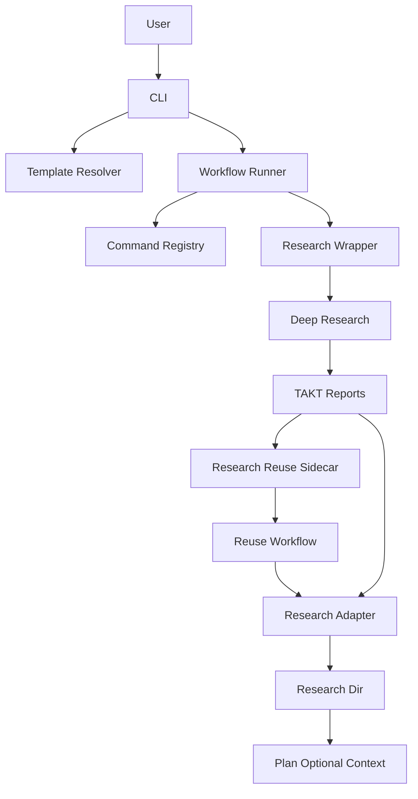
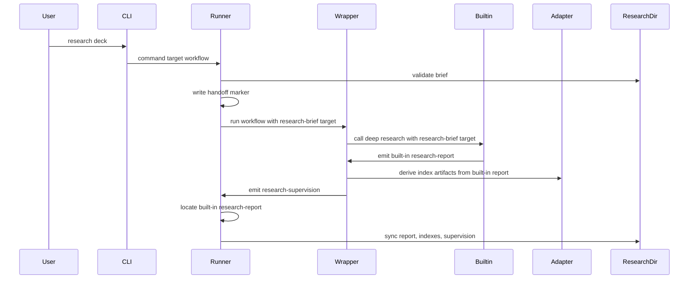
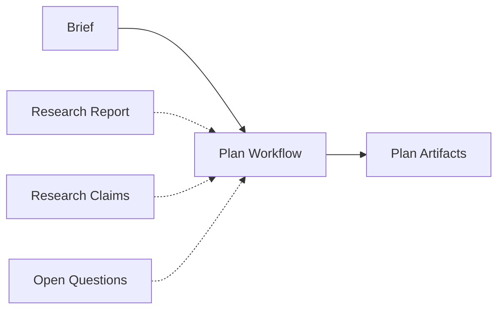
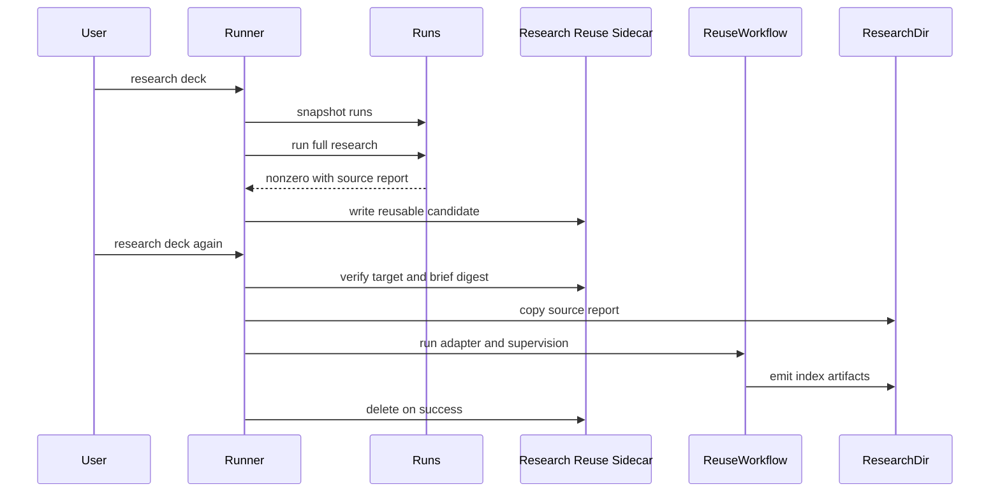
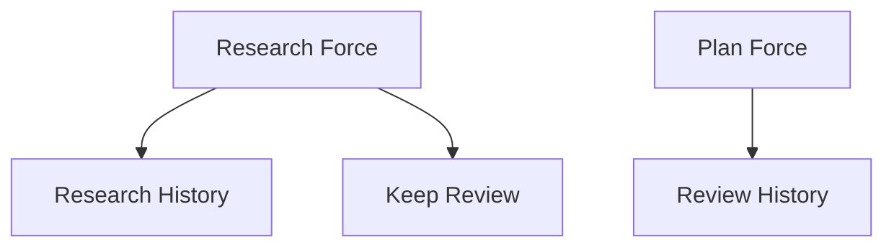

# 技術設計書: slide-workflow-research

## 概要

**Purpose（目的）**: 本機能は deck 作成者に、slide 制作 workflow とは独立した任意の deep research 段階を提供し、調査結果を `plan` の補助文脈として安全に渡す価値を提供する。

**Users（ユーザー）**: deck 作成者が外部調査を要する講義・登壇・解説資料を作るときに利用する。workflow メンテナが command/state/report/template の配布境界を保守するためにも利用する。

**Impact（影響）**: 現在の `plan / compose / polish / deliver` に、任意の前段 `research` を追加する。既存 successful state、approval、review artifact は維持し、research 成果物は `slides/<deck>/research/` に隔離する。research の探索そのものは TAKT built-in `deep-research` を正本として使い、repo-local では再実装しない。deep research 完了後の後続処理だけが失敗した場合は、調査元レポートを安全条件付きで再利用し、同じ外部調査を繰り返さない。

### 目標

- `takt-marp research slides/<deck>` を任意 command として提供する。
- TAKT built-in `deep-research` を最大限活用し、repo-local は薄い wrapper と deck-local artifact adapter だけを所有する。
- `research` の入力・成果物・supervision を deck-local `research/` domain に閉じる。
- deep research 完了後の失敗再実行では、同じ調査元レポートから adapter/supervision だけを再実行する。
- `plan` は `brief.md` primary input を維持し、research artifacts を任意入力として扱う。
- bundled/ejected template、validation、smoke の surface を揃える。

### 非目標

- `plan / compose / polish / deliver` の state 名、approval ownership、既存 report schema の再設計
- `research` を全 deck の必須前提にすること
- deep research engine、persona、policy、report contract の repo-local fork
- TAKT runtime の resume 機能の所有または拡張
- PPTX/PDF を research workflow の中核 artifact にすること
- 既存 deck の自動再生成

## 境界コミットメント

### このスペックが所有するもの

- `research` command の CLI 表示、target validation、TAKT workflow 起動、rerun/force behavior
- `research` command の state `researched` と `research-supervision.md` validation
- TAKT built-in `deep-research` を呼ぶ `takt-marp-slide-research.yaml` wrapper
- CLI target、research brief target、deck-local output dir を結ぶ runner handoff contract
- selected TAKT run から built-in `research-report.md` を一意に特定する Research Source Report Locator
- failed research run から再利用可能な built-in `research-report.md` を検出し、Research Reuse Sidecar（調査再利用サイドカー）として保存・照合・破棄する contract
- deep research を呼ばず adapter/supervision だけを実行する Research Reuse Workflow
- built-in `research-report.md` から deck-local research artifacts を派生する adapter contract
- `slides/<deck>/research/` 配下の input/output contract:
  - `research-brief.md`
  - `research-report.md`
  - `research-sources.md`
  - `research-claims.md`
  - `open-questions.md`
  - `research-supervision.md`
- `plan` workflow/facets が research artifacts を任意文脈として読む契約
- bundled/ejected templates と validation scripts の research 追加分

### 境界外

- TAKT built-in `deep-research` の内部 step、persona、policy、output contract の再実装
- TAKT runtime の resume point からの再開制御
- built-in research facets の repo-local コピー
- 通常 workflow の外部 web access 許可拡大
- `brief.md` の primary input 性質の変更
- `compose / polish / deliver` の prerequisite、approval、supervision contract の変更
- `.coderabbit.yml` / `.coderabbit.yaml` の変更
- 「ついでに」取り込まない変更: visual review、PPTX/PDF QA、Atomic Design component taxonomy の追加再設計

### 許可する依存

- TAKT built-in workflow name `deep-research`
- `node_modules/takt/builtins/ja/workflows/deep-research.yaml`
- `node_modules/takt/builtins/ja/facets/output-contracts/research-report.md`
- TAKT `workflow_call` の built-in workflow 名解決
- TAKT run `meta.json` の `workflow`、`task`、`runSlug`、`reportDirectory`、`updatedAt`
- 既存 `.takt/workflow-current-target.json` marker に research 固有 field を追加する方式
- 既存 `reports/subworkflows/**` 探索パターン
- `.takt/research-reuse/*.json` を runtime state として扱う方式
- Node.js `crypto` module による `research-brief.md` の SHA-256 digest
- 既存 target resolver、front matter parser、TAKT executable resolver
- `scripts/lib/takt-marp-project-templates.mjs` の bundled/ejected template resolver
- `templates/project/workflows/**` と `templates/project/facets/**` の sync/check mechanism
- `scripts/takt-marp-validate-slide-workflow-foundation.mjs` と `scripts/takt-marp-validate-slide-workflow-smoke.mjs`

違反してはならない依存制約:

- `research` 成果物を `slides/<deck>/review/` の既存 command state と混ぜない。
- `plan` 成功条件に external web access を追加しない。
- `research --force` で plan/compose/polish/deliver の approval を退避しない。
- repo-local adapter step は built-in report からの抽出・整形だけを行い、追加調査や再評価をしない。
- repo-local adapter step は built-in report に存在しない URL、取得日、確度、claim/source 対応を補完しない。欠落値は `not_present_in_builtin_report` として明示する。
- Research Source Report Reuse は target と `research-brief.md` digest が一致する場合だけ許可する。
- `research --force` は Research Source Report Reuse を行わず、Research Reuse Sidecar が存在しても full research を実行する。

### 再検証トリガー

- `CommandConfigRegistry` の metadata shape 変更
- `research-supervision.md` front matter contract の変更
- `slides/<deck>/research/` の artifact 名または配置変更
- TAKT built-in `deep-research` の output file 名変更
- TAKT `workflow_call` の built-in workflow 名解決仕様変更
- TAKT run `meta.json` の `workflow` または `task` semantics 変更
- Research Reuse Sidecar の schema 変更
- Research Reuse Workflow の step 構成変更
- template resolver の bundled/ejected 判定変更
- `plan` の prerequisite または source artifact sync の変更

## アーキテクチャ

### 既存アーキテクチャ分析

既存 slide workflow は `plan / compose / polish / deliver` の4 command を前提に、以下を scripts と workflow/facets が分担している。

- `scripts/lib/takt-marp-slide-workflow.mjs`: command list、state、approval support、target validation、front matter validation、force archive
- `scripts/takt-marp-run-slide-workflow.mjs`: workflow path 解決、TAKT 起動、report/source artifact sync
- `scripts/lib/takt-marp-cli.mjs`: top-level command routing、bundled/ejected workflow template の選択
- `.takt/workflows/**` と `templates/project/workflows/**`: TAKT workflow definitions
- validation scripts: runner behavior、template resolution、smoke path、static workflow constraints

注意点は `downstreamCommands(command)` が `COMMANDS` 配列の順序を使うことである。`research` を先頭追加すると `research --force` が既存 command の artifacts を退避しうるため、command behavior を明示 metadata にする。

TAKT 側には built-in `deep-research` が存在し、research persona、policy、knowledge、output contract を既に持つ。本設計はこれを `workflow_call` で呼び、slide workflow 固有の artifact 同期だけを repo-local に置く。

### アーキテクチャパターンと境界マップ

採用パターン: Command Config Registry + Research Workflow Wrapper + Research Adapter + Research Reuse Sidecar。既存 helper exports は維持しつつ、内部の判断を registry と runner-owned reuse decision に集約する。



**Architecture Integration（アーキテクチャ統合）**:

- 採用パターン: `research` を既存 review state へ混ぜず、command metadata で artifact domain と invalidation scope を分離する。
- ドメイン／機能境界: `research` domain は調査入力・built-in report・派生成果物・調査 supervision を所有する。`review` domain は既存 slide workflow state を所有し続ける。
- 維持する既存パターン: `slides/<deck>` target contract、front matter parser、atomic replace、package-bundled/ejected template selection、`--skip-git` TAKT 起動。
- 新規コンポーネントの根拠: Command Config Registry は `research` の異なる invalidation/report domain を if 文の散在なしに表現するため必要。Research Adapter は built-in report を requirements が求める deck-local files へ写像するためだけに必要。Research Reuse Sidecar は、失敗 run の source report を target/brief hash で安全に照合するために必要。
- ステアリング準拠: roadmap の canonical command/state model を壊さず、follow-up として任意前段 research を追加する。

### Existing Baseline and New Scope

この設計は既存 `research` baseline を再実装しない。要件 1-7 のうち、現在の codebase に存在する `research` command、Command Config Registry、`slide:research` script、Research Source Report Locator、Research Artifact Sync、bundled/ejected Research Workflow Wrapper は regression verification の対象として扱う。

今回の新規実装範囲は Research Source Report Reuse である。具体的には Research Reuse Sidecar lifecycle、failed run candidate detection、Research Workflow Selection Contract、`takt-marp-slide-research-reuse.yaml` template、reuse marker fields、adapter instruction の reuse mode 対応、reuse 用 validation/smoke coverage を追加する。

### Research Handoff Contract

`research` の user-facing target は常に `slides/<deck>` とする。Runner は既存 target resolver で deck を検証したうえで、TAKT 実行だけ次の target に変換する。

```text
CLI target:        slides/<deck>
TAKT target:       slides/<deck>/research/research-brief.md
output directory:  slides/<deck>/research/
state target:      slides/<deck>
```

Runner は TAKT 起動前に `.takt/workflow-current-target.json` を次の shape で書く。

```json
{
  "command": "research",
  "target": "slides/<deck>",
  "deck": "<deck>",
  "research_brief_path": "slides/<deck>/research/research-brief.md",
  "research_output_dir": "slides/<deck>/research",
  "research_source_report_name": "research-report.md",
  "started_at": "<ISO-8601>"
}
```

この marker は wrapper、adapter、supervision が deck target と research brief target を混同しないための handoff であり、template 配布対象には含めない。`plan / compose / polish / deliver` の marker shape は既存互換を維持し、research 固有 field は追加しない。

### Research Source Report Locator

`research-report.md` は built-in `deep-research` の output を正本とする。Runner は TAKT 成功後、まず `research-supervision.md` の front matter で selected parent reports directory を一意に決める。そのうえで、source report は selected parent reports directory の内側だけから探索する。

探索順は次の通りである。

1. `<reportsDir>/subworkflows/**/research-report.md` のうち、ancestor directory 名に `workflow-deep-research` を含むもの。
2. 互換 fallback として `<reportsDir>/research-report.md`。

一致が 0 件なら `TAKT_SOURCE_ARTIFACT_SYNC_MISSING`、2 件以上なら `TAKT_SOURCE_ARTIFACT_SYNC_AMBIGUOUS` で失敗する。Runner はこの source report を `slides/<deck>/research/research-report.md` へ byte-for-byte copy し、adapter が再生成した report では置き換えない。

### Research Source Report Reuse Contract

Research Source Report Reuse（調査元レポート再利用）は、TAKT が非 0 終了した research run から built-in `research-report.md` が一意に見つかる場合だけ候補化する。Runner は research 起動前に `.takt/runs` の snapshot を取り、非 0 終了後に今回作成または更新された run を `meta.json` と report layout で絞り込む。

再利用候補の run は次の条件をすべて満たす必要がある。

- `meta.json.workflow` を Workflow Identity に正規化した値が `takt-marp-slide-research`
- `meta.json.task` が `slides/<deck>/research/research-brief.md`
- run が今回の execution snapshot 以後に作成または更新されている
- run reports 内に `workflow-deep-research` 配下の built-in `research-report.md` が一意に存在する
- 現在の `research-brief.md` の SHA-256 digest を Research Reuse Sidecar に保存できる

Workflow Identity は、`meta.json.workflow` が workflow 名の場合はその値、path の場合は `path.basename(value, ".yaml")` を使う。bundled runtime の一時 workflow path や ejected workflow path を raw string equality で比較しない。candidate detection は selected Research Workflow Wrapper の basename、`meta.json.task`、execution snapshot、`reportDirectory` 内の `workflow-deep-research` source report の組み合わせで判定する。

Runner は候補を `.takt/research-reuse/<deck-slug>.json` に保存する。次回 `research` 実行時、`--force` が無く、successful state が無く、Research Reuse Sidecar の target と `research-brief.md` digest が現在値に一致する場合だけ reuse mode に入る。reuse mode では source report を `slides/<deck>/research/research-report.md` に byte-for-byte copy し、private workflow `takt-marp-slide-research-reuse.yaml` を実行する。この workflow は `deep_research` step を持たず、adapter と supervision だけを実行する。

Research Reuse Sidecar lifecycle:

- full research 非 0 終了で reusable report がある場合、Research Reuse Sidecar を作成または更新する。
- full research 成功または reuse research 成功時、該当 deck の Research Reuse Sidecar を削除する。
- reuse research 非 0 終了時、Research Reuse Sidecar は維持する。
- `research --force` 開始時、該当 deck の Research Reuse Sidecar を削除し、full research を実行する。
- Research Reuse Sidecar の source report が消えている、target が違う、digest が違う場合は Research Reuse Sidecar を破棄し、通常の full research として扱う。
- 複数の reusable report 候補が同一 execution から見つかる場合は、推測で選ばず明示エラーにする。

### Research Workflow Selection Contract

public command として解決する workflow は `research` だけである。CLI は既存どおり `workflowFilePath(source, "research")` で selected Research Workflow Wrapper を runner に渡す。Research Reuse Workflow は public command list に追加せず、selected Research Workflow Wrapper と同じ `workflows` directory にある sibling path として導出する。

```text
selected Research Workflow Wrapper: <workflowsDir>/takt-marp-slide-research.yaml
selected Research Reuse Workflow: <workflowsDir>/takt-marp-slide-research-reuse.yaml
```

Runner は reuse mode を選択した後、selected Research Reuse Workflow の存在を TAKT 起動前に検証し、`runTakt` へ selected Research Reuse Workflow path を渡す。bundled template の場合は `prepareBundledWorkflowRuntime` が `templates/project/workflows/**` を runtime directory に copy した後、その runtime directory 内の sibling Research Reuse Workflow を使う。ejected template の場合は project-local `.takt/workflows/` の sibling Research Reuse Workflow を使う。`research-reuse` のような user-facing command 名は追加しない。

### 技術スタック

| レイヤー | 選択／バージョン | 機能内での役割 | メモ |
|----------|------------------|----------------|------|
| CLI | Node.js ESM scripts | `research` command routing | 既存 CLI に追加 |
| Workflow runtime | TAKT `^0.44.0` built-in `deep-research` | 調査実行 | repo-local fork なし |
| Artifact storage | Markdown under `slides/<deck>/research/` | deck-local source/evidence | Git 管理可能 |
| Runtime state | `.takt/research-reuse/*.json` | failed research run の reuse candidate | Git 管理対象ではない runtime state |
| Validation | 既存 Node validation scripts | state/report/template/smoke 検証 | 新規依存なし |
| Template Distribution | `.takt/**` + `templates/project/**` | bundled/ejected 両対応 | sync/check 対象 |

## ファイル構造計画

### ディレクトリ構造

```text
.kiro/specs/slide-workflow-research/
├── spec.json
├── requirements.md
├── research.md
└── design.md

.takt/
├── research-reuse/
│   └── <deck-slug>.json
├── workflows/
│   ├── takt-marp-slide-research.yaml
│   ├── takt-marp-slide-research-reuse.yaml
│   └── takt-marp-slide-plan.yaml
└── facets/
    ├── instructions/
    │   ├── takt-marp-adapt-research.md
    │   └── takt-marp-plan.md
    └── output-contracts/
        └── takt-marp-supervision.md

templates/project/
├── workflows/
│   ├── takt-marp-slide-research.yaml
│   └── takt-marp-slide-research-reuse.yaml
└── facets/
    └── instructions/
        └── takt-marp-adapt-research.md

slides/<deck>/
├── brief.md
└── research/
    ├── research-brief.md
    ├── research-report.md
    ├── research-sources.md
    ├── research-claims.md
    ├── open-questions.md
    ├── research-supervision.md
    └── history/
```

### 変更対象ファイル

- `scripts/lib/takt-marp-slide-workflow.mjs` — 既存 `Command Config Registry` と `research` artifact domain を維持し、Research Reuse Sidecar path、brief digest、Workflow Identity 正規化 helper を追加する。
- `scripts/takt-marp-run-slide-workflow.mjs` — 既存 Research Handoff Contract marker、research brief TAKT target、Research Source Report Locator、`Research Artifact Sync` を維持し、Research Source Report Reuse の candidate detection、Research Reuse Sidecar lifecycle、Research Workflow Selection Contract を追加する。
- `scripts/lib/takt-marp-cli.mjs` — 既存 `research` public command を維持する。`research-reuse` のような public command は追加しない。
- `scripts/lib/takt-marp-project-templates.mjs` — 既存 Research Workflow Wrapper path 解決を維持し、Research Reuse Workflow は selected Research Workflow Wrapper の sibling path として検証できる helper を追加する。
- `.takt/workflows/takt-marp-slide-research.yaml` — 既存 `Research Workflow Wrapper`。`kind: workflow_call` と `call: deep-research` で built-in を呼び、adapter step と supervision step だけを repo-local に置く。
- `.takt/workflows/takt-marp-slide-research-reuse.yaml` — `Research Reuse Workflow`。`deep_research` を呼ばず、deck-local にコピー済みの built-in `research-report.md` から adapter step と supervision step だけを実行する private workflow。
- `.takt/facets/instructions/takt-marp-adapt-research.md` — `Research Adapter` の instruction。normal mode では current TAKT run の built-in report、reuse mode では marker が指す deck-local copy から artifacts を抽出し、追加調査は行わない。
- `.takt/workflows/takt-marp-slide-plan.yaml` — `Plan Optional Context`。research artifacts が存在する場合に optional context として読むように instruction context を追加する。prerequisite は変更しない。
- `.takt/facets/instructions/takt-marp-plan.md` — `Plan Optional Context` の根拠識別、未解決事項の扱いを追加する。
- `.takt/facets/output-contracts/takt-marp-supervision.md` — `Research Supervision Validator` のため、`command: research` と `state: researched` を許容する。
- `templates/project/workflows/takt-marp-slide-research.yaml`、`templates/project/workflows/takt-marp-slide-research-reuse.yaml`、`templates/project/facets/instructions/takt-marp-adapt-research.md` — `Template Distribution`。`npm run installer:sync-templates` で同期する。手編集は避ける。
- `scripts/takt-marp-validate-slide-workflow-foundation.mjs` — `Validation Surface`。registry、research prerequisite、force archive、bundled/ejected path、artifact sync の deterministic checks を追加する。
- `scripts/takt-marp-validate-slide-workflow-smoke.mjs` — `Validation Surface`。research 追加後も既存 4 command path が維持されること、mock research が research domain に artifact を置くことを確認する。
- `docs/marp-slide-workflow.md` — `Plan Optional Context` と `research` の任意性を追記する。
- `docs/marp-slide-workflow-reports.md` — `Research Supervision Validator` と research artifacts の contract を追記する。
- `package.json` — 既存 `slide:research` script を維持する。Research Source Report Reuse 用の新しい public script は追加しない。

## システムフロー

### research 実行



Adapter は built-in report の内容だけを構造化する。追加の web 調査、追加の主張生成、出典の再評価は行わない。Runner は built-in report を直接 copy し、adapter 出力で `research-report.md` を置換しない。

### plan 任意参照



`plan` は `brief.md` を常に primary input とする。research artifacts がある場合だけ参照し、無い場合は従来どおり進む。

### Research Source Report Reuse



reuse mode は `deep_research` を呼ばない。`--force` が指定された場合は Research Reuse Sidecar を破棄し、このフローに入らず full research を実行する。

### force invalidation



`research --force` は research domain のみ退避する。`plan --force` 以降の既存挙動は変えない。

## 要件トレーサビリティ

| 要件 | 要約 | コンポーネント | インターフェース | フロー |
|------|------|----------------|------------------|--------|
| 1.1 | research target validation | CLI, Workflow Runner, Command Config Registry | `resolveDeckTarget` | research 実行 |
| 1.2 | workflow unavailable error | Workflow Runner, Template Distribution | `assertWorkflowAvailable`, `assertBuiltinWorkflowAvailable` | research 実行 |
| 1.3 | plan does not require research | Plan Optional Context | `assertCommandPrerequisites` | plan 任意参照 |
| 1.4 | existing prerequisites kept | Command Config Registry | command prerequisite map | plan 任意参照 |
| 1.5 | CLI help distinction | CLI | usage text | research 実行 |
| 2.1 | research brief primary input | Workflow Runner | `researchTaktTarget` | research 実行 |
| 2.2 | missing research brief error | Workflow Runner | `PREREQUISITE_MISSING` | research 実行 |
| 2.3 | brief.md untouched | Research Artifact Sync | source artifact map | research 実行 |
| 2.4 | plan ignores research brief absence | Plan Optional Context | optional reads | plan 任意参照 |
| 3.1 | research report output | Research Artifact Sync | Research Source Report Locator | research 実行 |
| 3.2 | sources output | Research Adapter | `research-sources.md` | research 実行 |
| 3.3 | claims output | Research Adapter | `research-claims.md` | research 実行 |
| 3.4 | open questions output | Research Adapter | `open-questions.md` | research 実行 |
| 3.5 | URL/date/fact separation | Research Adapter | derived artifact sections | research 実行 |
| 4.1 | research supervision output | Research Supervision Validator | `research-supervision.md` | research 実行 |
| 4.2 | researched state | Command Config Registry, Research Supervision Validator | `state: researched` | research 実行 |
| 4.3 | rerun blocked | Workflow Runner | `isSuccessfulCommandState` | force invalidation |
| 4.4 | force archive research | Workflow Runner | research domain archive | force invalidation |
| 4.5 | do not archive plan artifacts | Command Config Registry | `invalidationTargets` | force invalidation |
| 4.6 | rejected rerun | Workflow Runner | rejected archive path | force invalidation |
| 5.1 | brief primary | Plan Optional Context | `brief.md` | plan 任意参照 |
| 5.2 | optional research context | Plan Optional Context | optional files | plan 任意参照 |
| 5.3 | missing research does not fail | Plan Optional Context | optional reads | plan 任意参照 |
| 5.4 | cite research origin | Plan Optional Context | `reference-analysis.md` | plan 任意参照 |
| 5.5 | open questions not fabricated | Plan Optional Context | unresolved assumptions | plan 任意参照 |
| 6.1 | web access limited | Research Workflow Wrapper | built-in workflow call | research 実行 |
| 6.2 | no web success condition in normal flow | Plan Optional Context | unchanged workflows | plan 任意参照 |
| 6.3 | source timestamp | Research Adapter | source extraction | research 実行 |
| 6.4 | external failure isolated | Workflow Runner, Command Config Registry | command result domain | research 実行 |
| 6.5 | no local fork | Research Workflow Wrapper | `call: deep-research` | research 実行 |
| 7.1 | bundled template | Template Distribution | package workflow path | research 実行 |
| 7.2 | ejected template | Template Distribution | project workflow path | research 実行 |
| 7.3 | eject copies research | Template Distribution | templates/project | research 実行 |
| 7.4 | validation coverage | Validation Surface | foundation validation | force invalidation |
| 7.5 | smoke keeps existing flows | Validation Surface | smoke validation | plan 任意参照 |
| 7.6 | template drift detection | Template Distribution | installer check | research 実行 |
| 8.1 | reuse source report after failed research | Workflow Runner, Research Reuse Sidecar, Research Reuse Workflow | Research Reuse Sidecar, private workflow | Research Source Report Reuse |
| 8.2 | no reusable report falls back | Workflow Runner, Research Reuse Sidecar | Research Reuse Sidecar lookup | Research Source Report Reuse |
| 8.3 | ambiguous reusable report errors | Workflow Runner, Research Reuse Sidecar | ambiguity error | Research Source Report Reuse |
| 8.4 | target mismatch blocks reuse | Research Reuse Sidecar | target check | Research Source Report Reuse |
| 8.5 | brief mismatch blocks reuse | Research Reuse Sidecar | brief digest check | Research Source Report Reuse |
| 8.6 | force bypasses reuse | Workflow Runner, Research Reuse Sidecar | force lifecycle | force invalidation |
| 8.7 | reuse emits normal artifacts | Research Reuse Workflow, Research Artifact Sync | adapter outputs | Research Source Report Reuse |
| 8.8 | failed reuse keeps candidate | Workflow Runner, Research Reuse Sidecar | Research Reuse Sidecar lifecycle | Research Source Report Reuse |

## コンポーネントとインターフェース

| コンポーネント | ドメイン／レイヤー | 意図 | 要件カバー範囲 | 主要依存 | 契約 |
|----------------|--------------------|------|----------------|----------|------|
| Command Config Registry | CLI core | command behavior を一元化 | 1.1, 1.3, 1.4, 4.2, 4.3, 4.4, 4.5 | existing helpers | State |
| Workflow Runner | Runtime | command preflight と TAKT 起動を行う | 1.1, 1.2, 2.1, 2.2, 4.3, 4.6, 6.4, 8.1, 8.2, 8.3, 8.6, 8.8 | Command Config Registry | Batch |
| Research Workflow Wrapper | TAKT workflow | built-in deep research を呼ぶ | 1.2, 3.1, 6.1, 6.5 | TAKT built-in | Batch |
| Research Reuse Sidecar | Runtime | failed research run の再利用候補を保存・照合する | 8.1, 8.2, 8.3, 8.4, 8.5, 8.6, 8.8 | TAKT runs, research brief | State |
| Research Reuse Workflow | TAKT workflow | deep research を呼ばず後続 artifacts を再生成する | 8.1, 8.7 | Research Reuse Sidecar | Batch |
| Research Adapter | TAKT workflow | built-in report から deck artifacts を派生する | 3.2, 3.3, 3.4, 3.5, 6.3, 8.7 | built-in report | Batch |
| Research Artifact Sync | Runtime | research domain へ成果物を同期する | 2.1, 2.3, 3.1, 4.1, 4.4, 8.7 | TAKT reports | Batch |
| Research Supervision Validator | CLI core | `researched` state を検証する | 4.1, 4.2, 4.6 | front matter parser | State |
| Plan Optional Context | Workflow facets | research を任意入力として読む | 2.4, 5.1, 5.2, 5.3, 5.4, 5.5, 6.2 | plan workflow | Batch |
| Template Distribution | Installer templates | bundled/ejected 両方で research workflow を利用可能にする | 7.1, 7.2, 7.3, 7.6, 8.1 | template resolver | Batch |
| Validation Surface | scripts | regression と smoke を保証する | 7.4, 7.5, 8.1, 8.2, 8.3, 8.4, 8.5, 8.6, 8.7, 8.8 | validation scripts | Batch |

### CLI core

#### Command Config Registry

| 項目 | 詳細 |
|------|------|
| 意図 | command ごとの state、artifact domain、approval、invalidation scope を定義する |
| 要件 | 1.1, 1.3, 1.4, 4.2, 4.3, 4.4, 4.5 |

**責務と制約**

- `research / plan / compose / polish / deliver` の metadata を単一 source of truth とする。
- 既存 exports `COMMANDS`、`COMMAND_STATES`、`APPROVAL_COMMANDS` は互換のため維持する。
- `research` は `approvalSupported: false`、`artifactDomain: "research"`、`invalidationTargets: ["research"]` とする。
- `plan` の prerequisite は `brief.md` のみであり、research state を要求しない。

**契約種別**: Service [x] / State [x]

##### サービスインターフェース

```typescript
type CommandName = "research" | "plan" | "compose" | "polish" | "deliver";
type ArtifactDomain = "research" | "review";

interface CommandConfig {
  name: CommandName;
  successfulState: "researched" | "planned" | "composed" | "polished" | "delivered";
  artifactDomain: ArtifactDomain;
  approvalSupported: boolean;
  invalidationTargets: CommandName[];
  sourceArtifacts: string[];
}

interface CommandConfigRegistry {
  requireCommand(command: string): CommandName;
  configFor(command: CommandName): CommandConfig;
  downstreamCommands(command: CommandName): CommandName[];
}
```

- Preconditions（事前条件）: command string は CLI positional から渡される。
- Postconditions（事後条件）: unsupported command は `INVALID_COMMAND` で失敗する。
- Invariants（不変条件）: `research` の downstream は `research` のみ。

#### Research Supervision Validator

| 項目 | 詳細 |
|------|------|
| 意図 | research supervision を既存 front matter parser で検証する |
| 要件 | 4.1, 4.2, 4.3, 4.6 |

**責務と制約**

- `research-supervision.md` は `slides/<deck>/research/` から読む。
- `result: passed` の場合に `state: researched` を要求する。
- `blocking_findings` など既存 supervision count fields を再利用する。

**契約種別**: State [x]

### Runtime

#### Workflow Runner

| 項目 | 詳細 |
|------|------|
| 意図 | research preflight、TAKT 起動、成功済み rerun 判定を既存 runner に統合する |
| 要件 | 1.1, 1.2, 2.1, 2.2, 4.3, 4.6, 6.4, 8.1, 8.2, 8.3, 8.6, 8.8 |

**責務と制約**

- `research-brief.md` が無い場合、TAKT 起動前に失敗する。
- `research` 実行時は wrapper workflow template と built-in workflow `deep-research` の両方を TAKT 起動前に検証する。
- user-facing target は `slides/<deck>` のまま維持し、TAKT target だけを `slides/<deck>/research/research-brief.md` に変換する。
- `.takt/workflow-current-target.json` に `target`、`research_brief_path`、`research_output_dir` を書き、wrapper と adapter の handoff を明示する。
- external research failure は `research` command の失敗として扱い、既存 `plan` state を変更しない。
- selected workflow path は Template Distribution から受け取り、bundled/ejected のどちらでも同じ runner を使う。
- `research` 実行前に `.takt/runs` の snapshot を取り、非 0 終了時に今回更新された research run から reusable source report を検出する。
- `--force` が指定された場合は reuse decision を行わず、既存 Research Reuse Sidecar を削除して full research を実行する。
- reuse mode が選択された場合は `takt-marp-slide-research-reuse.yaml` を選び、TAKT target は user-facing target ではなく existing `research-brief.md` contract を維持する。

**契約種別**: Batch [x]

##### バッチ／ジョブ契約

- Trigger（トリガー）: `takt-marp research slides/<deck>`
- Input / validation（入力／検証）: `slides/<deck>/research/research-brief.md` と `slides/<deck>` target
- Output / destination（出力／宛先）: selected parent reports directory と Research Source Report Locator の結果を Research Artifact Sync へ渡す
- Idempotency & recovery（冪等性と回復）: 成功済み state がある場合 `--force` なしは拒否。rejected は同一 command artifact を history へ退避して再実行できる。deep research 完了後の非 0 終了では Research Reuse Sidecar を残し、次回は安全条件を満たす場合だけ Research Reuse Workflow に進む。

#### Research Reuse Sidecar

| 項目 | 詳細 |
|------|------|
| 意図 | failed research run の built-in report を再利用できるか判定する runtime state を管理する |
| 要件 | 8.1, 8.2, 8.3, 8.4, 8.5, 8.6, 8.8 |

**責務と制約**

- Research Reuse Sidecar は `.takt/research-reuse/<deck-slug>.json` に保存し、deck-local research artifacts には混ぜない。
- Research Reuse Sidecar は target、deck、research brief path、brief digest、source run、source report path、created timestamp を持つ。
- Research Reuse Sidecar は current `research-brief.md` digest と一致する場合だけ有効とする。
- Research Reuse Sidecar の source report path が消えている場合、reuse せず full research に戻す。
- target mismatch と digest mismatch は stale candidate として扱い、reuse しない。
- 同一 execution で複数 reusable reports が見つかった場合は、Research Reuse Sidecar を作らず ambiguity error を返す。
- successful state 到達時と `--force` 開始時に該当 deck の Research Reuse Sidecar を削除する。

**契約種別**: State [x]

##### 状態管理

- State model（状態モデル）: absent、candidate、consumed、stale の4状態を runner が判定する。ファイル上は candidate のみ永続化し、consumed/stale は削除で表現する。
- Persistence & consistency（永続化と整合性）: Research Reuse Sidecar write は JSON file の atomic replace とし、deck-local artifact sync とは別 transaction とする。
- Concurrency strategy（並行制御戦略）: 同一 deck の同時 `research` 実行は未サポートとし、複数候補が見えた場合は ambiguity error で停止する。

#### Research Artifact Sync

| 項目 | 詳細 |
|------|------|
| 意図 | TAKT run reports から deck-local research artifacts へ同期する |
| 要件 | 2.1, 2.3, 3.1, 4.1, 4.4, 8.7 |

**責務と制約**

- `brief.md` は読み書きしない。
- sync 先は `slides/<deck>/research/` のみ。
- `research-report.md` は Research Source Report Locator が特定した built-in output から直接 copy する。
- reuse mode では Research Reuse Sidecar が指す source report を `slides/<deck>/research/research-report.md` に事前 copy し、Research Reuse Workflow の入力正本にする。
- `research-sources.md`、`research-claims.md`、`open-questions.md`、`research-supervision.md` は wrapper の top-level report output から copy する。
- artifact replace は既存 `replaceFileAtomically` を使う。
- `research --force` の archive 先は `slides/<deck>/research/history/` のみ。

### TAKT workflow

#### Research Workflow Wrapper

| 項目 | 詳細 |
|------|------|
| 意図 | TAKT built-in `deep-research` を slide workflow の artifact contract に接続する |
| 要件 | 1.2, 3.1, 6.1, 6.5 |

**責務と制約**

- `kind: workflow_call` と `call: deep-research` を使い、調査実行そのものは TAKT built-in に委譲する。
- repo-local wrapper は `deep_research` workflow_call step、adapter step、supervision step だけを定義する。
- `deep_research` step は Runner が渡した TAKT target `slides/<deck>/research/research-brief.md` をそのまま built-in workflow へ渡す。
- adapter と supervision は `.takt/workflow-current-target.json` を読み、state/report front matter の `target` には user-facing target `slides/<deck>` を書く。
- web access の許可は built-in research workflow 内に閉じる。
- built-in facets の persona/policy/output contract を repo-local にコピーしない。

**契約種別**: Batch [x]

#### Research Reuse Workflow

| 項目 | 詳細 |
|------|------|
| 意図 | deep research を再実行せず、既存調査元レポートから後続 artifacts を再生成する |
| 要件 | 8.1, 8.7 |

**責務と制約**

- public command ではなく、runner が reuse mode のときだけ選択する private workflow とする。
- `deep_research` step、`kind: workflow_call`、`call: deep-research` を含めない。
- step は `adapt_research` と `supervise_research` のみに限定し、full research wrapper と同じ output contracts を使う。
- `.takt/workflow-current-target.json` には `research_reuse: true`、`research_source_report_path`、`research_source_report_origin: builtin_deep_research` を含める。
- adapter は marker の `research_source_report_path` を読み、deck-local に copy 済みの built-in report を source of truth として扱う。

**契約種別**: Batch [x]

#### Research Adapter

| 項目 | 詳細 |
|------|------|
| 意図 | built-in `research-report.md` を requirements が求める deck-local artifacts に写像する |
| 要件 | 3.2, 3.3, 3.4, 3.5, 6.3, 8.7 |

**責務と制約**

- 入力は runner が選択した built-in `research-report.md` のみとする。normal mode では current TAKT run の built-in report、reuse mode では `research_source_report_path` の deck-local copy を読む。
- `research-sources.md` は built-in report のデータソース表と URL/取得日情報から、存在する情報だけを構造化する。
- `research-claims.md` は built-in report の主要な発見・結論を、built-in report 内で確認できる根拠 source と確度つきで構造化する。
- `open-questions.md` は built-in report の残存ギャップから作る。
- built-in report に URL、取得日、claim/source 対応、確度が明示されていない場合、adapter は `not_present_in_builtin_report` として記録し、推測で補完しない。
- 追加調査、外部 web fetch、出典の再評価、独自 research policy の適用、built-in report にない claim 生成は行わない。
- adapter は情報欠落だけを理由に失敗しない。失敗条件は source report が読めない、handoff marker または adapter output front matter が壊れている、または output file を生成できない場合に限定する。
- reuse mode でも `source_report_origin: builtin_deep_research` を維持し、deck-local copy を adapter 由来 report と誤表示しない。

**契約種別**: Batch [x]

### Workflow facets

#### Plan Optional Context

| 項目 | 詳細 |
|------|------|
| 意図 | research artifacts を `plan` の任意入力として扱う |
| 要件 | 2.4, 5.1, 5.2, 5.3, 5.4, 5.5, 6.2 |

**責務と制約**

- `brief.md` を primary input として維持する。
- research artifacts が存在する場合のみ参照する。
- `open-questions.md` の内容は未解決前提として扱い、推測で埋めない。
- `reference-analysis.md` または `plan.md` に research 由来の根拠を識別できる記述を残す。
- external web access は success condition にしない。

**契約種別**: Batch [x]

### Distribution and validation

#### Template Distribution

| 項目 | 詳細 |
|------|------|
| 意図 | bundled/ejected 両方で research workflow を利用可能にする |
| 要件 | 7.1, 7.2, 7.3, 7.6, 8.1 |

**責務と制約**

- `.takt/workflows/takt-marp-slide-research.yaml` を template sync 対象にする。
- `.takt/workflows/takt-marp-slide-research-reuse.yaml` を private workflow template として sync 対象にする。
- `templates/project/workflows/takt-marp-slide-research.yaml` と `templates/project/workflows/takt-marp-slide-research-reuse.yaml` は sync で生成する。
- ejected partial state は既存 resolver のエラー規約に従う。
- related facet は adapter instruction だけに限定し、built-in research facets はコピーしない。

#### Validation Surface

| 項目 | 詳細 |
|------|------|
| 意図 | research 追加で既存 workflow が壊れないことを機械的に確認する |
| 要件 | 7.4, 7.5, 8.1, 8.2, 8.3, 8.4, 8.5, 8.6, 8.7, 8.8 |

**責務と制約**

- foundation validation は command registry、research prerequisite、force archive、template path を検証する。
- smoke validation は mock research と既存 4 command の成功経路を検証する。
- `research --force` が review/approval を退避しないことを確認する。
- Research Source Report Reuse は foundation validation で Research Reuse Sidecar lifecycle、brief digest mismatch、target mismatch、ambiguous candidate、`--force` bypass を検証する。
- smoke validation は failed full research から reuse success までを mock provider で確認し、Research Reuse Workflow が deep research を呼ばないことを検証する。

## データモデル

Markdown 実体では YAML front matter と本文セクションを使う。front matter は既存 parser の scalar/inline-array subset に収め、nested object は使わない。

```typescript
interface ResearchArtifactManifest {
  command: "research";
  target: string;
  generated_at: string;
  workflow_run_id: string;
  source_report: "research-report.md";
  source_report_origin: "builtin_deep_research";
}

interface ResearchSourceEntry {
  source_id: string;
  title: string;
  url: string;
  retrieved_at: string;
  source_type: "web" | "document" | "codebase" | "other";
  confidence: "high" | "medium" | "low" | "not_present_in_builtin_report";
}

interface ResearchClaimEntry {
  claim_id: string;
  claim: string;
  confidence: "confirmed" | "inferred" | "uncertain" | "not_present_in_builtin_report";
  source_ids: string[];
  slide_use: string;
  caveats: string[];
}

interface OpenQuestionEntry {
  question_id: string;
  question: string;
  why_it_matters: string;
  suggested_next_step: string;
}

interface ResearchReuseSidecar {
  version: 1;
  target: string;
  deck: string;
  research_brief_path: string;
  research_brief_sha256: string;
  source_run: string;
  source_reports_dir: string;
  source_report_path: string;
  source_report_origin: "builtin_deep_research";
  created_at: string;
}
```

`research-report.md` は built-in output を正本とする。その他の research artifacts は正本ではなく、plan が参照しやすい index として扱う。adapter は built-in report に存在しない field を推測しないため、`url`、`retrieved_at`、`confidence`、`source_ids` などが report 内で確認できない場合は文字列 `not_present_in_builtin_report`、または空配列と caveat で欠落を表現する。

`ResearchReuseSidecar` は runtime state であり、deck-local source artifact ではない。`research_brief_sha256` は現在の `research-brief.md` と同じ内容かを判定するためだけに使い、調査内容の正本にはしない。

## エラーハンドリング

| 条件 | エラーコード | 挙動 |
|------|--------------|------|
| unsupported command | `INVALID_COMMAND` | 期待 command list に research を含めて表示 |
| missing target | `INVALID_TARGET` | 既存 target resolver の message を維持 |
| missing `research-brief.md` | `PREREQUISITE_MISSING` | TAKT 起動前に失敗 |
| missing research workflow template | `WORKFLOW_NOT_IMPLEMENTED` | workflow path を表示 |
| missing TAKT built-in `deep-research` | `BUILTIN_WORKFLOW_NOT_AVAILABLE` | built-in workflow name と期待 path を表示し、TAKT 起動前に失敗 |
| successful research rerun without force | `RERUN_BLOCKED` | `--force` を案内 |
| missing built-in `research-report.md` after TAKT success | `TAKT_SOURCE_ARTIFACT_SYNC_MISSING` | 不足 artifact 名を表示 |
| multiple built-in `research-report.md` candidates after TAKT success | `TAKT_SOURCE_ARTIFACT_SYNC_AMBIGUOUS` | 候補 path を表示し同期を拒否 |
| multiple reusable report candidates after TAKT failure | `TAKT_RESEARCH_REUSE_AMBIGUOUS` | 候補 path を表示し Research Reuse Sidecar を作らない |
| Research Reuse Sidecar target mismatch | none | Research Reuse Sidecar を破棄し、通常の full research として扱う |
| Research Reuse Sidecar brief digest mismatch | none | Research Reuse Sidecar を破棄し、通常の full research として扱う |
| reuse source report missing | none | Research Reuse Sidecar を破棄し、通常の full research として扱う |
| invalid research supervision state | `STATE_MISMATCH` | expected `researched` を表示 |
| missing adapter output artifact after TAKT success | `TAKT_SOURCE_ARTIFACT_SYNC_MISSING` | built-in report と不足 artifact を表示 |

## テスト戦略

### Foundation validation

- `requireCommand("research")` が通り、未知 command が拒否されることを確認する。1.1
- `research` config が `state: researched`、`artifactDomain: research`、`approvalSupported: false`、`invalidationTargets: ["research"]` を持つことを確認する。4.2, 4.5
- `plan` prerequisite が `research` を要求しないことを確認する。1.3, 5.3
- `research` prerequisite が `research-brief.md` を要求し、`brief.md` から推測しないことを確認する。2.1, 2.2
- `research` の TAKT target が user-facing target ではなく `slides/<deck>/research/research-brief.md` になることを確認する。2.1
- `.takt/workflow-current-target.json` が `target`、`research_brief_path`、`research_output_dir` を持ち、state target は `slides/<deck>` に残ることを確認する。1.1, 2.1, 4.2
- `assertBuiltinWorkflowAvailable("deep-research")` が built-in workflow 不在を TAKT 起動前に拒否することを確認する。1.2, 6.5
- `research --force` が `research/history/` だけへ archive し、`review/*-approval.md` を触らないことを確認する。4.4, 4.5
- bundled/ejected workflow path が `takt-marp-slide-research.yaml` を解決することを確認する。7.1, 7.2
- research wrapper が `call: deep-research` を使い、built-in research facets を repo-local に複製していないことを確認する。6.5
- Research Source Report Locator が `reports/subworkflows/**/research-report.md` から `workflow-deep-research` の report を一意に選ぶことを確認する。3.1
- Research Source Report Locator が 0 件と複数件をそれぞれ `TAKT_SOURCE_ARTIFACT_SYNC_MISSING` / `TAKT_SOURCE_ARTIFACT_SYNC_AMBIGUOUS` で拒否することを確認する。3.1
- full research が非 0 終了し、今回 run に built-in `research-report.md` が一意に存在する場合、`.takt/research-reuse/<deck>.json` の Research Reuse Sidecar が作成されることを確認する。8.1
- failed research run の `meta.json.workflow` が workflow 名でも workflow file path でも、Workflow Identity 正規化後に同じ `takt-marp-slide-research` と判定されることを確認する。7.1, 7.2, 8.1
- full research が非 0 終了しても built-in `research-report.md` が無い場合、Research Reuse Sidecar を作らず次回 full research に戻ることを確認する。8.2
- 同一 execution で reusable report 候補が複数ある場合、`TAKT_RESEARCH_REUSE_AMBIGUOUS` で Research Reuse Sidecar を作らないことを確認する。8.3
- Research Reuse Sidecar の target または `research_brief_sha256` が現在値と一致しない場合、Research Reuse Workflow を起動しないことを確認する。8.4, 8.5
- `research --force` が Research Reuse Sidecar を削除し、Research Reuse Workflow ではなく Research Workflow Wrapper を起動することを確認する。8.6
- Research Reuse Workflow が selected Research Workflow Wrapper の sibling path として導出され、`research-reuse` が public command list に追加されないことを確認する。7.1, 7.2, 8.1
- Research Reuse Workflow YAML が `workflow_call deep-research` を含まないことを static validation で確認する。8.1

### Smoke validation

- mock provider で `research` が `research-supervision.md` と research artifacts を `slides/<deck>/research/` に同期することを確認する。3.1-4.1
- mock provider の built-in `research-report.md` が byte-for-byte で `slides/<deck>/research/research-report.md` に同期され、adapter 出力で置換されないことを確認する。3.1, 6.5
- mock provider の report に URL/取得日/claim-source 対応が欠ける場合、adapter が `not_present_in_builtin_report` を出し、追加調査や補完を行わないことを確認する。3.2-3.5, 6.5
- mock failed research run から Research Reuse Sidecar を作成し、次回実行で deep research を再実行せず adapter/supervision artifacts を同期することを確認する。8.1, 8.7
- Research Reuse Workflow が非 0 終了した場合、Research Reuse Sidecar が残り次回再試行できることを確認する。8.8
- Research Reuse Workflow 成功時に Research Reuse Sidecar が削除され、`research-supervision.md` が通常成功時と同じ `state: researched` になることを確認する。8.7
- research 未実行 deck で `plan` が成功することを確認する。5.1, 5.3
- research 実行済み deck で `plan` が research artifacts を任意文脈として参照し、research 由来を `reference-analysis.md` に残すことを確認する。5.2, 5.4
- 既存 `plan / compose / polish / deliver` smoke が research 追加後も成功することを確認する。7.5

### Template validation

- `.takt/workflows/takt-marp-slide-research.yaml` と `templates/project/workflows/takt-marp-slide-research.yaml` の drift を検出する。7.6
- `.takt/workflows/takt-marp-slide-research-reuse.yaml` と `templates/project/workflows/takt-marp-slide-research-reuse.yaml` の drift を検出する。7.6, 8.1
- ejected templates に research wrapper と adapter instruction が含まれることを確認する。7.3
- built-in research facets が `templates/project/facets/**` にコピーされていないことを確認する。6.5

## セキュリティとプライバシー

- `research` は built-in deep research により外部 web access を許可しうるため、入力に秘密情報を入れないことを `research-brief` docs と adapter instruction に明記する。
- `plan / compose / polish / deliver` は外部 web access を成功条件にしない。
- research artifacts は deck-local Markdown として保存されるため、出典 URL と取得日を残しつつ、API keys や private credentials を含めない。
- TAKT 実行は既存どおり `--skip-git` を維持し、agent に git 操作を委譲しない。

## 移行

既存 deck は変更不要である。`research` を使う deck だけ `slides/<deck>/research/research-brief.md` を追加する。

実装順:

1. 既存 research baseline（Command Config Registry、runner domain 分離、Research Workflow Wrapper、Research Adapter、deck-local sync、`slide:research`）を regression verification として固定する。
2. Research Reuse Sidecar path、brief digest、Workflow Identity 正規化、failed run candidate detection を runner に追加する。
3. selected Research Workflow Wrapper の sibling path として Research Reuse Workflow を解決し、bundled/ejected の両方で TAKT 起動前に検証する。
4. `.takt/workflows/takt-marp-slide-research-reuse.yaml` と template counterpart を追加し、adapter/supervision だけを実行する。
5. adapter instruction と handoff marker に reuse mode fields を追加し、deck-local copy 済み source report を input 正本にする。
6. foundation validation と smoke validation に Research Source Report Reuse の lifecycle、Workflow Identity、Research Workflow Selection Contract、`--force` bypass を追加する。
7. docs を更新する。
