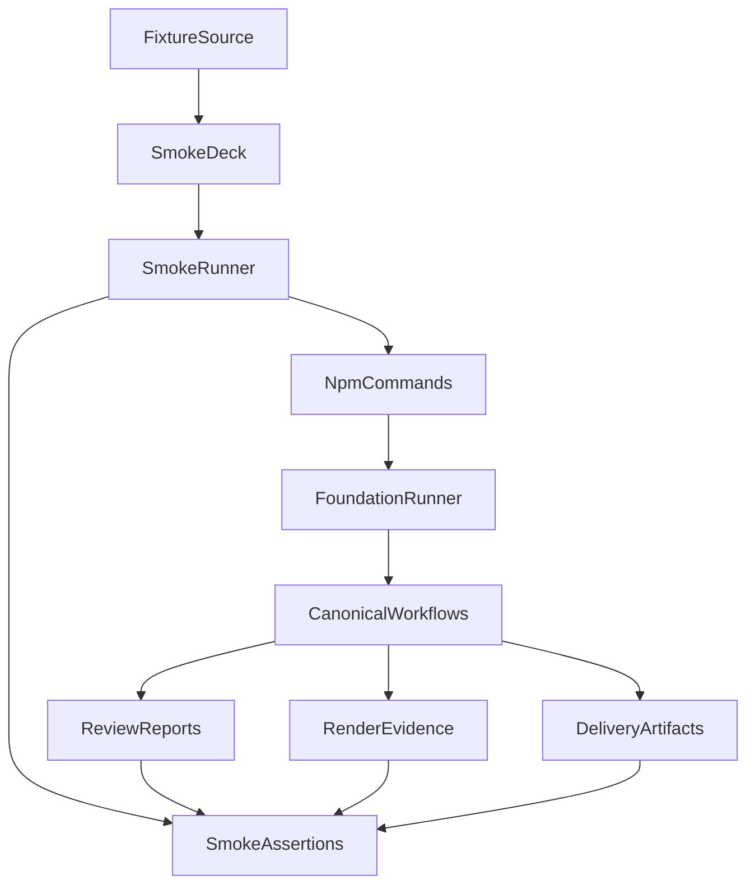

# 設計ドキュメント

## 概要

`slide-workflow-smoke-validation` は、foundation と orchestration の契約を smoke deck で実行確認する integration validation です。既存の command/state model、approval ownership、report schema、workflow routing を再定義せず、`slides/<deck>` target の canonical sequence が `delivered` に到達することと、主要な failure/rerun/force path が設計どおり動くことを検証します。

### 目標

- smoke fixture を `slides/<deck>` target contract に合わせて準備する
- canonical command sequence を npm scripts 経由で end-to-end 実行する
- invalid target、missing approval、invalid approval command を TAKT 起動前 failure として検証する
- plan/compose approval が明示的な人間コマンドだけで生成されることを検証する
- supervision report、loop monitor、render evidence、delivery artifact の契約を検証する
- successful rerun、rejected rerun、`--force` invalidation、history archive を検証する
- smoke で見つかった integration issue を上流契約の範囲で最小修正する

### 非目標

- command/state model の再設計
- TAKT workflow semantics の追加
- 旧 command 互換 alias の復活
- approval ownership の変更
- `html`、`pdf`、`pptx` 以外の deliverable 追加
- `polish` への PPTX visual inspection 組み込み
- GitHub PR automation

## 境界コミットメント

### この spec が所有するもの

- smoke fixture を canonical target で使う準備手順と fixture documentation の更新
- smoke sequence validation script と npm entrypoint
- invalid target、missing approval、approval command、rerun/force/history の integration validation
- render evidence と delivery artifact の実行証跡 validation
- smoke run で見つかった integration issue の最小修正
- smoke 結果として残す検証サマリー

### 境界外

- foundation が所有する target resolver、front matter parser、approval writer、runner semantics の再設計
- orchestration が所有する canonical workflow topology と facet/output-contract semantics の再設計
- smoke deck 以外の実 deck 品質改善
- source artifact を force invalidation で削除する挙動
- Git 操作、commit、PR 作成

### 許可する依存

- `slide-workflow-foundation` の `slides/<deck>` target、approval、state check、runner、render evidence、force/rerun contract
- `slide-workflow-orchestration` の `takt-marp-slide-plan`、`takt-marp-slide-compose`、`takt-marp-slide-polish`、`takt-marp-slide-deliver` と canonical report family
- 既存 fixture `fixtures/marp-slide-workflow/_workflow-smoke/`
- npm scripts と Node.js ESM script
- 既存 Marp/TAKT tooling と `./node_modules/.bin/takt --pipeline --skip-git`

### 再検証トリガー

- foundation の report/approval front matter field、state enum、approval policy が変わる
- runner の target contract、workflow name mapping、rerun/force/archive 対象が変わる
- orchestration の report name、step role、loop monitor routing、supervision output contract が変わる
- render evidence path または delivery artifact path が変わる
- smoke fixture の source requirements または `plan.md` deliverables contract が変わる

## アーキテクチャ

### 既存状態

既存 fixture は `fixtures/marp-slide-workflow/_workflow-smoke/` にあり、README は旧 `slides/<deck>/brief.md` target と旧 `draft / review-revise / build-qa` workflow を案内しています。roadmap と上流 spec は、再設計後の target を `slides/<deck>` に固定し、ユーザー向け command を `plan / compose / polish / deliver` に限定しています。

この spec は fixture の存在を活かしつつ、実行用 deck directory を `slides/_workflow-smoke` として準備し、npm scripts 経由の canonical sequence と failure path を検証します。検証で見つかったズレは、validation 側の fixture/setup 問題、foundation 契約実装の問題、orchestration 契約実装の問題に分類してから修正します。

### 採用パターン

採用パターン: fixture-backed integration validation plus convergence fix loop。smoke validation は deterministic script で実行前後の filesystem と report front matter を確認し、TAKT の詳細判断は canonical workflow の report contract に委ねます。

主要な決定:

- smoke runner は新しい workflow semantics を持たず、npm scripts と上流 contract を呼び出して観測する。
- failure path は TAKT 起動有無を検証対象に含め、preflight failure と workflow failure を混同しない。
- smoke deck の source artifact は fixture から再作成できる一時 deck とし、generated output は検証前に clean できる。
- `pdftoppm` がない環境では PDF raster evidence を degraded として扱い、HTML PNG evidence failure とは区別する。
- integration issue の修正は、既存 contract に対する実装ズレの修正に限定する。契約自体の変更が必要な場合は upstream feedback として明示する。

## ファイル構成計画

### 作成するファイル

- `scripts/takt-marp-validate-slide-workflow-smoke.mjs` — smoke deck setup、canonical sequence、failure path、evidence/artifact、rerun/force/history を検証する CLI。
- `slides/_workflow-smoke/.gitkeep` または生成時のみの deck directory — smoke 実行時に fixture から再作成される作業 target。常設する場合は source artifact と generated artifact の境界を明示する。

### 変更するファイル

- `fixtures/marp-slide-workflow/_workflow-smoke/README.md` —旧 command/旧 target の案内を canonical sequence と `slides/<deck>` target に更新する。
- `fixtures/marp-slide-workflow/_workflow-smoke/brief.md` — plan が `plan.md` の `deliverables` へ正規化できる artifact request を `html`、`pdf`、必要に応じて `pptx` の範囲で明確になるよう最小更新する。
- `package.json` — smoke validation 用 npm script を追加する。既存 `slide:*` command model の再設計は foundation の所有なので、この spec では smoke entrypoint だけを追加する。
- `scripts/takt-marp-validate-slide-workflow-foundation.mjs` または foundation validation 周辺 — smoke で見つかった preflight/rerun/force の integration gap が既存 validation で捕捉できない場合のみ、最小の regression を追加する。
- `.takt/workflows/*.yaml`、`.takt/facets/**/*.md` — smoke で見つかった orchestration の参照切れ、report schema 不一致、loop routing 不備だけを integration fix exception として最小修正する。

### 変更しないファイル

- `.kiro/specs/slide-workflow-foundation/**`
- `.kiro/specs/slide-workflow-orchestration/**`
- 旧 command alias を戻すための workflow または npm script
- smoke と関係しない real deck source
- GitHub workflow、PR automation、repository metadata

## 要件トレーサビリティ

| Requirement | Summary | Components | Interfaces | Flows |
|-------------|---------|------------|------------|-------|
| 1.1 | smoke deck directory を準備する | SmokeDeckFixture, SmokeDeckSetup | filesystem | Setup |
| 1.2 | `slides/<deck>` target を案内する | SmokeDeckFixture | README | Setup |
| 1.3 | source と generated を分離する | SmokeDeckSetup, SmokeArtifactBoundary | filesystem | Setup |
| 2.1 | canonical sequence を実行する | SmokeRunner | npm scripts | Main sequence |
| 2.2 | delivered 到達を確認する | SmokeAssertions | reports, dist | Main sequence |
| 2.3 | sequence failure を診断する | SmokeResultReporter | validation summary | Main sequence |
| 3.1 | invalid target を検証する | PreflightAssertions | command exit | Failure path |
| 3.2 | missing plan approval を検証する | PreflightAssertions | command exit | Failure path |
| 3.3 | missing compose approval を検証する | PreflightAssertions | command exit | Failure path |
| 3.4 | stale report を成功扱いしない | PreflightAssertions, ReportAssertions | front matter | Failure path |
| 3.5 | stale approval mismatch を成功扱いしない | PreflightAssertions, ReportAssertions | front matter | Failure path |
| 4.1 | plan/compose approval を検証する | ApprovalFlowAssertions | approval files | Approval |
| 4.2 | missing `--by` を検証する | ApprovalFlowAssertions | command exit | Approval |
| 4.3 | polish/deliver approval 拒否を検証する | ApprovalFlowAssertions | command exit | Approval |
| 4.4 | workflow が approval を生成しない | ApprovalFlowAssertions | filesystem | Approval |
| 5.1 | plan/compose supervision を検証する | ReportAssertions | front matter | Reporting |
| 5.2 | polish/deliver supervision を検証する | ReportAssertions | front matter | Reporting |
| 5.3 | 非収束を成功にしない | ConvergenceAssertions | loop reports | Convergence |
| 5.4 | invalid front matter を拒否する | ReportAssertions | state check | Reporting |
| 6.1 | render evidence を検証する | RenderEvidenceAssertions | `.takt/render` | Evidence |
| 6.2 | degraded PDF raster を区別する | RenderEvidenceAssertions | metadata | Evidence |
| 6.3 | delivery artifacts を検証する | DeliveryArtifactAssertions | `dist` | Delivery |
| 6.4 | evidence と dist を分離する | SmokeArtifactBoundary | filesystem | Evidence |
| 7.1 | successful rerun を拒否する | RerunForceAssertions | command exit | Rerun |
| 7.2 | rejected rerun と archive を検証する | RerunForceAssertions | history | Rerun |
| 7.3 | force archive を検証する | RerunForceAssertions | history | Force |
| 7.4 | force cleanup と source 保持を検証する | RerunForceAssertions | filesystem | Force |
| 8.1 | issue を分類する | IntegrationFixLoop | summary | Fix loop |
| 8.2 | 契約内で最小修正する | IntegrationFixLoop | patch scope | Fix loop |
| 8.3 | 契約矛盾を upstream feedback にする | IntegrationFixLoop | summary | Fix loop |
| 8.4 | smoke 結果を残す | SmokeResultReporter | summary | Closeout |

## コンポーネントとインターフェース

| Component | Domain/Layer | Intent | Requirement Coverage | Key Dependencies | Contracts |
|-----------|--------------|--------|----------------------|------------------|-----------|
| SmokeDeckFixture | Fixture | smoke 入力と README を canonical target contract に合わせる | 1.1, 1.2 | existing fixture P0 | State |
| SmokeDeckSetup | Validation | fixture から clean な `slides/<deck>` target を準備する | 1.1, 1.3 | filesystem P0 | Batch |
| SmokeRunner | Validation | canonical command sequence と個別 failure path を実行する | 2.1, 2.3 | npm scripts P0 | Batch |
| PreflightAssertions | Validation | invalid target と missing approval が TAKT 前に止まることを検証する | 3.1, 3.2, 3.3, 3.4 | foundation runner P0 | Batch |
| ApprovalFlowAssertions | Validation | explicit human approval flow を検証する | 4.1, 4.2, 4.3, 4.4 | approval script P0 | Batch, State |
| ReportAssertions | Validation | supervision/front matter/state check を検証する | 2.2, 5.1, 5.2, 5.4 | state check P0 | State |
| ConvergenceAssertions | Validation | TAKT `loop_monitors` 設定で非生産的な反復が success supervision に進まないことを検証する | 5.3 | orchestration workflow P0 | State |
| RenderEvidenceAssertions | Validation | `.takt/render/<deck>/` の metadata と degraded mode を検証する | 6.1, 6.2, 6.4 | render evidence script P0 | State |
| DeliveryArtifactAssertions | Validation | `dist/<deck>/` clean と `plan.md` deliverables を検証する | 6.3, 6.4 | Marp delivery P0 | State |
| RerunForceAssertions | Validation | successful rerun、rejected rerun、force archive/cleanup を検証する | 7.1, 7.2, 7.3, 7.4 | foundation runner P0 | Batch, State |
| SmokeArtifactBoundary | Validation | source/evidence/delivery artifact の混同を防ぐ | 1.3, 6.4, 7.4 | filesystem P0 | State |
| IntegrationFixLoop | Process | smoke で見つかったズレを分類し最小修正する | 8.1, 8.2, 8.3 | upstream specs P0 | State |
| SmokeResultReporter | Validation | 実行 command、failure path、evidence、artifact、残存リスクを記録する | 2.3, 8.4 | validation CLI P1 | Batch |

### Batch Contract: smoke validation CLI

- Trigger: `node scripts/takt-marp-validate-slide-workflow-smoke.mjs [--deck slides/_workflow-smoke] [--keep]`
- Primary flow: fixture setup、invalid target/preflight checks、canonical sequence、evidence/artifact checks、rerun/force/history checks、summary output
- Exit behavior: すべての必須 check が通った場合は zero exit。失敗時は failing check 名、実行 command、期待値、観測値、関連 path を出して non-zero exit。
- Side effects: smoke target、`.takt/render/<deck>/`、`dist/<deck>/`、`review/history/` を作成または clean できる。`--keep` がない場合は再実行可能な clean state を優先する。

### State Contract: smoke result summary

Smoke result summary は `slides/<deck>/review/smoke-summary.md` に Markdown + YAML front matter で保存する。front matter には `target`、`generated_at`、`result`、`commands_run`、`failed_checks`、`upstream_feedback_count` を含める。body は少なくとも次を含む。

- executed commands
- verified preflight failures
- verified approvals
- supervision reports and observed states
- render evidence metadata path
- `plan.md` の deliverables と delivery artifact paths
- rerun/force/history observations
- integration fixes applied or upstream feedback needed
- residual risks

Final report format は `slides/<deck>/review/smoke-summary.md` に固定し、JSON を追加する場合も Markdown summary を authoritative にする。

### State Contract: convergence negative harness

Convergence negative harness は、実 deck の修正ループ品質に依存せず、workflow YAML の `loop_monitors` 設定を使って orchestration routing contract を決定論的に検証する。smoke validation は次の設定を検証入力として扱う。

- `cycle` が実際に反復する review/inspect/verify、fix、work/build/render step を順番に含む
- `threshold` が有限である
- `judge.instruction` が TAKT built-in instruction を参照する
- 非生産的な反復の judge rule が `ABORT` へ向く

smoke validation は `.takt/workflows/takt-marp-slide-*.yaml` の `loop_monitors` block を静的に確認し、旧 deck-local loop monitor step や dedicated loop monitor facet が残っていないことを検証する。この harness は TAKT agent に新しい loop semantics を要求せず、TAKT 標準の loop monitor 構造が使われていることだけを検証する。

## エラー処理

- invalid target と missing approval は TAKT 起動前 failure として扱い、TAKT workflow failure と混同しない。
- smoke setup が既存 source artifact を上書きする場合は、fixture 由来の smoke deck だけに限定する。
- optional PDF rasterization missing は degraded evidence として扱い、HTML PNG evidence failure は blocker として扱う。
- rejected rerun/force の history archive が観測できない場合は smoke failure とする。
- integration issue が上流契約の曖昧さに由来する場合は、smoke 側で意味論を埋めず upstream feedback として明示する。

## テスト戦略

- Smoke setup validation: fixture から `slides/_workflow-smoke/brief.md` が再現され、source と generated output が分離されることを確認する。
- Preflight validation: `slides/_workflow-smoke/brief.md`、Markdown file、`slides/` 外 path、missing approval、stale approval mismatch が TAKT 起動前に失敗することを確認する。
- Approval validation: `plan`/`compose` approval、missing `--by`、`polish`/`deliver` approval rejection、workflow-only approval non-generation を確認する。
- Sequence validation: canonical sequence が `delivered` に到達し、plan/compose/polish/deliver supervision front matter が expected state と `result: passed` を持つことを確認する。
- Convergence validation: workflow YAML の `loop_monitors` が各 command の実 cycle を監視し、非生産的な反復時に `ABORT` へ向くことを確認する。
- Evidence validation: `.takt/render/<deck>/` metadata、HTML PNG evidence、optional PDF raster degraded mode を確認する。
- Delivery validation: `dist/<deck>/` clean 後に `plan.md` の deliverables が生成され、render evidence と混同されないことを確認する。
- Rerun/force validation: successful rerun rejection、rejected rerun archive、force archive、generated output cleanup、source retention を確認する。
- Regression validation: smoke で直した integration issue が再発しないよう、対応する assertion を smoke validation CLI または既存 validation に含める。

## 実装メモ

- 既存の上流 spec は approved として扱い、この spec 内では再承認待ちを作らない。
- fixture README の更新は smoke 実行方法の更新に限定し、workflow redesign の説明文書にしない。
- validation script は command の出力全文を成功条件にせず、exit code、front matter、filesystem path、metadata を primary evidence として扱う。
- `pdftoppm` availability は環境差があるため、必須成功条件は HTML PNG evidence と metadata 記録に置く。
- この design では `research.md` を生成しない。ユーザー指定により spec directory 配下の生成対象を4ファイルに限定する。
