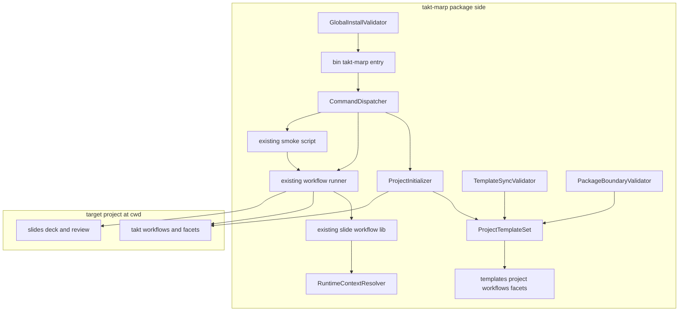
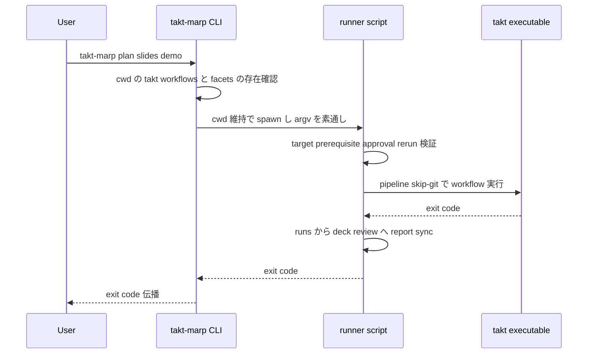
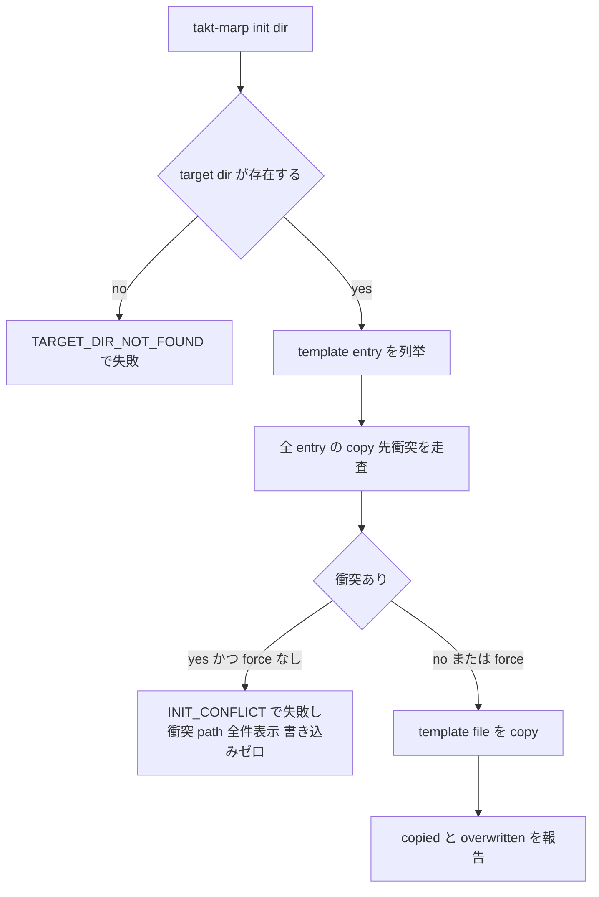
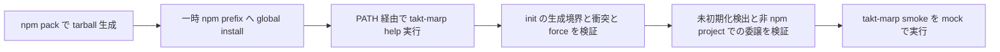

# 技術設計: takt-marp-global-installer

## 概要

**Purpose**: この機能は slide workflow 利用者とメンテナに対し、repo clone と `npm run slide:*` の repo-local 知識に依存しない導入・実行入口を提供する。`npm install -g takt-marp` で `takt-marp` command が利用可能になり、任意の対象プロジェクトで `takt-marp init .` による明示的な template 導入と、`plan / compose / polish / deliver / smoke` の実行ができる。

**Users**: workflow 利用者は別プロジェクトでの slide 作成導入と日常の workflow 実行に利用する。workflow メンテナは package 境界・template drift・global install 経路の CI 検証に利用する。

**Impact**: 現在「bin なし・files なし・engines なし・runtime 依存が devDependencies」の npm package を、global install 可能な CLI package に変える。既存の workflow runner / lib / smoke script は source of truth のまま保ち、executable 解決の既定だけを「cwd の node_modules」から「takt-marp package 自身の node_modules」へ置き換える。

### 目標

- `npm install -g` 後に `takt-marp` command(`init / plan / compose / polish / deliver / smoke`)が PATH から実行できる
- `takt-marp init` が `.takt/workflows/**` と `.takt/facets/**` だけを安全(既定失敗・明示上書き)に導入する
- 対象プロジェクトに `package.json` / `node_modules` / local install を要求しない実行モデルを成立させる
- package 境界(files allowlist)・template drift・global install 経路を CI で決定論的に検証する

### 非目標

- `plan / compose / polish / deliver` の command/state/report/approval 契約の再設計(既存 spec 所有)
- workflow YAML / facets の内容変更(facets 内の `npm run build:*` 等 repo-local 参照の解消は orchestration 側 follow-up)
- npm registry publish automation、Homebrew / mise / standalone binary 配布
- global CLI への `slide:*` alias 追加
- provider 設定・API key・認証情報の生成や変更
- pnpm / yarn global の完全互換(npm を優先し、互換対応は最小限)

## 境界コミットメント

### このスペックが所有するもの

- `takt-marp` の bin entrypoint と利用者向け command surface(`init / plan / compose / polish / deliver / smoke`)
- `init` の意味論: template copy 範囲、衝突検出、既定失敗、`--force` / `--overwrite` 上書き
- 配布 template の正本 `templates/project/{workflows,facets}` と、その allowlist / 禁止 pattern 定義
- runtime executable 解決の方針(projectRoot = cwd と packageRoot/runtimeBin の分離)
- package metadata 境界: `bin`、`files`、`engines.node`、runtime `dependencies`
- installer 系検証: template drift 検証、package 境界検証、global install E2E 検証、およびそれらの CI 配線
- 未初期化 project の検出と `takt-marp init .` への誘導

### 境界外

- workflow の成功条件・状態遷移・report schema・approval ownership(`slide-workflow-foundation` / `slide-workflow-orchestration` 所有)
- smoke validation の検証 phase・provider 分離・summary 内容(`slide-workflow-smoke-validation` 所有。当 spec は入口と project root の注入のみ)
- facets / workflow YAML の内容。特に `takt-marp-deliver-build.md` 等が参照する `npm run build:*` は repo-local 前提であり、非 npm な対象プロジェクトでの real provider polish/deliver 完走はこの spec では保証しない(既知の制限)
- repo-local `npm run slide:*` 入口の廃止・変更(互換入口として温存)
- npm publish 先・versioning・release 自動化

### 許可する依存

- `scripts/lib/takt-marp-slide-workflow.mjs` の公開契約(`COMMANDS`、`resolveDeckTarget`、`assertWorkflowAvailable`、approval/rerun/force helper、`SlideWorkflowError`)
- runner script の argv 契約 `<command> <target> [--force] [--provider <name>]`、`stdio: inherit`、exit code 伝播
- smoke script の `--provider` 契約と provider 別 summary 生成(project root は本 spec が parameterize)
- TAKT の cwd ベース `.takt/` discovery と `-w takt-marp-slide-<command>` の名前解決
- npm CLI(`npm pack`、`npm install -g --prefix`)と Node.js >= 24 の builtin(`node:util parseArgs`、`node:fs` 等)

依存方向(import はこの向きのみ許可):

```
takt-marp-runtime-context → takt-marp-project-templates → takt-marp-project-init → takt-marp-cli → bin/takt-marp
```

既存 `takt-marp-slide-workflow.mjs` と build / smoke / validator script は `takt-marp-runtime-context`(および validator は `takt-marp-project-templates`)を import してよい。逆方向(runtime-context が他 module を import する等)は禁止する。

### 再検証トリガー

- runner script の argv / exit code / report sync 契約の変更
- workflow file 命名規約(`takt-marp-slide-<command>.yaml`)または `.takt/` 配下の workflows / facets directory 構造の変更
- smoke script の起動契約(`--provider`、project root の扱い)の変更
- TAKT の `.takt/` discovery 意味論(cwd 基準)の変更
- package 内 script 配置(`scripts/`、`scripts/lib/`)の変更
- facets の repo-local 参照解消(orchestration 側変更)— template 内容が変わるため drift 同期と再配布が必要

## アーキテクチャ

### 既存アーキテクチャ分析

- 既存 lib は target 検証・prerequisite・approval・freshness・rerun/force を所有し、多くの関数が `options.root ?? process.cwd()` で root 注入可能。runner は cwd を project root として動作し、takt を `--pipeline --skip-git -w takt-marp-slide-<command> -t <target>` で spawn する。
- executable 解決のみ `process.cwd()/node_modules/.bin/{takt,marp}` 固定であり(lib 116-132 行、build script 115 行)、これが「対象プロジェクトの npm project 化」を強制している唯一の結合点である。
- smoke script は `ROOT = path.resolve(SCRIPT_DIR, "..")` を project root とし、fixture(`fixtures/marp-slide-workflow/_workflow-smoke`)と runner を SCRIPT_DIR 相対で解決する。
- 維持する統合ポイント: runner の argv 契約、report sync、`SlideWorkflowError` のエラー形式(`CODE: message`)、`npm run slide:*` の repo-local 入口。

### アーキテクチャパターンと境界マップ



**Architecture Integration**:

- 採用パターン: 薄い CLI adapter + 既存 runner への委譲(ギャップ分析の選択肢C ハイブリッド)。installer 固有の関心事(init / template / packaging / 検証)は新規 module に隔離し、workflow 意味論は既存実装を source of truth とする。
- ドメイン境界: 「導入境界(installer)」と「workflow 契約(既存 spec 群)」を、未初期化検出(adapter 所有)と workflow 検証(runner 所有)の縫い目で分離する。
- 新規コンポーネントの根拠: 1932 行の smoke script や既存 runner へ installer 分岐を追加しない(ギャップ分析の推奨)。
- 鍵となる決定: executable 解決の既定を cwd から packageRoot(`import.meta.url` 由来)へ変更する。repo-local 実行では packageRoot == repo root のため挙動互換であり、global install では npm が package 配下 `node_modules/.bin` に依存 bin をリンクするため同一式が成立する。mode flag や env var 伝播は導入しない。

### 技術スタック

| レイヤー | 選択／バージョン | 機能内での役割 | メモ |
|-------|------------------|-----------------|-------|
| ランタイム | Node.js >= 24(`engines.node`) | CLI / script 実行基盤 | bin 先頭で実行時 version guard も行う |
| CLI | `node:util` `parseArgs` | dispatcher の引数解析 | 新規依存ゼロ。workflow command への引数は解析せず素通し |
| 配布 | npm(`bin` / `files` / `npm pack`) | global install と package 境界 | `.npmignore` は使わず `files` allowlist 単独 |
| workflow 実行 | `takt@^0.44.0`(dependencies へ移行) | TAKT workflow 実行 | `packageRoot/node_modules/.bin/takt` で解決 |
| render | `@marp-team/marp-cli@^4.4.0`、`@kazumatu981/markdown-it-kroki@^1.3.6`(dependencies へ移行) | slide build / kroki | marp も packageRoot 基準で解決 |

新規外部依存は追加しない。`overrides.yargs@^18` は維持し、dependencies 移行後の lockfile 再生成を CI で検証する。

## ファイル構造計画

### ディレクトリ構造(新規)

```
bin/
└── takt-marp.mjs                          # bin entry: Node version guard と dispatcher 起動のみ
scripts/
├── lib/
│   ├── takt-marp-runtime-context.mjs     # packageRoot / runtimeBin / 実行ファイル path の pure 解決
│   ├── takt-marp-project-templates.mjs   # template set 定義: 列挙・allowlist・禁止 pattern・差分計算
│   ├── takt-marp-project-init.mjs        # init 意味論: 衝突検出・既定失敗・copy・force 上書き
│   └── takt-marp-cli.mjs                 # command dispatch・help・未初期化検出・委譲 spawn
├── takt-marp-sync-project-templates.mjs  # template drift 検証(既定)と --write 同期
├── takt-marp-validate-package-boundary.mjs # npm pack 実内容と files allowlist / 禁止 pattern の突合
└── takt-marp-validate-global-install.mjs # tarball を一時 prefix へ install して行う E2E 検証
templates/
└── project/
    ├── workflows/                         # 配布正本(dev .takt/workflows から --write で同期)
    └── facets/                            # 配布正本(dev .takt/facets から --write で同期)
```

### 変更対象ファイル

- `package.json` — `bin`(`takt-marp` → `bin/takt-marp.mjs`)、`files`(`bin/`、`scripts/`、`templates/`、`fixtures/marp-slide-workflow/`、`marp.config.mjs`)、`engines.node >= 24`、`takt` / `@marp-team/marp-cli` / `@kazumatu981/markdown-it-kroki` の dependencies 移行、npm scripts 追加(`installer:sync-templates` / `installer:check-templates` / `installer:check-package` / `installer:validate`)
- `scripts/lib/takt-marp-slide-workflow.mjs` — `taktExecutablePath` / `assertTaktExecutableAvailable` の既定 root を `process.cwd()` から packageRoot(runtime context 経由)へ変更。`options.root` の明示 override は維持。エラーメッセージを global install 文脈(`npm install -g takt-marp` の再 install 案内)へ更新
- `scripts/takt-marp-build-slide-artifact.mjs` — marp 解決を runtime context 経由(packageRoot 基準)へ変更
- `scripts/takt-marp-validate-slide-workflow-smoke.mjs` — 3 点の最小変更(roadmap が認める smoke の upstream 最小修正の範囲): (1) `ROOT` を `path.resolve(SCRIPT_DIR, "..")` から `process.cwd()` 基準へ変更(fixture / runner の SCRIPT_DIR 相対解決は不変)、(2) `runNpmScript` の 3 呼び出し(`slide:approve` ×2、`slide:<command>`)を既存 `runNodeScript` と同型の `process.execPath` 直接起動へ置換(`npm run` は package script の薄い wrapper のため検証意味論は不変。`package.json` 不在の一時 smoke プロジェクトで必須)、(3) workflow doctor の takt 解決(`ROOT/node_modules/.bin/takt`)を RuntimeContextResolver 経由へ変更。`npm run slide:smoke` は cwd = repo root のため挙動互換
- `.github/workflows/ci.yml` — Node 22 → 24、`installer:check-templates` / `installer:check-package` / `installer:validate` step の追加

## システムフロー

### workflow command の委譲フロー



未初期化(`.takt/workflows/` または `.takt/facets/` 欠落)の場合、CLI は runner を spawn せず `PROJECT_NOT_INITIALIZED` で失敗し `takt-marp init .` を案内する。親 directory の探索は行わない。runner 内の検証エラー(invalid target 等)は TAKT 起動前に発生し、そのまま利用者に表示される。

### init の衝突処理フロー



衝突走査は全 copy に先行する(scan-then-copy)。これにより衝突失敗時の部分生成ゼロ(3.2)を構造的に保証する。copy / 上書き対象は template entry の相対 path に限定され、`.takt/` 配下のそれ以外のファイルには読み書きしない(2.5、3.4)。

### global install 検証フロー(CI)



## 要件トレーサビリティ

| 要件 | 要約 | コンポーネント | インターフェース／フロー |
|------|------|----------------|--------------------------|
| 1.1 | global install で PATH から実行可能 | PackageMetadata、CliEntry | `bin` 定義、GlobalInstallValidator phase 1 |
| 1.2 | help が 6 command を表示 | CommandDispatcher | `runCli` の help 出力 |
| 1.3 | `slide:*` を有効 command にしない | CommandDispatcher | 未知 command 拒否(`UNKNOWN_COMMAND`) |
| 1.4 | 未対応 Node で必要 version を表示 | CliEntry、PackageMetadata | version guard、`engines.node` |
| 2.1 | init が workflows/facets を生成 | ProjectInitializer、ProjectTemplateSet | `initializeProject`、init フロー |
| 2.2 | `init <dir>` の明示対象 | CommandDispatcher、ProjectInitializer | `InitOptions.targetDir` |
| 2.3 | config.yaml / runtime state を生成しない | ProjectTemplateSet、ProjectInitializer | template entry 限定 copy、禁止 pattern |
| 2.4 | provider 設定・認証情報を生成しない | ProjectTemplateSet、ProjectInitializer | 同上 |
| 2.5 | template 対象外の既存ファイル不変 | ProjectInitializer | 相対 path 限定の copy(削除・同期なし) |
| 3.1 | 衝突時は既定失敗 + 一覧表示 | ProjectInitializer | `INIT_CONFLICT`(全衝突 path) |
| 3.2 | 衝突失敗時の部分生成ゼロ | ProjectInitializer | scan-then-copy |
| 3.3 | `--force` / `--overwrite` で上書き許可 | CommandDispatcher、ProjectInitializer | `InitOptions.force`(完全 alias) |
| 3.4 | force でも template 対象外は不変 | ProjectInitializer | copy 対象 = template entry のみ |
| 3.5 | 自動 merge / 暗黙上書きをしない | ProjectInitializer | 衝突は失敗か明示 force の二択 |
| 4.1 | cwd を対象プロジェクトとする | CommandDispatcher | cwd 維持 spawn(委譲フロー) |
| 4.2 | 未初期化検出と init 案内 | CommandDispatcher | `PROJECT_NOT_INITIALIZED` |
| 4.3 | npm project 不在を失敗理由にしない | RuntimeContextResolver、既存 lib 変更 | packageRoot 基準の executable 解決 |
| 4.4 | 親 directory を暗黙探索しない | CommandDispatcher | cwd 直下のみ確認 |
| 4.5 | `npm run` を経由しない | CommandDispatcher | `process.execPath` での直接 spawn |
| 5.1 | 既存 workflow 契約の尊重 | CommandDispatcher、既存 runner | argv 素通し委譲(再実装なし) |
| 5.2 | invalid target を TAKT 起動前に表示 | 既存 runner(委譲) | runner preflight がそのまま表面化 |
| 5.3 | rerun blocking / force invalidation 同等 | 既存 runner(委譲) | `--force` の素通し |
| 5.4 | provider 明示の試行 | CommandDispatcher、既存 runner | `--provider` の素通し |
| 5.5 | 契約を再定義しない | CommandDispatcher | adapter は解析せず委譲のみ |
| 6.1 | smoke の既定 provider は mock | SmokeEntry、既存 smoke script | provider 未指定時の既定継承 |
| 6.2 | mock と分かる検証結果 | 既存 smoke script(委譲) | provider 別 summary(既存挙動) |
| 6.3 | `--provider <name>` で指定実行 | SmokeEntry | `--provider` 素通し |
| 6.4 | real と provider 名が分かる結果 | 既存 smoke script(委譲) | provider 別 summary(既存挙動) |
| 6.5 | 設定不足時は生成せず失敗情報 | SmokeEntry、既存 smoke script | 失敗の表面化。config 生成は行わない |
| 7.1 | template が workflows/facets のみ | ProjectTemplateSet、PackageBoundaryValidator | domain allowlist 検証 |
| 7.2 | 禁止ファイル混入なし | ProjectTemplateSet、PackageBoundaryValidator | 禁止 pattern 検証 |
| 7.3 | template と dev の drift 検出 | TemplateSyncValidator | path 集合 + byte 比較 |
| 7.4 | drift path が分かる失敗情報 | TemplateSyncValidator | `TEMPLATE_DRIFT`(path 一覧) |
| 7.5 | package/include 境界と実内容の一致 | PackageBoundaryValidator | `npm pack --dry-run --json` 突合 |
| 8.1 | tarball を global install 相当で検証 | GlobalInstallValidator | 一時 prefix install + PATH 実行 |
| 8.2 | init が workflows/facets だけ生成を検証 | GlobalInstallValidator | init 後の差分検査 |
| 8.3 | 衝突失敗と明示上書きを検証 | GlobalInstallValidator | conflict / force phase |
| 8.4 | mock smoke を必須検証とする | GlobalInstallValidator、CI | `takt-marp smoke`(mock)step |
| 8.5 | real provider smoke を必須にしない | GlobalInstallValidator、CI | real provider を CI から除外 |

## コンポーネントとインターフェース

| コンポーネント | レイヤー | 意図 | 要件 | 主要依存 | 契約 |
|-----------|--------------|--------|--------------|------------------|-----------|
| PackageMetadata | 配布 | package 境界の宣言 | 1.1, 1.4, 4.3, 7.5 | npm (External, P0) | State |
| CliEntry | CLI | version guard と起動 | 1.1, 1.4 | CommandDispatcher (P0) | Service |
| CommandDispatcher | CLI | command surface と委譲 | 1.2, 1.3, 4.1, 4.2, 4.4, 4.5, 5.1-5.5, 6.1, 6.3 | runner / smoke script (P0)、ProjectInitializer (P0) | Service |
| RuntimeContextResolver | 実行基盤 | packageRoot / runtimeBin 解決 | 4.3, 5.1 | なし(leaf) | Service |
| ProjectTemplateSet | template | 配布境界の単一定義 | 2.1, 2.3, 2.4, 7.1, 7.2 | RuntimeContextResolver (P0) | Service |
| ProjectInitializer | template | init 意味論 | 2.1-2.5, 3.1-3.5 | ProjectTemplateSet (P0) | Service |
| SmokeEntry | CLI | smoke の一時プロジェクト準備と委譲 | 6.1-6.5 | ProjectInitializer (P0)、smoke script (P0) | Service |
| TemplateSyncValidator | 検証 | drift 検出と同期 | 7.3, 7.4 | ProjectTemplateSet (P0) | Batch |
| PackageBoundaryValidator | 検証 | pack 実内容の突合 | 7.1, 7.2, 7.5 | npm pack (External, P0)、ProjectTemplateSet (P0) | Batch |
| GlobalInstallValidator | 検証 | global install E2E | 8.1-8.5 | npm (External, P0)、CliEntry (P0) | Batch |
| 既存 lib / build / smoke 変更 | 実行基盤 | executable 解決と smoke root の差し替え | 4.3, 5.1, 5.5, 6.1 | RuntimeContextResolver (P0) | Service |

インターフェース表記は契約の文書化として TypeScript 風に示す。実装は既存規約どおり ESM `.mjs` とし、引数は境界で検証する(契約に反する入力は `SlideWorkflowError` 互換の `CODE: message` で fail fast)。

### CLI レイヤー

#### CliEntry(`bin/takt-marp.mjs`)

| 項目 | 詳細 |
|-------|--------|
| 意図 | shebang 付き bin entry。Node version guard の後に dispatcher を起動する |
| 要件 | 1.1, 1.4 |

**責務と制約**
- `process.versions.node` の major が 24 未満なら、modern syntax の module を import する前に `NODE_VERSION_UNSUPPORTED: takt-marp requires Node.js >= 24 (current: vX.Y.Z)` を表示して exit 1(1.4 を npm の engines warning に依存させない)
- guard 通過後は `takt-marp-cli.mjs` を dynamic import し、`process.exitCode = await runCli(process.argv.slice(2))` とする
- ロジックを持たない(分岐は version guard のみ)

**依存**
- 流出: CommandDispatcher — 起動(P0)

**契約種別**: Service [x]

##### サービスインターフェース
```typescript
// bin/takt-marp.mjs(モジュールとしての公開 API はなし)
// 事前条件: なし(あらゆる Node で構文エラーなく version guard まで到達できる構文に限定する)
// 事後条件: Node >= 24 なら runCli へ委譲し、その exit code でプロセス終了する
```

#### CommandDispatcher(`scripts/lib/takt-marp-cli.mjs`)

| 項目 | 詳細 |
|-------|--------|
| 意図 | command surface の所有。help、未知 command 拒否、未初期化検出、既存 script への委譲 |
| 要件 | 1.2, 1.3, 4.1, 4.2, 4.4, 4.5, 5.1, 5.2, 5.3, 5.4, 5.5, 6.1, 6.3 |

**責務と制約**
- 有効 command は `init / plan / compose / polish / deliver / smoke` のみ。`--help` / 引数なし / `help` は usage(6 command の一覧と説明)を表示して exit 0(1.2)
- それ以外(`slide:plan` 等を含む)は `UNKNOWN_COMMAND` として有効 command 一覧とともに exit 1(1.3)
- workflow command(`plan / compose / polish / deliver`): cwd 直下に `.takt/workflows/` と `.takt/facets/` の両方が存在することを確認し、欠落時は `PROJECT_NOT_INITIALIZED` で `takt-marp init .` を案内して失敗する(4.2)。親 directory は探索しない(4.4)。確認後、`process.execPath` で `packageRoot/scripts/takt-marp-run-slide-workflow.mjs` を `cwd = process.cwd()`、`stdio: "inherit"` で spawn し、command 以降の argv(`<target>`、`--force`、`--provider` 等)を解析せず素通しする(4.1, 4.5, 5.1-5.5)。子プロセスの exit code を戻り値にする
- `init`: `node:util parseArgs` で `[dir]`(既定 `.`)、`--force` / `--overwrite`(boolean、完全 alias)を解析し、ProjectInitializer を in-process 呼び出しする。成功時は生成結果に加えて次手順(provider 設定がユーザ所有であること、workflow 実行には TAKT の provider 設定が必要なこと、`takt-marp plan` の実行例)を案内として表示する — ファイルの生成・変更は行わない(2.3, 2.4 不変)
- `smoke`: SmokeEntry の手順(後述)を実行する
- workflow 意味論(target / prerequisite / approval / rerun)の検証・解釈を一切持たない(5.5)

**依存**
- 流入: CliEntry — 起動(P0)
- 流出: ProjectInitializer — init 実行(P0)/ runner script — workflow 委譲(P0)/ smoke script — smoke 委譲(P0)/ RuntimeContextResolver — script path 解決(P0)

**契約種別**: Service [x]

##### サービスインターフェース
```typescript
type CliCommand = "init" | "plan" | "compose" | "polish" | "deliver" | "smoke";

interface CliResult {
  exitCode: number; // 0 = 成功 / help 表示
}

/** argv は process.argv.slice(2)。戻り値はプロセス exit code。 */
function runCli(argv: readonly string[]): Promise<number>;
```
- 事前条件: なし(空 argv は help)
- 事後条件: workflow / smoke command では子プロセスの exit code をそのまま返す。CLI 自身が失敗を検出した場合は `CODE: message` を stderr に出力して 1 を返す
- 不変条件: dispatcher は target project のファイルを直接読み書きしない(init / smoke の手順を除き、検査は directory 存在確認のみ)

#### SmokeEntry(CommandDispatcher 内の smoke 手順)

| 項目 | 詳細 |
|-------|--------|
| 意図 | 利用者 project を汚染しない一時 smoke プロジェクトの準備と、既存 smoke script への委譲 |
| 要件 | 6.1, 6.2, 6.3, 6.4, 6.5 |

**責務と制約**
- `os.tmpdir()` 配下に `mkdtemp`(prefix `takt-marp-smoke-`)で一時プロジェクトを作成し、ProjectInitializer で `.takt/workflows/**` / `.takt/facets/**` を導入する
- `packageRoot/scripts/takt-marp-validate-slide-workflow-smoke.mjs` を `cwd = 一時プロジェクト`、`stdio: "inherit"` で spawn し、`--provider` を含む argv を素通しする(provider 未指定時は smoke script の既定 = mock が適用される: 6.1)
- mock / real の判定・summary 生成は smoke script の既存責務(6.2, 6.4)。real provider の環境設定不足は smoke / TAKT の失敗としてそのまま表面化させ、CLI は provider 設定の生成・変更を行わない(6.5)
- 終了後、結果(exit code)と一時プロジェクト path(summary の所在)を表示する。一時プロジェクトは検証結果の置き場として削除しない
- 実装時検証(smoke 経路と workflow command 経路の両方): TAKT が `.takt/config.yaml` 不在で実行可能か(`--provider mock` 指定時 / 未指定時)、および `workflow_command_gates.custom_scripts` 不在が workflow 実行に与える影響を確認する。smoke については不可の場合に限り、smoke 準備が一時プロジェクト内へ ephemeral な最小 config を生成する(利用者 project への生成は行わない。init の禁止事項 2.3 / 2.4 は不変)。利用者の workflow command 経路については config 不在時の失敗モードを GlobalInstallValidator で観測・固定し、init 成功時の案内(CommandDispatcher 参照)で次手順を補う

**依存**
- 流出: ProjectInitializer(P0)、smoke script(P0)

**契約種別**: Service [x]

### 実行基盤レイヤー

#### RuntimeContextResolver(`scripts/lib/takt-marp-runtime-context.mjs`)

| 項目 | 詳細 |
|-------|--------|
| 意図 | projectRoot(cwd)と分離された packageRoot / runtimeBin の pure な解決 |
| 要件 | 4.3, 5.1 |

**責務と制約**
- packageRoot は自身の `import.meta.url` から導出する(`scripts/lib/` の 2 階層上)。env var・設定ファイル・cwd に依存しない
- 実行ファイル path は `path.join(root, "node_modules", ".bin", win32 ? "<tool>.cmd" : "<tool>")`。`root` の既定は packageRoot、`options.root` で明示 override 可能(foundation validation の fake root 互換)
- pure な path 計算のみを持ち、存在検証・エラー送出は呼び出し側(既存 lib の assert)に残す(循環 import の回避)

**依存**
- なし(node:path / node:url のみの leaf module)

**契約種別**: Service [x]

##### サービスインターフェース
```typescript
type RuntimeTool = "takt" | "marp";

interface RuntimeContext {
  packageRoot: string;   // takt-marp package の root(import.meta.url 由来)
  runtimeBinDir: string; // path.join(packageRoot, "node_modules", ".bin")
}

function resolveRuntimeContext(): RuntimeContext;
function runtimeExecutablePath(tool: RuntimeTool, options?: { root?: string }): string;
function packageScriptPath(relative: string): string; // packageRoot 配下の script 絶対 path
```
- 不変条件: 戻り値は同一プロセス内で決定論的(cwd 変化の影響を受けない)

#### 既存 lib / build / smoke の変更

| 項目 | 詳細 |
|-------|--------|
| 意図 | executable 解決の既定差し替えと smoke project root の parameterize(最小変更) |
| 要件 | 4.3, 5.1, 5.5, 6.1 |

**責務と制約**
- `takt-marp-slide-workflow.mjs`: `taktExecutablePath(options)` の既定 root を `runtimeExecutablePath("takt", options)` 委譲に変更。`assertTaktExecutableAvailable` のエラーメッセージを「Reinstall takt-marp (npm install -g takt-marp) and verify its dependencies.」系へ更新。公開関数の名前・シグネチャは不変
- `takt-marp-build-slide-artifact.mjs`: marp path を `runtimeExecutablePath("marp")` に変更
- `takt-marp-validate-slide-workflow-smoke.mjs`: (1) `ROOT` を `process.cwd()` 基準へ変更(`FIXTURE_PATH` / `RUNNER_SCRIPT` は SCRIPT_DIR 相対のまま)、(2) `runNpmScript` の全呼び出し(`slide:approve` 系、`slide:<command>` 系)を `process.execPath` + SCRIPT_DIR 相対 path の直接起動へ置換(同 script 内の既存 `runNodeScript` パターンと同型)、(3) workflow doctor の takt 解決を `runtimeExecutablePath("takt")` へ変更。検証 phase の構成・provider 分離・summary 生成は一切変更しない
- workflow の成功条件・状態遷移・report schema には触れない(5.5)

**依存**
- 流出: RuntimeContextResolver(P0)

**契約種別**: Service [x](既存契約の維持が本体)

### template レイヤー

#### ProjectTemplateSet(`scripts/lib/takt-marp-project-templates.mjs`)

| 項目 | 詳細 |
|-------|--------|
| 意図 | 「配布してよいもの」の単一定義。initializer と全 validator が共有する |
| 要件 | 2.1, 2.3, 2.4, 7.1, 7.2 |

**責務と制約**
- template root は `packageRoot/templates/project`。domain allowlist は `["workflows", "facets"]` に hardcode する(独立 manifest file は持たない — 正本の二重化を避ける設計判断)
- 禁止 pattern(`config.yaml`、`runs/`、`render/`、`persona_sessions.json`、`session-state.json`、`workflow-current-target.json`、`.env`、`*credential*`、`*api*key*` 等)を所有し、template tree への混入を検証エラーにする
- template entry の列挙(domain 配下の全 file の相対 path)と、2 つの tree(template ↔ dev `.takt/`)の差分計算(path 集合差 + byte 単位内容差)を提供する

**依存**
- 流出: RuntimeContextResolver(P0)

**契約種別**: Service [x]

##### サービスインターフェース
```typescript
type TemplateDomain = "workflows" | "facets";

interface TemplateEntry {
  domain: TemplateDomain;
  relativePath: string; // 例: "workflows/takt-marp-slide-plan.yaml"
  sourcePath: string;   // template root 配下の絶対 path
}

interface TemplateDiff {
  missingInTemplate: string[]; // dev にあって template にない
  missingInDev: string[];      // template にあって dev にない
  contentMismatch: string[];   // 両方にあるが byte 不一致
}

const TEMPLATE_DOMAINS: readonly TemplateDomain[];
const PROHIBITED_TEMPLATE_PATTERNS: readonly RegExp[];

function templateRootPath(): string;
function listTemplateEntries(options?: { templateRoot?: string }): Promise<TemplateEntry[]>;
function assertNoProhibitedEntries(entries: readonly TemplateEntry[]): void; // 違反は PACKAGE_BOUNDARY_VIOLATION
function diffTemplateTrees(templateRoot: string, devTaktRoot: string): Promise<TemplateDiff>;
```
- 事後条件: `listTemplateEntries` は domain allowlist 外の path を返さない

#### ProjectInitializer(`scripts/lib/takt-marp-project-init.mjs`)

| 項目 | 詳細 |
|-------|--------|
| 意図 | `takt-marp init` の意味論: 衝突検出・既定失敗・明示上書き・範囲限定 copy |
| 要件 | 2.1, 2.2, 2.3, 2.4, 2.5, 3.1, 3.2, 3.3, 3.4, 3.5 |

**責務と制約**
- 対象 directory(明示 `<dir>` または `.`)が存在しなければ `TARGET_DIR_NOT_FOUND` で失敗する(2.2)
- copy 元は ProjectTemplateSet の entry のみ。copy 先は `<dir>/.takt/<relativePath>`。`.takt/`、`.takt/workflows/**`、`.takt/facets/**` の中間 directory は必要に応じて作成する(2.1)
- **scan-then-copy**: 全 entry の衝突(copy 先 file の存在)を先に走査し、`force = false` で衝突が 1 件以上あれば書き込みを一切行わず `INIT_CONFLICT` で全衝突 path を表示して失敗する(3.1, 3.2, 3.5)
- `force = true` では template entry に対応する path に限り上書きを許可する(3.3)。entry 外の path は force でも読み書き・削除しない(2.5, 3.4)。merge や部分更新は行わない(3.5)
- `config.yaml` / runtime state / provider 設定 / 認証情報は template entry に存在し得ない(ProjectTemplateSet の禁止 pattern + package 境界検証で担保)ため、生成され得ない(2.3, 2.4)

**依存**
- 流入: CommandDispatcher、SmokeEntry、GlobalInstallValidator
- 流出: ProjectTemplateSet(P0)

**契約種別**: Service [x]

##### サービスインターフェース
```typescript
interface InitOptions {
  targetDir: string; // 解決済み絶対 path
  force: boolean;    // --force / --overwrite(完全 alias)
}

interface InitResult {
  created: string[];     // 新規生成した相対 path
  overwritten: string[]; // force で上書きした相対 path
}

/** 失敗は SlideWorkflowError 互換の code 付き例外:
 *  TARGET_DIR_NOT_FOUND | INIT_CONFLICT(message に衝突 path 全件) */
function initializeProject(options: InitOptions): Promise<InitResult>;
```
- 事前条件: targetDir は絶対 path
- 事後条件: 例外時は filesystem 変更ゼロ(衝突起因の場合)。成功時は entry 対応 path のみ変更
- 不変条件: entry 外の path への書き込み・削除はいかなる分岐でも発生しない

### 検証レイヤー

#### TemplateSyncValidator(`scripts/takt-marp-sync-project-templates.mjs`)

| 項目 | 詳細 |
|-------|--------|
| 意図 | 配布 template と開発用 `.takt/{workflows,facets}` の drift 検出(既定)と同期(`--write`) |
| 要件 | 7.3, 7.4 |

**契約種別**: Batch [x]

##### バッチ／ジョブ契約
- Trigger: `npm run installer:check-templates`(CI / 手動)、`npm run installer:sync-templates`(`--write`、手動)
- Input / validation: `diffTemplateTrees(templateRoot, repoRoot/.takt)` の結果
- Output: drift があれば種別(template 欠落 / dev 欠落 / 内容不一致)ごとの path 一覧を表示し `TEMPLATE_DRIFT` で exit 1(7.4)。`--write` は dev → template 方向に同期し、結果の path を表示する
- Idempotency: `--write` 直後の check は常に成功する(byte 比較の往復安定性)

#### PackageBoundaryValidator(`scripts/takt-marp-validate-package-boundary.mjs`)

| 項目 | 詳細 |
|-------|--------|
| 意図 | npm package の実内容と宣言済み境界の突合 |
| 要件 | 7.1, 7.2, 7.5 |

**契約種別**: Batch [x]

##### バッチ／ジョブ契約
- Trigger: `npm run installer:check-package`(CI / 手動)
- Input / validation:
  1. template tree 検証 — `listTemplateEntries` が domain allowlist(`workflows/**`、`facets/**`)のみを含むこと(7.1)、`assertNoProhibitedEntries` を通ること(7.2)
  2. pack 内容検証 — `npm pack --dry-run --json` の file 一覧が `files` allowlist(`bin/`、`scripts/`、`templates/`、`fixtures/marp-slide-workflow/`、`marp.config.mjs` + npm 自動同梱の package.json / README / LICENSE)に収まり、かつ template 全 entry と必須 script を含むこと。`.takt/**`、`.kiro/**`、`.claude/**`、`.agents/**`、`slides/**`、`dist/**`、禁止 pattern 該当 file が含まれないこと(7.2, 7.5)
  3. metadata 検証 — `bin` / `files` / `engines.node >= 24` が宣言され、`takt` / `@marp-team/marp-cli` / `@kazumatu981/markdown-it-kroki` が `dependencies` にあること
- Output: 違反 path / 欠落項目の一覧と `PACKAGE_BOUNDARY_VIOLATION` で exit 1
- Idempotency: 読み取り専用(`--dry-run`)

#### GlobalInstallValidator(`scripts/takt-marp-validate-global-install.mjs`)

| 項目 | 詳細 |
|-------|--------|
| 意図 | 実 tarball の global install 経路 E2E 検証 |
| 要件 | 8.1, 8.2, 8.3, 8.4, 8.5 |

**契約種別**: Batch [x]

##### バッチ／ジョブ契約
- Trigger: `npm run installer:validate`(CI / 手動)
- 手順(global install 検証フロー図に対応):
  1. `npm pack` で tarball を生成し、一時 npm prefix へ `npm install -g --prefix <tmp>` で install。以降の `takt-marp` 実行は `PATH=<tmp>/bin` 経由で行う(8.1)
  2. `takt-marp --help` が 6 command を表示し exit 0、`takt-marp slide:plan` が `UNKNOWN_COMMAND` で exit 1(1.1, 1.2, 1.3 の E2E 確認)
  3. 一時 target project で `takt-marp init .` を実行し、生成物が `.takt/workflows/**` と `.takt/facets/**` のみ(`config.yaml` / `runs` / `render` / session state / provider 設定が不在)であることを検証(8.2)。事前置きした template 対象外 file が不変であることも確認
  4. 再 `init` が `INIT_CONFLICT` で失敗し書き込みゼロであること、`--force` で上書きされ template 対象外 file は不変であることを検証(8.3)
  5. 未初期化 directory での `takt-marp plan slides/x` が `PROJECT_NOT_INITIALIZED` を表示すること、init 済みかつ `package.json` / `node_modules` 不在の project で workflow command が npm project 不在以外の理由(invalid target 等)で失敗すること(4.2, 4.3 の E2E 確認)。あわせて `.takt/config.yaml` 不在の init 済み project における workflow command の失敗モードを観測し、`package.json` / `node_modules` 不在を理由としないことを assertion として固定する
  6. `takt-marp smoke`(provider 未指定 = mock)が成功することを必須検証とする(8.4)。real provider の smoke は実行せず、必須条件にもしない(8.5)
- Output: phase ごとの結果一覧。失敗時は `GLOBAL_INSTALL_VALIDATION_FAILED` で exit 1
- Idempotency & recovery: すべて一時 directory(prefix / target project)内で完結し、repo の作業 tree を変更しない

### 配布レイヤー

#### PackageMetadata(`package.json` 変更)

| 項目 | 詳細 |
|-------|--------|
| 意図 | global install の成立条件と package 境界の宣言 |
| 要件 | 1.1, 1.4, 4.3, 7.5 |

**契約種別**: State [x]

##### 状態管理
- State model: `bin: { "takt-marp": "bin/takt-marp.mjs" }`、`files: ["bin/", "scripts/", "templates/", "fixtures/marp-slide-workflow/", "marp.config.mjs"]`、`engines: { "node": ">=24" }`、`takt` / `@marp-team/marp-cli` / `@kazumatu981/markdown-it-kroki` を `dependencies` へ移行(`@fontsource/noto-sans-jp` は現状維持)、`overrides.yargs` 維持
- 追加 npm scripts: `installer:sync-templates` / `installer:check-templates` / `installer:check-package` / `installer:validate`(既存 `slide:*` / `build:*` は不変)
- Persistence & consistency: 宣言と実態の整合は PackageBoundaryValidator が CI で強制する

## データモデル

この機能は永続データストアを持たない。扱うのは filesystem 上の 3 つの論理モデルのみ。

- **TemplateEntry / TemplateDiff**(前掲のインターフェース定義): 配布境界の単位。relativePath が init の copy 先(`.takt/<relativePath>`)・drift 比較・pack 検証で共通の自然キーになる
- **RuntimeContext**: `packageRoot` / `runtimeBinDir`。プロセス内で不変・決定論的
- **InitResult / InitConflict**: init の観測可能な結果。`created` / `overwritten` / 衝突 path 一覧は E2E 検証(8.2, 8.3)の検査対象でもある

検証結果(smoke summary、supervision report 等)の schema は既存 spec 所有であり、本設計は生成・参照位置(`slides/_workflow-smoke/review/` 等)に依存するだけで内容を再定義しない。

## エラーハンドリング

### エラー戦略

既存規約(`SlideWorkflowError` 由来の `CODE: message` を stderr へ、exit code 1)に統一する。CLI 利用者向けメッセージは既存 script と同じく英語とし、是正アクション(実行すべき command)を必ず含める。fail fast を原則とし、book-keeping 的な部分実行(init の部分 copy 等)を許さない。

### エラー分類と応答

| Code | 発生箇所 | 応答 |
|------|----------|------|
| `NODE_VERSION_UNSUPPORTED` | CliEntry | 必要 version(>= 24)と現在 version を表示(1.4) |
| `UNKNOWN_COMMAND` | CommandDispatcher | 有効 command 一覧を表示。`slide:*` もここに分類(1.3) |
| `PROJECT_NOT_INITIALIZED` | CommandDispatcher | `takt-marp init .` の実行を案内(4.2) |
| `TARGET_DIR_NOT_FOUND` | ProjectInitializer | 指定 directory の確認を案内(2.2) |
| `INIT_CONFLICT` | ProjectInitializer | 衝突 path 全件と `--force` の案内。書き込みゼロ(3.1, 3.2) |
| `TEMPLATE_DRIFT` | TemplateSyncValidator | drift path 一覧と `installer:sync-templates` の案内(7.4) |
| `PACKAGE_BOUNDARY_VIOLATION` | PackageBoundaryValidator | 違反 path / 欠落 metadata の一覧(7.1, 7.2, 7.5) |
| `GLOBAL_INSTALL_VALIDATION_FAILED` | GlobalInstallValidator | 失敗 phase と詳細(8.1-8.4) |
| `TAKT_EXECUTABLE_MISSING`(既存 code) | 既存 lib | メッセージを global 文脈へ更新: takt-marp の再 install を案内(4.3) |

委譲先(runner / smoke / TAKT)のエラーは `stdio: inherit` でそのまま表面化させ、CLI は exit code の伝播のみ行う(5.2, 6.5)。real provider の設定不足は TAKT / provider 層の失敗として利用者に届き、CLI は設定を生成・変更しない(6.5)。

### 監視

CLI はローカルツールであり、観測手段は stdout / stderr と exit code に限定する。CI では各 validator の出力(drift path、違反 path、phase 結果)がそのまま失敗診断ログになる。

## テスト戦略

検証は本 repo の規約(test framework ではなく決定論的 validation script + CI)に従う。各項目は要件の受け入れ条件から導出している。

### 回帰(既存契約の維持)
- `npm test`(`slide:validate-foundation`)が executable 解決の既定変更後も成功すること — `options.root` override 互換の検証(5.1, 5.5)
- `npm run slide:smoke`(repo-local、mock)が smoke ROOT の cwd 化後も成功すること — repo-local 経路の挙動互換(6.1)

### Integration(validator script、CI 必須)
- `installer:check-templates`: 同期済み状態で exit 0。template 側 1 file 改変 / 削除 / dev 側追加のそれぞれで drift path が一覧表示され exit 1(7.3, 7.4)
- `installer:check-package`: 正常構成で exit 0。`files` から `templates/` を外す・template に `config.yaml` を混入させる、の各シナリオで `PACKAGE_BOUNDARY_VIOLATION`(7.1, 7.2, 7.5)
- `installer:validate` 内の init 検証 phase: 生成境界(workflows/facets のみ)、既存 file 保全、衝突既定失敗(書き込みゼロ)、`--force` / `--overwrite` の同等動作(2.1-2.5, 3.1-3.5, 8.2, 8.3)

### E2E(global install 経路、CI 必須)
- tarball → 一時 prefix → PATH 経由 `takt-marp --help` / 未知 command 拒否(1.1, 1.2, 1.3, 8.1)
- 未初期化 project での workflow command が init 案内で失敗 → init 後、`package.json` / `node_modules` なしで workflow command が npm project 不在以外の理由でのみ失敗(4.1-4.4)
- `takt-marp smoke`(mock 既定)が一時プロジェクトで成功し、provider 別 summary が生成される(6.1, 6.2, 8.4)

### 手動 / 任意(CI 非必須)
- `takt-marp smoke --provider <real>` — ユーザ環境設定がある環境での real provider 検証(6.3, 6.4)。設定不足時に provider 設定が生成されないことの確認(6.5)。CI の必須条件にはしない(8.5)
- Node 22 環境での `takt-marp` 実行 → `NODE_VERSION_UNSUPPORTED` 表示(1.4。CI は Node 24 のため手動確認とし、engines 宣言の存在は `installer:check-package` が機械検証する)

## セキュリティ考慮事項

- provider 設定・API key・認証情報は「配布しない・生成しない・上書きしない」を 3 層で強制する: template 禁止 pattern(混入防止)、init の entry 限定 copy(生成防止)、package 境界検証(配布防止)
- real provider の認証情報はユーザ環境(env var / ユーザ所有の TAKT 設定)にのみ存在し、本機能はそれを読む側の TAKT に委ねる
- `npm pack` 内容の allowlist 検証により、`.kiro/` / `.claude/` / `.agents/` 等の開発資産・内部文書の意図しない公開を防ぐ

## 移行戦略

スキーマ移行はない。以下の順で導入し、各段階を CI が検証する。

1. **package 境界の確立**: `files` / `bin` / `engines` / dependencies 移行 + lockfile 再生成 → `installer:check-package` で固定
2. **runtime 解決の差し替え**: RuntimeContextResolver 導入と lib / build / smoke の最小変更 → `npm test` と `slide:smoke` を回帰ゲートにする
3. **installer 本体**: template 正本の生成(`installer:sync-templates`)、CLI / init / smoke entry → `installer:check-templates`
4. **CI 更新**: Node 22 → 24、`installer:check-templates` / `installer:check-package` / `installer:validate` step 追加 → global E2E(mock smoke 必須、real 非必須)

rollback は git revert で完結する(永続状態・外部公開を持たないため)。npm publish はこの spec の対象外であり、公開判断は下流の運用に委ねる。
