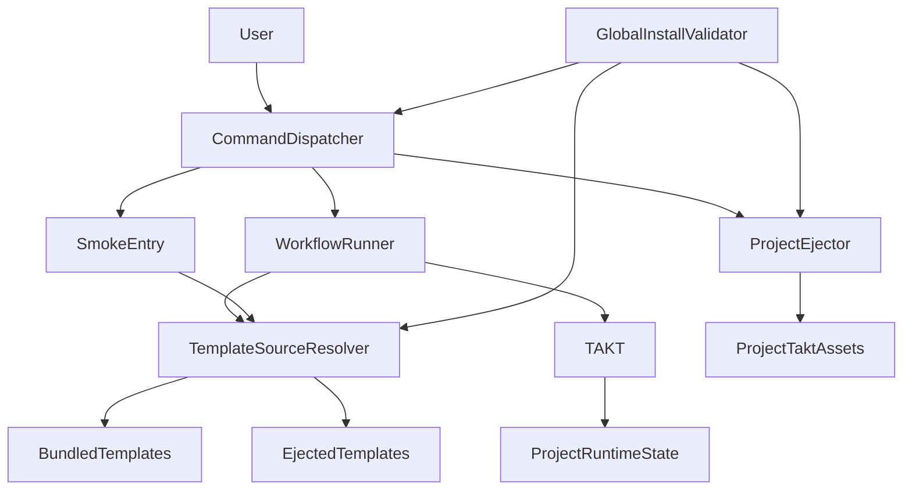
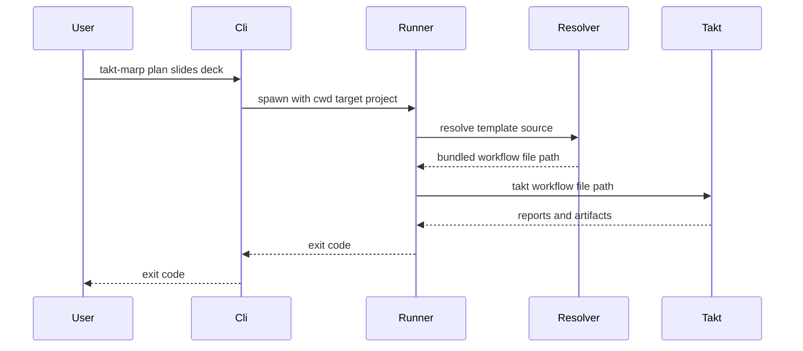
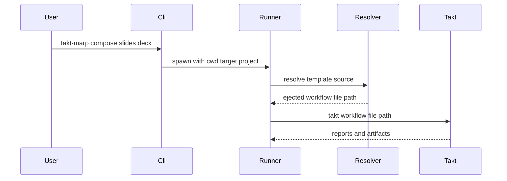
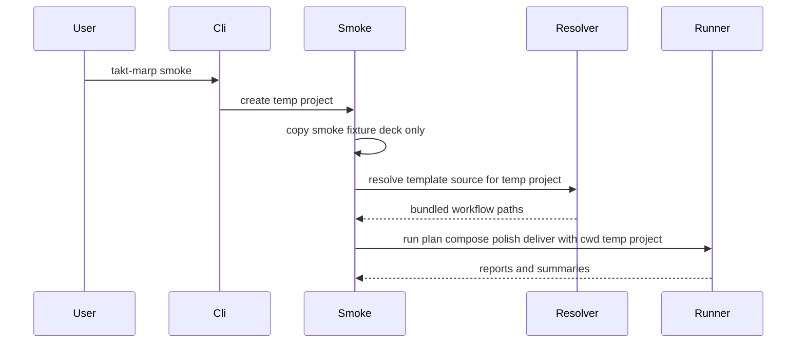
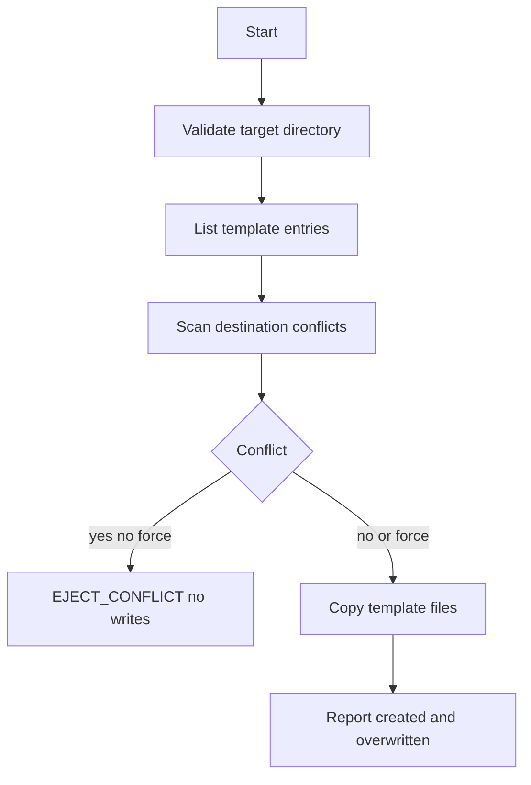

# 技術設計: takt-marp-global-installer

## 概要

**Purpose**: この機能は slide workflow 利用者とメンテナに対し、repo clone と `npm run slide:*` の repo-local 知識に依存しない導入・実行入口を提供する。`npm install -g takt-marp` で `takt-marp` command が利用可能になり、通常は対象プロジェクトへ workflow/facet template をコピーせず bundled template で実行できる。

**Users**: workflow 利用者は別プロジェクトでの slide 作成と日常の `plan / compose / polish / deliver` 実行に利用する。workflow メンテナは package 境界、template drift、global install 経路の CI 検証に利用する。

**Impact**: 現行 global installer の `init` 前提を廃止し、明示的な `eject` だけが `.takt/workflows` / `.takt/facets` を生成するモデルへ変更する。workflow の状態管理、approval、report freshness、rerun/force の意味論は既存 runner/lib を source of truth として維持する。

### 目標

- `takt-marp --help` から `init` を外し、`eject` を公開する
- `.takt/workflows` / `.takt/facets` がない対象 project で bundled template による no-copy workflow 実行を成立させる
- `.takt/workflows` / `.takt/facets` が両方ある場合だけ user-owned ejected override として扱う
- `eject` の scan-then-copy、衝突既定失敗、明示上書き、template 対象外不変を保証する
- global install validator で no-copy、eject、mock smoke、package/template 境界を固定する

### 非目標

- `plan / compose / polish / deliver` の command/state/report/approval contract の再設計
- workflow YAML / facets の品質責務変更
- ejected assets の upgrade 時自動 merge、自動置換、自動同期
- provider 設定、API key、認証情報の生成や変更
- npm registry publish automation、Homebrew / mise / standalone binary 配布

## 境界コミットメント

### このスペックが所有するもの

- `takt-marp` global CLI の command surface: `eject / plan / compose / polish / deliver / approve / smoke` と既存 utility command(`build:html`、`build:pdf`、`build:pptx`、`preview`)の表示整合
- `init` command の廃止表示と `eject` への移行 guidance
- bundled/ejected template source の判定契約
- TAKT へ渡す workflow YAML path の選択契約
- `eject` の copy 境界、衝突処理、上書き処理、禁止ファイル非生成
- package template の allowlist / prohibited pattern / drift 検証
- global install validator の no-copy / eject / smoke 回帰

### 境界外

- runner が所有する target validation、prerequisite、approval gate、rerun/force、report sync の意味論
- TAKT workflow YAML と facets の内容品質
- `build:html`、`build:pdf`、`build:pptx`、`preview`、`approve` の機能追加。ただし既存 public command として保持し、`init` preflight は取り除く
- ejected assets の merge/migration tooling
- real provider の環境設定補助

### 許可する依存

- `scripts/lib/takt-marp-slide-workflow.mjs` の既存 contract: `resolveDeckTarget`、`assertCommandPrerequisites`、approval/rerun/force helpers
- `scripts/lib/takt-marp-errors.mjs` の共有 error contract: `SlideWorkflowError` と `formatError`
- TAKT CLI の `--workflow <name>` / `--workflow <path>` contract
- `templates/project/{workflows,facets}` と `.takt/{workflows,facets}` の同一相対構造
- Node.js >= 24 builtin modules
- npm global install layout と `packageRoot/node_modules/.bin`

import 依存方向は次の向きに限定する。

```
Cli -> ProjectEjector -> ProjectTemplates -> RuntimeContext
Cli -> Runner -> ProjectTemplates -> RuntimeContext
Cli -> Runner -> SlideWorkflowLib -> RuntimeContext
Cli -> SmokeEntry -> SmokeValidator -> ProjectTemplates
BuildAndPreview -> RuntimeContext
Validators -> ProjectTemplates
ProjectTemplates -> TaktMarpErrors
SlideWorkflowLib -> TaktMarpErrors
```

`RuntimeContext` と `TaktMarpErrors` は leaf として他の takt-marp module を import しない。`ProjectTemplates` と `SlideWorkflowLib` は互いに import してはならない。`Runner` は `TemplateSourceResolver` と `SlideWorkflowLib` の両方を使って workflow path と既存 workflow contract を接続する。`Cli` は workflow semantics を再実装せず runner を spawn する。既存 build/preview script は `RuntimeContext` だけを共有してよい。

### 再検証トリガー

- TAKT の `--workflow <path>` semantics または facet relative path resolution が変わる
- `templates/project` の directory 構造、workflow file naming、facet relative path が変わる
- runner argv / exit code / report sync contract が変わる
- `slides/<deck>` target contract または approval ownership が変わる
- package `files` allowlist または runtime dependencies が変わる

## アーキテクチャ

### 既存アーキテクチャ分析

- 現行 `scripts/lib/takt-marp-cli.mjs` は `init` を public command とし、workflow/approve 前に `.takt/workflows` と `.takt/facets` の存在を必須化している。
- `scripts/takt-marp-run-slide-workflow.mjs` は cwd を target project として扱い、`takt -w takt-marp-slide-<command>` を起動する。report sync と artifact replacement はここが所有する。
- `scripts/lib/takt-marp-slide-workflow.mjs` は `workflowPath(command, { root })` と `assertWorkflowAvailable()` を project `.takt/workflows` 前提で持つ。
- `scripts/lib/takt-marp-project-init.mjs` は scan-then-copy の mechanics を実現済みだが、public concept が `init` のまま。
- `scripts/takt-marp-validate-slide-workflow-smoke.mjs` は現行では temp project へ `initializeProject()` 済みであること、および `ROOT/.takt/workflows` / `ROOT/.takt/facets` があることを前提に workflow inspection と doctor を行っている。
- `scripts/takt-marp-validate-global-install.mjs` は init boundary と uninitialized failure を固定しているため、要求変更に合わせて phase を作り直す必要がある。

### アーキテクチャパターンと境界マップ



採用パターンは thin CLI adapter + existing runner delegation + explicit template source resolution。新しい境界は `TemplateSourceResolver` と `ProjectEjector` だけに絞る。no-copy 実行は TAKT に workflow file absolute path を渡すことで実現し、cwd は対象 project のまま維持する。

### 技術スタック

| レイヤー | 選択／バージョン | 機能内での役割 | メモ |
|-------|------------------|-----------------|------|
| CLI runtime | Node.js >= 24 | bin entry、parseArgs、spawn | 新規依存なし |
| Workflow runtime | `takt@^0.44.0` | `--workflow <path>` による workflow 実行 | global package 側 dependency |
| Render utilities | `@marp-team/marp-cli@^4.4.0` | build/preview utility | 既存 utility を維持する場合のみ |
| Package | npm `bin` / `files` / `pack` | global install と validation | npm global を優先 |

## ファイル構造計画

### ディレクトリ構造

```
bin/
└── takt-marp.mjs
scripts/
├── lib/
│   ├── takt-marp-runtime-context.mjs
│   ├── takt-marp-errors.mjs
│   ├── takt-marp-project-templates.mjs
│   ├── takt-marp-project-eject.mjs
│   ├── takt-marp-slide-workflow.mjs
│   └── takt-marp-cli.mjs
├── takt-marp-run-slide-workflow.mjs
├── takt-marp-validate-slide-workflow-smoke.mjs
├── takt-marp-validate-global-install.mjs
├── takt-marp-validate-package-boundary.mjs
└── takt-marp-validate-slide-workflow-foundation.mjs
templates/
└── project/
    ├── workflows/
    └── facets/
```

### 変更対象ファイル

- `package.json` / `package-lock.json` — `bin`、`files`、`engines.node`、runtime dependencies、installer validation scripts の宣言を `init` 廃止後の command surface に合わせる。
- `scripts/lib/takt-marp-errors.mjs` — `SlideWorkflowError` と `formatError` を `takt-marp-slide-workflow.mjs` から切り出し、template module と workflow lib が循環せず共有できる leaf module にする。
- `scripts/lib/takt-marp-cli.mjs` — `init` を public command から外し、`eject` を追加する。`init` は `COMMAND_REMOVED` guidance で失敗させる。workflow/approve の project initialization preflight を削除する。`approve` と build/preview utility は public command として保持する。smoke は temp project を作るが template assets を eject しない。
- `scripts/lib/takt-marp-project-init.mjs` → `scripts/lib/takt-marp-project-eject.mjs` — `initializeProject` を `ejectProject` へ改名し、error code/message を `EJECT_CONFLICT` へ変更する。
- `scripts/lib/takt-marp-project-templates.mjs` — `resolveTemplateSource(projectRoot)` を追加し、`bundled` / `ejected` / partial invalid state を判定する。`workflowFilePath(source, command)` を提供する。`templateRootPath()` と prohibited pattern は継続利用する。`SlideWorkflowLib` は import せず `TaktMarpErrors` だけを共有する。
- `scripts/lib/takt-marp-slide-workflow.mjs` — `SlideWorkflowError` / `formatError` を shared error module へ移す。`workflowPath` / `assertWorkflowAvailable` は explicit workflow path または workflow asset root を受け取れる形に縮小し、`TemplateSourceResolver` は import しない。
- `scripts/takt-marp-run-slide-workflow.mjs` — `TemplateSourceResolver` を呼び、TAKT `-w` へ workflow file absolute path を渡す。cwd、target、report sync は不変。
- `scripts/takt-marp-validate-slide-workflow-smoke.mjs` — temp project を初期化せず、fixture deck だけを配置する。workflow inspection、AI gate rule inspection、workflow doctor は `TemplateSourceResolver` が返す bundled/ejected workflow path を使う。`.takt/workflows` / `.takt/facets` の direct path 前提を削除し、mock smoke の成功後も temp project に template assets が生成されていないことを検証する。
- `scripts/takt-marp-validate-global-install.mjs` — `surface`、`workflow-command-no-copy`、`partial-template-state`、`eject-boundary`、`eject-conflict-force`、`mock-smoke` phase へ更新する。
- `scripts/takt-marp-validate-package-boundary.mjs` — required script を `takt-marp-project-eject.mjs` と `takt-marp-errors.mjs` へ更新し、旧 init module を pack 必須から外す。
- `scripts/takt-marp-validate-slide-workflow-foundation.mjs` — approve が `.takt/workflows` / `.takt/facets` を要求しないこと、partial template state が拒否されること、bundled source の workflow path が返ることを検証する。
- `scripts/takt-marp-sync-project-templates.mjs` — template sync の drift 検証は維持し、表示文言を bundled/eject 対象へ更新する。
- `README.md`、`README.ja.md` — 導入手順を no-copy default と `eject` optional customization に更新し、`init` を廃止済みとして記載する。

## システムフロー

### no-copy workflow command



`Resolver` は `.takt/workflows` と `.takt/facets` が両方ない場合に bundled template を返す。runner は対象 project へ `.takt/workflows` / `.takt/facets` をコピーしない。TAKT runtime state と report は cwd 側へ生成される。

### ejected override workflow command



`.takt/workflows` と `.takt/facets` が両方存在する場合だけ ejected source とする。片方だけの場合は runner 起動前の preflight で `PROJECT_TEMPLATE_STATE_INVALID` を返す。

### no-copy smoke command



smoke は temp project を使うが、既定では `.takt/workflows` / `.takt/facets` を生成しない。workflow schema/doctor、AI gate workflow inspection、loop monitor inspection は `TemplateSourceResolver` が返す workflow path を読む。検証後、temp project に workflow/facet template assets が生成されていないことを assertion として固定する。

### eject copy flow



scan-then-copy を維持し、衝突失敗時は書き込みゼロにする。copy 先は `.takt/<template-relative-path>` のみであり、`.takt/runs`、`.takt/render`、provider 設定、認証情報には触れない。

## 要件トレーサビリティ

| 要件 | 要約 | コンポーネント | インターフェース／フロー |
|------|------|----------------|--------------------------|
| 1.1 | global install で PATH 実行 | PackageMetadata、CliEntry | `bin`、GlobalInstallValidator |
| 1.2 | help に `eject`、workflow、approve、utility commands を表示 | CommandDispatcher | `usage()` |
| 1.3 | `slide:*` を拒否 | CommandDispatcher | `UNKNOWN_COMMAND` |
| 1.4 | `init` 廃止 guidance | CommandDispatcher | `COMMAND_REMOVED` |
| 1.5 | Node version 境界 | CliEntry、PackageMetadata | version guard、`engines.node` |
| 2.1 | cwd を project root とする | CommandDispatcher、Runner | spawn cwd |
| 2.2 | local template 不在時 bundled no-copy | TemplateSourceResolver、Runner | no-copy flow |
| 2.3 | 両方存在時 ejected override | TemplateSourceResolver、Runner | ejected flow |
| 2.4 | partial state を拒否 | TemplateSourceResolver | `PROJECT_TEMPLATE_STATE_INVALID` |
| 2.5 | npm project 不在を失敗理由にしない | RuntimeContext、Runner | packageRoot bin 解決 |
| 2.6 | parent root 探索なし | CommandDispatcher | cwd 固定 |
| 2.7 | target project の npm run を使わない | CommandDispatcher | direct node spawn |
| 3.1 | `eject .` が workflows/facets 生成 | ProjectEjector | `ejectProject` |
| 3.2 | `eject <dir>` の明示対象 | CommandDispatcher、ProjectEjector | `EjectOptions.targetDir` |
| 3.3 | runtime state 非生成 | ProjectTemplateSet、ProjectEjector | prohibited patterns |
| 3.4 | provider/credential 非生成 | ProjectTemplateSet、ProjectEjector | prohibited patterns |
| 3.5 | template 対象外不変 | ProjectEjector | entry-scoped copy |
| 3.6 | upgrade auto merge 禁止 | CommandDispatcher、Docs | no automatic path |
| 4.1 | 衝突既定失敗 | ProjectEjector | `EJECT_CONFLICT` |
| 4.2 | 衝突時書き込みゼロ | ProjectEjector | scan-then-copy |
| 4.3 | force/overwrite 上書き | CommandDispatcher、ProjectEjector | force alias |
| 4.4 | force でも対象外不変 | ProjectEjector | entry-scoped copy |
| 4.5 | merge/best-effort なし | ProjectEjector | fail or force |
| 5.1 | 既存 workflow 契約尊重 | Runner、SlideWorkflowLib | delegation |
| 5.2 | invalid target preflight | SlideWorkflowLib | `INVALID_TARGET` |
| 5.3 | rerun/force 維持 | SlideWorkflowLib、Runner | existing helpers |
| 5.4 | provider 明示を渡す | Runner | `--provider` pass-through |
| 5.5 | workflow semantics 再定義禁止 | CommandDispatcher、Runner | thin adapter |
| 5.6 | approve は template asset を要求しない | CommandDispatcher、ApproveScript | no template preflight |
| 6.1 | smoke mock default | SmokeEntry | smoke script |
| 6.2 | mock summary | SmokeEntry、SmokeValidator | smoke summary |
| 6.3 | smoke provider pass-through | SmokeEntry | argv pass-through |
| 6.4 | real provider summary | SmokeEntry、SmokeValidator | existing summary |
| 6.5 | provider 設定を生成しない | SmokeEntry | no config writes |
| 6.6 | user cwd を汚さない | SmokeEntry | temp project |
| 6.7 | smoke temp project も no-copy template source を使う | SmokeEntry、TemplateSourceResolver、SmokeValidator | no-copy smoke flow |
| 7.1 | template domain 限定 | ProjectTemplateSet、PackageBoundaryValidator | domain allowlist |
| 7.2 | 禁止 file 混入検出 | ProjectTemplateSet、PackageBoundaryValidator | prohibited patterns |
| 7.3 | drift 検出 | TemplateSyncValidator | byte diff |
| 7.4 | drift path 表示 | TemplateSyncValidator | `TEMPLATE_DRIFT` |
| 7.5 | package/include 境界 | PackageBoundaryValidator | `npm pack --dry-run` |
| 8.1 | tarball global install 検証 | GlobalInstallValidator | pack-install phase |
| 8.2 | help で public command surface と init 非表示を検証 | GlobalInstallValidator | surface phase |
| 8.3 | no-copy workflow E2E | GlobalInstallValidator | workflow-command-no-copy |
| 8.4 | eject 生成境界 | GlobalInstallValidator | eject-boundary |
| 8.5 | eject 衝突/force | GlobalInstallValidator | eject-conflict-force |
| 8.6 | mock smoke と smoke no-copy を必須検証 | GlobalInstallValidator、SmokeValidator | mock-smoke |
| 8.7 | real smoke 非必須 | GlobalInstallValidator | no real provider phase |

## コンポーネントとインターフェース

| コンポーネント | ドメイン／レイヤー | 意図 | 要件カバー範囲 | 主要依存 | 契約 |
|----------------|--------------------|------|----------------|----------|------|
| PackageMetadata | Package | bin/files/engines/dependencies を宣言する | 1.1, 1.5, 7.5, 8.1 | npm P0 | State |
| CliEntry | CLI | version guard と dispatcher 起動 | 1.1, 1.5 | RuntimeContext P1 | Service |
| CommandDispatcher | CLI | command surface と spawn 委譲 | 1.2-1.4, 2.1, 2.6, 2.7, 3.2, 4.3, 5.5, 5.6, 6.3 | Runner P0, ProjectEjector P0 | Service |
| TemplateSourceResolver | Template | bundled/ejected/partial state 判定 | 2.2-2.4, 7.1, 7.2, 8.3 | RuntimeContext P0 | Service, State |
| ProjectEjector | Template | explicit copy mechanics | 3.1-3.6, 4.1-4.5 | ProjectTemplateSet P0 | Service |
| WorkflowRunner | Runtime | workflow path 明示指定と既存契約委譲 | 2.1-2.5, 5.1-5.5 | SlideWorkflowLib P0, TAKT P0 | Batch |
| SmokeEntry | Validation | temp project で mock/real smoke を委譲する | 6.1-6.7, 8.6, 8.7 | WorkflowRunner P0, TemplateSourceResolver P0 | Batch |
| SmokeValidator | Validation | smoke fixture、workflow inspection、doctor、no-copy assertion を検証する | 6.1-6.7, 8.6 | TemplateSourceResolver P0, WorkflowRunner P0 | Batch |
| TemplateSyncValidator | Validation | dev `.takt` と package template の drift を検出する | 7.3, 7.4 | ProjectTemplateSet P0 | Batch |
| PackageBoundaryValidator | Validation | npm pack 内容と禁止 file を検証する | 7.1, 7.2, 7.5 | PackageMetadata P0 | Batch |
| GlobalInstallValidator | Validation | public install path の E2E 固定 | 8.1-8.7 | npm P0, CLI P0 | Batch |

### CLI

#### CommandDispatcher

| 項目 | 詳細 |
|------|------|
| 意図 | public command surface を決め、各 script へ最小委譲する |
| 要件 | 1.2, 1.3, 1.4, 2.1, 2.6, 2.7, 3.2, 4.3, 5.5, 5.6, 6.3 |

**責務と制約**
- `VALID_COMMANDS` から `init` を除き、`eject` を追加する。
- `init` は unknown ではなく removed command として `COMMAND_REMOVED` を返す。
- workflow command の argv は解析せず runner へ素通しする。
- `approve` は workflow/facet template source を必要としないため、template preflight を持たない。
- `approve`、`build:html`、`build:pdf`、`build:pptx`、`preview` は retained public commands として help と validator surface に残す。

**サービスインターフェース**

```typescript
interface CommandDispatcherService {
  runCli(argv: readonly string[]): Promise<number>;
}
```

### Template

#### TemplateSourceResolver

| 項目 | 詳細 |
|------|------|
| 意図 | workflow 実行時に bundled template と ejected template のどちらを使うかを決める |
| 要件 | 2.2, 2.3, 2.4, 7.1, 7.2, 8.3 |

**状態契約**

```typescript
type TemplateSourceKind = "bundled" | "ejected";

interface TemplateSource {
  kind: TemplateSourceKind;
  rootDir: string;
  workflowsDir: string;
  facetsDir: string;
}

interface TemplateSourceResolverService {
  resolveTemplateSource(projectRoot: string): TemplateSource;
  workflowFilePath(source: TemplateSource, command: "plan" | "compose" | "polish" | "deliver"): string;
}
```

**不変条件**
- `.takt/workflows` と `.takt/facets` が両方ない場合は `bundled`。
- 両方ある場合は `ejected`。
- 片方だけある場合は `PROJECT_TEMPLATE_STATE_INVALID`。
- resolver は file を作成しない。
- resolver module は `SlideWorkflowLib` を import しない。error は `TaktMarpErrors` だけから共有する。

#### ProjectEjector

| 項目 | 詳細 |
|------|------|
| 意図 | bundled template assets を明示的に project `.takt/` へコピーする |
| 要件 | 3.1-3.6, 4.1-4.5 |

**サービスインターフェース**

```typescript
interface EjectOptions {
  targetDir: string;
  force: boolean;
}

interface EjectResult {
  created: readonly string[];
  overwritten: readonly string[];
}

interface ProjectEjectorService {
  ejectProject(options: EjectOptions): Promise<EjectResult>;
}
```

**不変条件**
- copy 対象は `listTemplateEntries()` の entry のみ。
- conflict scan は copy より先に全件実行する。
- `force: false` の conflict は `EJECT_CONFLICT` で書き込みゼロ。
- `force: true` でも template entry 外の path は変更しない。

### Runtime

#### WorkflowRunner

| 項目 | 詳細 |
|------|------|
| 意図 | 既存 workflow 契約を保ったまま TAKT へ workflow file path を渡す |
| 要件 | 2.1-2.5, 5.1-5.5 |

**バッチ契約**
- Trigger: `takt-marp <command> <target> [--force] [--provider <name>]`
- Input: command、target、force、provider、cwd project root
- Preflight order: command/target/prerequisite → template source resolution → workflow file existence → takt executable
- Output: existing runner の report sync と exit code
- Recovery: rerun/force/rejected rerun は既存 helper に従う

**Implementation Notes**
- Integration: `runTakt()` は `-w workflowFilePath` を渡す。
- Validation: no-copy E2E は provider mock で小さい fixture deck を実行する。
- Risks: TAKT `-w` path behavior に依存するため validator で固定する。

### Validation

#### SmokeEntry / SmokeValidator

| 項目 | 詳細 |
|------|------|
| 意図 | mock/real smoke を temp project で実行し、global CLI と同じ template source selection を検証する |
| 要件 | 6.1-6.7, 8.6, 8.7 |

**バッチ契約**
- Trigger: `takt-marp smoke [--provider <name>]`
- Input: provider、temp project root、package fixture deck、selected template source
- Setup: temp project へ smoke fixture deck をコピーし、`.takt/workflows` / `.takt/facets` は作成しない。
- Validation: workflow inspection、AI gate callable workflow inspection、workflow doctor は `workflowFilePath(resolveTemplateSource(tempProject), command)` の結果を使う。
- Output: provider 別 smoke summary。mock は CI 必須、real provider は任意。
- Invariant: smoke 完了後も temp project に `.takt/workflows` と `.takt/facets` が存在しない。

## データモデル

永続 DB は追加しない。扱うデータは filesystem contract だけである。

### データ契約と統合

- `TemplateSource`: bundled/ejected の runtime 判定結果。プロセス内の値で永続化しない。
- `EjectResult`: user-facing output と validator assertion のための created/overwritten path list。
- `.takt/workflow-current-target.json`、`.takt/runs/**`: workflow runtime state。no-copy 実行でも対象 project 側に生成され得るが、workflow/facet template assets ではない。

## エラーハンドリング

| コード | 発生元 | 応答 |
|--------|--------|------|
| `COMMAND_REMOVED` | CommandDispatcher | `init` 廃止と `eject` guidance を表示 |
| `PROJECT_TEMPLATE_STATE_INVALID` | TemplateSourceResolver | partial `.takt` state と修復方法を表示 |
| `EJECT_CONFLICT` | ProjectEjector | conflict path 全件と `--force` guidance を表示 |
| `WORKFLOW_NOT_IMPLEMENTED` | SlideWorkflowLib | selected template source の workflow file 欠落を表示 |
| `TAKT_EXECUTABLE_MISSING` | SlideWorkflowLib | package reinstall guidance を表示 |

## テスト戦略

- Unit/Foundation:
  - `TemplateSourceResolver` が none/both/workflows-only/facets-only を判定する。
  - `ProjectEjector` が scan-then-copy、conflict zero-write、force overwrite、template 対象外不変を満たす。
  - `runCli(["init"])` が `COMMAND_REMOVED` を返し、help には `init` が出ない。
  - `approve` は `.takt/workflows` / `.takt/facets` 不在でも help と approval write が動く。
- Integration:
  - runner が bundled source の absolute workflow path を TAKT に渡す。
  - ejected source が存在する場合は project-local workflow path を TAKT に渡す。
  - partial `.takt` state は TAKT 起動前に拒否される。
  - smoke の workflow inspection / doctor が temp project の `.takt/workflows` ではなく selected template source の workflow path を読む。
- Global E2E:
  - tarball global install 後、surface/no-copy/eject/conflict/mock-smoke の各 phase が通る。
  - no-copy workflow 実行後、対象 project に `.takt/workflows` と `.takt/facets` が作られていない。
  - `takt-marp smoke` は呼び出し元 cwd を汚さず、mock summary を temp project に残し、temp project にも `.takt/workflows` と `.takt/facets` を作らない。

## セキュリティ考慮事項

- `eject` は provider 設定、API key、credential、token、secret に一致する template entry を生成しない。
- no-copy 実行は package 同梱 template を読むだけで、対象 project へ workflow/facet source を追加しない。
- `--force` は template entry に対応する path だけを上書きし、runtime state や user-owned non-template files を削除しない。

## 移行戦略

- `init` は alias として残さず、`COMMAND_REMOVED` で `eject` を案内する。
- 既に `init` で `.takt/workflows` / `.takt/facets` を持つ project は ejected override としてそのまま動く。
- bundled template に戻したい project は user-owned `.takt/workflows` / `.takt/facets` を削除する。
- template を再取得したい project は明示的に `takt-marp eject . --force` を実行する。
