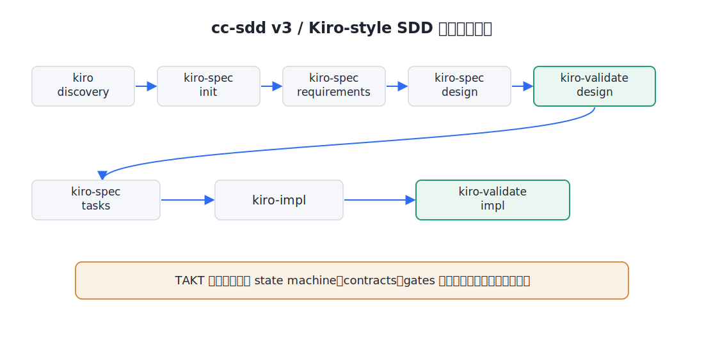
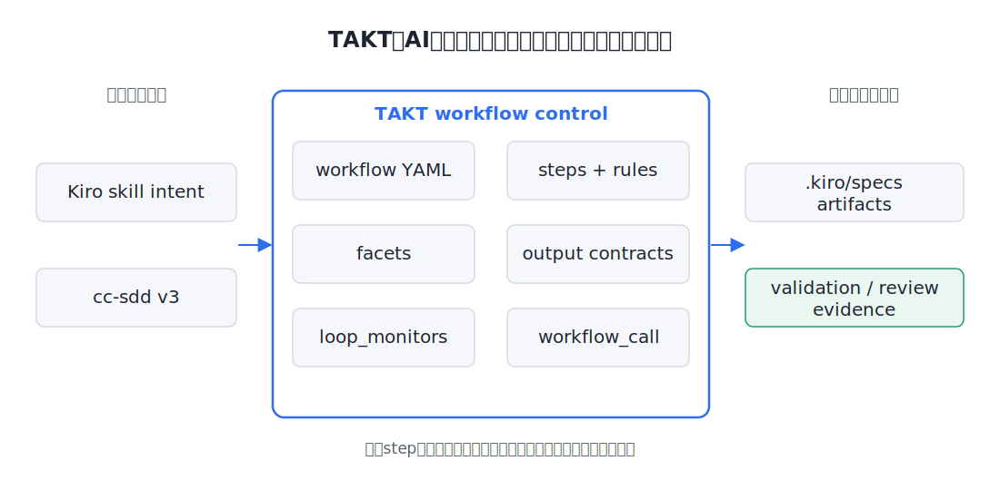
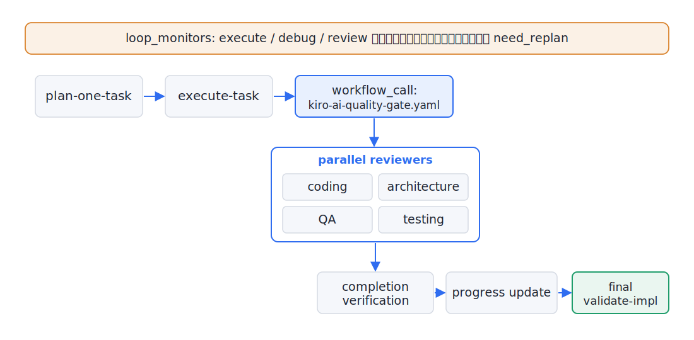

<!-- _class: title -->
<!-- _paginate: false -->

TAKTでAI開発を制御する

takt-sddに見る cc-sdd v3品質ゲート設計

- TAKTはAI出力そのものではなく、**実行経路・分岐・証跡・完了判定**を決定論化する
- takt-sddは、AIエージェントによる開発を閉じた品質ループへ載せる具体例

<!--
TAKT勉強会として、takt-sddの紹介だけでなくTAKT workflow設計の実例として話す、と最初に宣言する。冒頭で、AIを賢くする話ではなく、AI開発を制御する話だと線を引く。次のスライドでcc-sdd v3の基本をおさらいしてから、なぜAIエージェント利用だけでは危ういのかへ進む。
根拠: brief.md（Goal / Core Message / Audience Context）/ takt-sdd README.md（TAKT state-machine workflow control / pinned cc-sdd@3.0.2 / Kiro Compatibility Workflow）/ CC-SDD-CODEX.md / package.json（canonical kiro:* surface）。
-->

---

<!-- _class: visual-full -->

# cc-sdd v3のおさらい

cc-sdd v3/Kiro-style SDD は discovery から spec生成・design validation・tasks・impl・final validation へ進む。

<!--
cc-sddそのものの一般紹介には寄せすぎず、以降のTAKT制御を理解するための前提だけを置く。v3対応ではKiro-compatibleなspec artifactとkiro:* surfaceを前提にし、kiro-discovery → kiro-spec-init → kiro-spec-requirements → kiro-spec-design → kiro-validate-design → kiro-spec-tasks → kiro-impl → kiro-validate-impl の流れを扱う。takt-sddはpinned cc-sdd@3.0.2初期化を含め、その流れをTAKT workflowで制御対象にしている、と説明する。次スライドで、なぜこの流れをAIエージェントに任せきりにすると危ういのかへ進む。
根拠: takt-sdd README.md（pinned cc-sdd@3.0.2 / Kiro Compatibility Workflow / Artifacts from each phase）/ CC-SDD-CODEX.md（Specs path / Minimal Workflow）/ package.json（canonical kiro:* surface）。
-->

---

<!-- _class: single -->

# AIエージェントの一回実行では品質保証にならない

AIは成果物を出せるが、1回の回答採用では品質保証にならない。

- AIは成果物を出せるが、毎回同じ経路で進むとは限らない
- 受入条件未達やレビュー漏れが、人間レビューを素通りすることがある
- 脆弱性や本番障害につながる変更も、1回の回答採用では止めにくい
- 問題が出たら、検出・修正・再検証の**閉じたループ**で扱う必要がある
- TAKTはここを state machine と gate で制御する

<!--
問題はAIが間違えること自体ではなく、間違えたときに検出・修正・再検証する閉じたループが設計されていないことだと説明する。本来は必要な回数だけ検出→修正→再検証を回すべきだが、AIエージェント利用では開発者が1回の回答を採用しがちだ、という現状認識を共有する。次にTAKTが何を制御しているのかを図で見せる。
根拠: brief.normalized.md（Required Topics #1 / AI quality gate / Implementation quality gate）/ takt-sdd README.md（Multi-stage Validation / Loop Detection）。
-->

---

<!-- _class: visual-full -->

# TAKTは何を決定論化しているのか

TAKTはKiro/cc-sddの意図をworkflow・facets・contracts・loopで制御し、spec artifactsとevidenceへ落とす。

<!--
TAKTは「AIの回答を固定する」ものではなく、「どのstepを、どの条件で、どの証跡をもって次へ進めるか」を固定するものだと説明する。takt-sddはcc-sdd v3 / Kiro-style SDDをこの構造に乗せた実例であり、Kiro-compatible workflowをTAKTのworkflow・facet・contract・gateとして制御している。次スライドでfacetとoutput contractを深掘りする。
根拠: takt-sdd README.md（Declarative Workflow Control / Faceted Prompting）/ .takt/en/workflows/kiro-impl.yaml / kiro-ai-quality-gate.yaml / .kiro/specs/kiro-shared-workflow-contracts/。
-->

---

<!-- _class: single -->

# Facets + Contracts — 状態を機械可読にする

promptを分解し、ruleが読める machine-readable state を作る。

- Facets: <code>Persona / Policy / Instruction / Knowledge / Output Contract</code> を分ける
- Output contracts: <code>STATUS</code> ・ <code>DECISION</code> ・ <code>VERDICT</code> ・ finding count ・ evidence を後続ruleが読める形にする
- Rules: 自由文の印象ではなく、machine field と条件で次stepを決める
- <code>kiro:*</code> surface は、この構造を外から呼ぶ安定した入口

<!--
promptを1つの巨大文書にせず、役割・制約・手順・知識・出力契約に分けることがTAKTの強みだと説明する。特にoutput contractがないと、次の分岐がAIの自由文解釈になってしまう。kiro:* は主役ではなく、この制御構造への安定した入口として扱う。
根拠: takt-sdd README.md（Faceted Prompting）/ .kiro/specs/kiro-shared-workflow-contracts/design.md / CC-SDD-CODEX.md / package.json（canonical kiro:* surface）。
-->

---

<!-- _class: compare-2col -->

# 作るstepと判定するgateを分ける

作るstepと判定するgateを分け、成功扱いの根拠を明確にする。

## state-changing（生成）

- <code>kiro-spec-init</code>
- <code>kiro-spec-requirements</code>
- <code>kiro-spec-design</code>
- <code>kiro-spec-tasks</code>
- <code>kiro-spec-quick</code>

## read-only（判定）

- <code>kiro-spec-status</code>
- <code>kiro-validate-gap</code>
- <code>kiro-validate-design</code>
- <code>kiro-validate-impl</code>
- artifactを直さず GO/NO-GO・不足証跡・manual check 等を返す

<!--
AI workflowでは、生成と検証を同じstepに混ぜると「作った本人が通した」状態になりやすい。TAKTでは状態変更するworkflowとread-only gateを分け、validationが成功の根拠を明示する。検証不能な項目は成功扱いにしない。次スライドでは、問題を見つけたときの閉じた修正ループを見る。
根拠: .kiro/specs/kiro-spec-generation-workflows/ / kiro-status-validation-workflows/ / .takt/en/workflows/kiro-validate-design.yaml / kiro-validate-impl.yaml。
-->

---

<!-- _class: single -->

# AI quality gate — review/fix/replanで閉じる

検出するだけでなく、分岐で次の状態を決める。

- <code>No AI-specific issues</code> → <code>COMPLETE</code>
- <code>AI-specific issues found</code> → <code>fix</code> → <code>review</code> に戻る
- ambiguous / blocked / internally inconsistent → <code>need_replan</code>
- <code>loop_monitors.threshold</code> 到達 → <code>need_replan</code>
- 検出例: hallucinated path/API、scope mismatch、unsupported claim、unused artifact

<!--
AI gateの本質は、検出項目の多さではなく、問題が出たときに閉じたループで修正し、未収束なら安全にreplanへ戻すことだと説明する。これは「1回の回答を採用する」使い方との決定的な違いである。次スライドを山場として、このgateをsubworkflowとして組み込んだ実装制御を見せる。
根拠: .takt/en/workflows/kiro-ai-quality-gate.yaml / .kiro/specs/kiro-ai-quality-gate/ / kiro-ai-quality-gate-workflow-coverage/。
-->

---

<!-- _class: visual-full -->

# `kiro-impl` — subworkflow・並列review・loop監視

<code>kiro-impl</code>は実装step、AI quality gate、並列review、loop監視、final validateを1つの制御スタックにする。

<!--
ここを発表の山場として扱う。kiro-impl はTAKTの高度な制御例として見せる。AI gateを内部subworkflowとして呼び、4観点reviewをparallelで走らせ、未収束ループをmonitorし、最後にcompletion verificationとread-only validateで完了判定する。`need_replan` は parent workflow で debug-task 側へ戻す、と口頭で補足する。ここでTAKTが「手順の自動化」ではなく「品質制御の合成」であることを強調する。reviewerは coding/architecture/QA/testing の4観点であり、security専用gateがあるとは言わない。
根拠: .takt/en/workflows/kiro-impl.yaml / kiro-ai-quality-gate.yaml / kiro-validate-impl.yaml / .kiro/specs/kiro-iterative-implementation-workflow/。
-->

---

<!-- _class: single -->

# 持ち帰り — TAKT設計パターン

AI開発をpromptではなく、workflow・contract・gateとして設計する。

- AI作業を <code>step + rule + contract</code> に分解する
- 状態変更workflowと read-only validation を分ける
- AI gateは検出だけでなく <code>fix / replan</code> の分岐を持つ
- <code>parallel review</code> と <code>loop monitor</code> でレビュー漏れ・未収束を抑える
- cc-sdd v3をこの形で包み、工数削減と品質向上を同時に実現しやすくする

<!--
TAKTの設計パターンとして何を持ち帰るべきかを整理する。takt-sddは単なるcc-sddラッパーではなく、AI開発を閉じた品質ループとして運用する具体例である。CLI導線は主題にせず、今日の価値はすでに実体化している品質制御にあると述べる。最後に「TAKTでAI開発を制御する」というタイトルへ戻して締める。
補足の根拠の扱い: 「すでに実体化している品質制御」は workflow YAML と package.json の kiro:* surface を根拠に話す。spec.json の ready_for_implementation は補足根拠であり「全タスク実装完了」とは言わない。
根拠: takt-sdd README.md / package.json（canonical kiro:* surface）/ .kiro/specs/*/spec.json / brief.md（Optional Topics）。
-->
